*PART I — TIME SERIES: UNDERSTANDING AND FORECASTING PATTERNS OVER TIME*

# Chapter 1 — Time Series Foundations: Reading the Story Data Tells Over Time


<!-- [IMAGE: images/ch01/fig-1-0-wave-decomposition.png]
Alt text: A cinematic cross-section of an ocean wave revealing three distinct internal layers — a deep steady current, rhythmic wave patterns, and chaotic surface spray — observed by a small silhouette on a rocky shore at twilight.
Nano Banana Pro Prompt: "A wide cinematic cross-section view of an ocean wave, sliced vertically to reveal three distinct internal layers. The bottom layer is a deep, smooth current flowing steadily from left to right in dark navy blue, representing trend — stable and directional. The middle layer shows rhythmic, repeating wave forms in electric blue with clean sinusoidal curves, representing seasonality — structured and cyclical. The top layer is chaotic white and amber spray and foam breaking at the surface, representing residuals — unpredictable and irregular. The three layers are visually separated by thin glowing amber lines, as if the wave has been analytically deconstructed. A small human silhouette stands on a dark rocky shore to the left, observing the deconstructed wave. The ocean extends to a distant horizon under a twilight sky transitioning from deep navy above to pale amber at the horizon line. The lighting is a split between cool deep-ocean blue light emanating from within the wave layers and warm amber twilight from the horizon, creating a dramatic contrast. Style: modern tech editorial illustration with crisp vector-influenced rendering, subtle gradients, and a dark navy-and-electric-blue color palette with amber accents. Composition is a wide horizontal panorama with the cross-section wave occupying the center two-thirds and the observer figure small in the left quarter for scale. No text or labels."
-->

---

## 1. The Business Problem

A boutique hotel group on Collins Avenue operates three properties with 340 rooms between them. The general manager, like a lot of hospitality professionals in South Florida, has been making pricing and staffing decisions the same way for years: gut instinct, last year's calendar, and a spreadsheet that nobody fully trusts. Last year, that approach cost them an estimated $1.2 million in lost revenue.

The math is straightforward and painful. During the slow weeks of September and early October, rooms sat empty at $289 a night — a rate that made sense in March but priced the hotel out of the post-summer market. Occupancy dropped below 40%, and fixed costs kept running. Then Art Basel hit in December, Spring Break surged in March, and the hotel sold out every night at rates $80 to $120 *below* what competitors were charging. Full occupancy feels like a win until you realize you left six figures on the table because you didn't raise rates fast enough.

The frustrating part? The data has been there the whole time. Five years of daily occupancy rates, average daily rates, and revenue per available room — sitting in a property management system, exported to CSV once a quarter and largely ignored. The patterns are in there: the long-term growth as Miami Beach tourism climbs year over year, the seasonal rhythm of snowbird season and hurricane season, the random spikes from a music festival or a viral TikTok. But the team doesn't know how to separate those forces. They see a squiggly line on a chart and shrug.

This chapter gives you the tools to read that line. You'll learn to decompose any time series into its fundamental components — trend, seasonality, and residuals — so that what looks like chaos becomes a story with structure. By the end, you'll be able to look at five years of data and tell a hotel manager exactly *when* demand peaks, *how fast* it's growing, and *how much* of the variation is predictable versus random noise.

That's not a forecast yet. That comes in Chapter 2. But you can't predict the future until you understand the present — and that starts here.

---

## 2. The Concept

### 2.1 What Is Time Series Data and Why Does It Need Special Treatment?

Not every dataset with a date column is a time series. A time series is a sequence of observations recorded at regular time intervals where the *order matters*. Monthly revenue figures. Daily temperature readings. Quarterly GDP. The key distinction is this: if you shuffle the rows, you destroy the meaning.

Think about it this way. Shuffling a playlist changes the vibe but every song still makes sense on its own. Shuffling a patient's medical history — blood pressure readings taken over six months — turns a diagnostic story into meaningless noise. Time series data is the medical history, not the playlist. The value of each observation depends on what came before it and what comes after.


**Figure 1.1: Cross-Sectional vs. Time Series Data** — Cross-sectional data captures a snapshot at one moment; time series data captures the same measurement across many moments, and the sequence is part of the information.

This dependency between neighboring observations is why standard statistical tools often fail on time series data. A regular regression model assumes that each data point is independent of the others. In a time series, today's hotel occupancy is heavily influenced by yesterday's, and last Tuesday's, and the same Tuesday last year. Ignoring that structure means ignoring the most valuable information in the data.

### 2.2 The Three Components of Any Time Series: Trend, Seasonality, and Residuals

Every time series, no matter how messy it looks on a chart, can be broken down into three forces acting simultaneously.

**Trend** is the long-term direction. Is the line generally going up, going down, or staying flat over months and years? For Miami Beach hotel occupancy, the trend has been upward for the past decade as international tourism grows. Trend tells you the big picture — the direction of the current underneath the waves.

**Seasonality** is the repeating pattern. Hotel occupancy in South Florida peaks in Q1 (snowbird season) and Q4 (holidays and Art Basel), dips in Q2 and Q3 (summer heat, hurricane season). This cycle repeats with remarkable consistency every single year. Seasonality is the rhythm — predictable, structured, and valuable once you can see it.

**Residuals** are everything else — the variation that isn't explained by trend or seasonality. A surprise convention that fills rooms on a random Wednesday. A hurricane warning that empties them. A viral social media moment that spikes bookings for a week. Residuals are the noise, and while you can't predict them, you *can* measure how much of your data they account for.

Think of Miami Beach hotel occupancy like ocean waves. The tide is the trend — rising slowly over years as tourism grows. The waves are the seasonality — coming in predictable daily and monthly cycles, cresting in winter, retreating in summer. The spray at the top is the residuals — random, unpredictable, and impossible to forecast, but usually small compared to the tide and the waves.


**Figure 1.2: The Three Components of a Time Series** — Every time series is the sum (or product) of these three forces. Decomposition separates them; recombination reconstructs the original.

> **Scenario: The Wynwood Gallery's Invisible Calendar**
>
> Maria runs a contemporary art gallery in Wynwood that she opened four years ago. Every month she looks at her visitor count and sales numbers and thinks, "This business is completely unpredictable." Some months are great. Others are terrible. She can't plan inventory, can't plan staffing, and she's starting to wonder if the location was a mistake.
>
> Then she plots three years of daily visitor counts on a single chart. Suddenly the "unpredictable" business has structure. There's a clear upward trend — foot traffic is climbing as the neighborhood gentrifies and her reputation grows. There are sharp, repeating spikes every second Saturday (Wynwood Art Walk) and a massive annual peak during Art Basel week in December. And there's random day-to-day variation — the residuals — driven by weather, social media mentions, and nearby gallery openings she can't control.
>
> Once Maria sees the components, she stops blaming randomness and starts planning. She stocks high-value pieces before Art Walk weekends. She hires extra staff for Q4. She stops panicking during the slow summer dip because she knows the trend is still climbing underneath.
>
> *Connection*: The three components of a time series aren't abstract statistical concepts — they're the signal hiding inside every business's "messy" data. Once you separate them, decisions that felt like guesswork become data-driven.

💡 **Key Insight**: Seasonality doesn't just mean spring, summer, fall, winter. In time series analysis, seasonality is *any* repeating pattern at a fixed interval — daily, weekly, monthly, quarterly, or annual. A restaurant that's busier every Friday has weekly seasonality. A retailer that spikes every November has annual seasonality. The interval depends on your data and your domain.

### 2.3 Stationarity: Why Your Model Needs a Stable Playing Field

Here's a concept that trips everyone up the first time, but once it clicks, it changes how you think about modeling.

A **stationary** time series is one whose statistical properties — its mean, its variance, its autocorrelation structure — don't change over time. The data can absolutely fluctuate. It can be noisy, volatile, and hard to read. But the *behavior* of that noise stays consistent. The average value doesn't drift upward or downward. The size of the swings doesn't grow or shrink.

Why does this matter? Because most forecasting models assume stationarity. They assume that the patterns they learn from the past will hold in the future. If the mean of your series keeps shifting — like condo prices in Brickell that were $350,000 in 2014 and $650,000 in 2024 — a model trained on 2014 data will be catastrophically wrong about 2024. The statistical properties changed underneath the model's feet.

Imagine you're training for a marathon on a treadmill. If the speed stays constant — say, 6.5 mph — you can settle into a pace. Your heart rate stabilizes, your breathing finds a rhythm, and you can sustain the effort. That's a stationary series. Now imagine someone keeps nudging the speed up every few minutes. You never settle in. Your strategy for the first mile doesn't work for the fifth mile. That's a non-stationary series — and it's why models need stability before they can learn.


**Figure 1.3: The Stationarity Check Workflow** — Test first, then transform if necessary. Most real-world time series are non-stationary and need at least one round of differencing.

> **Scenario: The Brickell Condo Market's Stationarity Problem**
>
> A real estate analyst at a Brickell-based firm is asked to forecast condo prices for the next two years. She pulls ten years of monthly median sale prices from the MLS and plots them. The chart tells a dramatic story: prices climbed from 2014 to 2019, dipped during 2020, then surged to record highs by 2023. The mean price in 2014 was roughly $350,000; by 2024, it was approaching $650,000.
>
> If she feeds this raw series into a forecasting model, the model will assume the statistical properties stay constant — that the average and variance it learned from 2014–2019 still apply. They don't. The model will hallucinate a forecast that ignores the structural shift in the market.
>
> Her fix is simple: instead of modeling raw prices, she models month-over-month *changes* in price. The differenced series bounces above and below zero with no clear drift — the mean is stable, the variance is consistent. Now the model has a stable playing field to learn from.
>
> *Connection*: Stationarity isn't a theoretical nicety. It's the difference between a model that works and one that produces confident, wrong answers. Testing for it takes one line of code — and skipping that test is one of the most common mistakes in time series analysis.

### 2.4 The Augmented Dickey-Fuller Test: One Rule You Need to Know

You could stare at a plot and try to judge stationarity by eye, but that's subjective and unreliable. The **Augmented Dickey-Fuller (ADF) test** gives you a number.

The ADF test is a hypothesis test. The null hypothesis is that the series is *non-stationary* — that it has a unit root, which is the statistical term for a series whose mean drifts over time. If the test returns a p-value less than 0.05, you reject the null hypothesis and conclude the series is stationary. If the p-value is 0.05 or above, you fail to reject — the series is likely non-stationary and needs transformation.

Think of the ADF test as a building inspector for your data. Before you start construction — before you build a forecasting model — the inspector checks whether the foundation is stable enough to build on. A p-value below 0.05 means "foundation approved, proceed." A p-value above 0.05 means "stabilize this foundation first."

⚠️ **Common Pitfall**: A common misconception is that failing the ADF test means the data is useless. It doesn't. It means the data needs a transformation — usually *differencing*, which simply subtracts each value from the one before it. Instead of modeling raw prices ($350K, $355K, $361K), you model the changes (+$5K, +$6K, ...). One round of differencing fixes most non-stationary series. Occasionally you need two rounds, but if you're differencing more than twice, something else is going on — and over-differencing can actually make things worse.

### 2.5 Resampling and Rolling Windows: Summarizing Data Across Time

Real-world time series data often arrives at a granularity that's too fine for the analysis you need. Daily sales data for a business that makes strategic decisions quarterly. Hourly temperature readings when you're studying monthly climate trends. Two tools help you adjust the resolution: **resampling** and **rolling windows**.

**Resampling** changes the frequency of your data. Daily becomes monthly. Monthly becomes quarterly. It's like switching from a daily diary to a monthly journal — same story, different resolution. In pandas, the `.resample()` method handles this, and you specify how to aggregate: sum the daily sales to get monthly totals, or average the hourly temperatures to get daily means.

**Rolling windows** compute statistics over a sliding window of fixed size. A 12-month rolling average, for example, takes every point and replaces it with the average of the 12 months surrounding it. The window slides forward one step at a time, producing a smoothed version of the original series. Rolling averages are noise-canceling headphones for your data — they don't remove information, they let you hear the signal underneath the static.

> **Scenario: Rolling Averages at a Hialeah Auto Parts Chain**
>
> A Hialeah auto parts distributor tracks daily sales across 12 stores. The daily numbers are wildly erratic — a single fleet order on a Tuesday can spike one store's revenue by 400%. The operations manager stares at the daily chart and sees chaos. He can't tell which stores are growing and which are declining.
>
> When he applies a 30-day rolling average, the spikes disappear and the underlying trends emerge. Three stores are on a steady six-month decline. Two others are growing at 8% per quarter. One store's rolling average is flat but its daily variance is enormous — a sign of an unstable customer base. None of this was visible in the raw daily data.
>
> *Connection*: Rolling windows don't delete data or oversimplify it. They reveal the signal that was always there, buried under day-to-day noise. The choice of window size matters — too small and you still see noise, too large and you smooth out real patterns.

### 2.6 Seasonal Decomposition: Taking the Series Apart to Understand It

Seasonal decomposition is where everything in this chapter comes together. It's an algorithm that takes a raw time series and separates it into its three components — trend, seasonal, and residual — so you can examine each one independently.

Python's `statsmodels` library provides the `seasonal_decompose()` function, which offers two models. The **additive model** assumes the components add together: Observed = Trend + Seasonal + Residual. This works when the seasonal swings stay roughly the same size regardless of the trend level. The **multiplicative model** assumes the components multiply: Observed = Trend × Seasonal × Residual. This works when the seasonal swings grow as the trend grows — which is common in business data, where a 20% holiday bump on $1 million in revenue is a lot bigger than a 20% bump on $100,000.

Think of decomposition like an audio mixing board. The original track is everything playing at once — vocals, drums, bass, guitar — all layered together. Decomposition gives you the individual channels so you can work with each one separately. Turn up the trend to see long-term direction. Solo the seasonal track to measure the rhythm. Check the residuals to see if there's unexplained noise that needs investigating.

```mermaid
graph TD
    input["Raw Time Series"] --> method{"Choose Model"}
    method -->|"Seasonal swings constant"| add["Additive:<br/>Observed = T + S + R"]
    method -->|"Seasonal swings grow<br/>with trend"| mult["Multiplicative:<br/>Observed = T × S × R"]
    add --> decomp["seasonal_decompose()"]
    mult --> decomp
    decomp --> p1["📈 Trend Component"]
    decomp --> p2["🔄 Seasonal Component"]
    decomp --> p3["〰️ Residual Component"]
    decomp --> p4["📊 Observed (Original)"]
```



**Figure 1.4: Seasonal Decomposition Workflow** — Choose your model based on whether the seasonal pattern grows with the trend (multiplicative) or stays constant (additive), then let `seasonal_decompose()` do the separation.

🔧 **Pro Tip**: Not sure whether to use additive or multiplicative? Try both and look at the residuals. The model that produces residuals closer to zero (additive) or closer to 1.0 (multiplicative) with no visible pattern is the better fit. If the residuals still show a clear seasonal shape, the wrong model was chosen.

---

## 3. The Data

For Examples 1 and 2, we'll use the classic **airline passengers dataset** — monthly totals of international airline passengers from 1949 to 1960, originally published by Box and Jenkins. It's 144 rows of monthly data with a clear upward trend and strong annual seasonality, which makes it perfect for learning decomposition fundamentals. The dataset is small enough to plot easily and structured enough to produce clean results.

For Example 3 and the Full Pipeline, we'll work with **Australian international tourism data** — quarterly visitor counts from 1999 to 2010, sourced from the Australian Bureau of Statistics. This dataset has 48 quarterly observations with visible trend growth, seasonal patterns tied to Southern Hemisphere travel seasons, and a few anomalies worth investigating.

Both datasets load directly from URLs — no local files, no downloads, no setup beyond running the cell.

Here's what the airline passengers data looks like:

| Month | Passengers |
|-------|-----------|
| 1949-01 | 112 |
| 1949-02 | 118 |
| 1949-03 | 132 |
| 1949-04 | 129 |
| 1949-05 | 121 |

Each row represents one month. The `Passengers` column is the total count of international airline passengers (in thousands) for that month. Notice even in the first five rows, March is higher than January — a hint of seasonality already visible.

📊 **By The Numbers**: The airline passengers dataset has been used in thousands of textbooks and tutorials since its publication in 1970. It remains the standard benchmark for time series instruction because its trend and seasonal components are strong, clean, and visually obvious — exactly what you need when learning decomposition for the first time.

---

## 4. The Demo

Let's build your time series analysis toolkit step by step. We'll start with the simplest possible task — loading and plotting a time series — then layer on stationarity testing, rolling averages, and finally a complete decomposition pipeline.

### Example 1: Plotting and Reading a Time Series

Before any statistical test or algorithm, the first thing you should always do with time series data is *look at it*. A well-made plot reveals trend and seasonality in seconds — long before you write a single line of analysis code.

```python
# ============================================
# Example 1.1: Loading and Plotting a Time Series
# Purpose: Visualize trend and seasonality in raw time series data
# Prerequisites: pandas, matplotlib
# ============================================

# Step 1: Import libraries
import pandas as pd                    # Data manipulation and time series tools
import matplotlib.pyplot as plt        # Plotting and visualization

# Step 2: Load the airline passengers dataset from URL
url = 'https://raw.githubusercontent.com/jbrownlee/Datasets/master/airline-passengers.csv'
df = pd.read_csv(url, parse_dates=['Month'], index_col='Month')  # Parse dates and set as index

# Step 3: Plot the raw time series
plt.figure(figsize=(12, 5))
plt.plot(df['Passengers'], color='#1a5276', linewidth=1.5)       # Dark navy line
plt.title('Monthly International Airline Passengers (1949–1960)', fontsize=14)
plt.xlabel('Year')
plt.ylabel('Passengers (thousands)')
plt.grid(True, alpha=0.3)
plt.tight_layout()
plt.show()

# Step 4: Quick summary statistics
print(f"Date range: {df.index.min()} to {df.index.max()}")
print(f"Total observations: {len(df)}")
print(f"Mean passengers: {df['Passengers'].mean():.0f} thousand")

# Expected Output:
# A line chart showing a clear upward trend from ~100 in 1949 to ~600 in 1960,
# with repeating annual peaks (summer months) and valleys (winter months).
# The seasonal swings get LARGER as the overall level rises — important later.
#
# Date range: 1949-01-01 to 1960-12-01
# Total observations: 144
# Mean passengers: 280 thousand
```

Look at that chart carefully. Two things should jump out immediately. First, the line is going up — that's the trend. Air travel grew enormously through the 1950s, and the data captures that climb. Second, there's a zigzag pattern that repeats every year — summer peaks, winter valleys. That's seasonality. And notice something subtle: the summer peaks in 1960 are *much taller* relative to the winter valleys than the peaks in 1949. The seasonal swings are growing as the overall level grows. We'll come back to that observation when we choose between additive and multiplicative decomposition.

⚠️ **Common Pitfall**: If you forget `parse_dates=['Month']` when loading the CSV, pandas treats the date column as plain text. Your plot's x-axis will show dates as evenly-spaced string labels instead of a proper time axis — and time-based operations like `.resample()` will fail entirely. Always parse your dates at load time.

🤔 **Think About It**: Look at the plot again. Can you spot any individual months that seem unusually high or low compared to their neighbors? Those anomalies are residuals — variation that isn't explained by the trend or the seasonal pattern. What real-world events might cause a spike or dip in international air travel?

**Try It Yourself:**
1. Change the plot to show only 1955–1960 using `df['1955':'1960']`. What happens to the trend — is it steeper in the later years?
2. Add a second line showing a 12-month rolling mean: `df['Passengers'].rolling(12).mean()`. How does the smoothed line compare to the raw data?
3. Try plotting each year as a separate line on the same axes to see the seasonal pattern more clearly. (Hint: loop through `df.index.year.unique()` and plot each subset.)

---

### Example 2: Stationarity Testing and Rolling Averages

Now that you can see the data, let's measure what we're seeing. Is this series stationary? (Spoiler: it isn't.) And what does a rolling average reveal that the raw plot doesn't?

```python
# ============================================
# Example 1.2: Stationarity Testing and Rolling Averages
# Purpose: Quantify stationarity with the ADF test and smooth with rolling windows
# Prerequisites: pandas, matplotlib, statsmodels (Example 1.1 data loaded)
# ============================================

# Step 1: Import the ADF test
from statsmodels.tsa.stattools import adfuller

# Step 2: Compute rolling statistics (12-month window = 1 full seasonal cycle)
rolling_mean = df['Passengers'].rolling(window=12).mean()
rolling_std = df['Passengers'].rolling(window=12).std()

# Step 3: Plot raw data with rolling mean and rolling std
fig, ax = plt.subplots(figsize=(12, 5))
ax.plot(df['Passengers'], color='#1a5276', linewidth=1, alpha=0.6, label='Raw Data')
ax.plot(rolling_mean, color='#e67e22', linewidth=2, label='12-Month Rolling Mean')
ax.plot(rolling_std, color='#c0392b', linewidth=2, linestyle='--', label='12-Month Rolling Std')
ax.set_title('Airline Passengers: Rolling Mean and Standard Deviation', fontsize=14)
ax.set_xlabel('Year')
ax.set_ylabel('Passengers (thousands)')
ax.legend()
ax.grid(True, alpha=0.3)
plt.tight_layout()
plt.show()

# Step 4: Run the ADF test on the raw series
print("=" * 50)
print("ADF Test on RAW Series")
print("=" * 50)
result_raw = adfuller(df['Passengers'])
print(f"ADF Statistic: {result_raw[0]:.4f}")
print(f"p-value:       {result_raw[1]:.4f}")
print(f"Conclusion:    {'Stationary ✅' if result_raw[1] < 0.05 else 'Non-Stationary ❌'}")

# Step 5: Difference the series (subtract previous month's value)
df['Passengers_diff'] = df['Passengers'].diff()  # First-order differencing

# Step 6: Run ADF on the differenced series
print("\n" + "=" * 50)
print("ADF Test on DIFFERENCED Series")
print("=" * 50)
result_diff = adfuller(df['Passengers_diff'].dropna())  # dropna() removes the first NaN
print(f"ADF Statistic: {result_diff[0]:.4f}")
print(f"p-value:       {result_diff[1]:.6f}")
print(f"Conclusion:    {'Stationary ✅' if result_diff[1] < 0.05 else 'Non-Stationary ❌'}")

# Step 7: Plot original vs differenced series side by side
fig, axes = plt.subplots(1, 2, figsize=(14, 5))

axes[0].plot(df['Passengers'], color='#1a5276')
axes[0].set_title('Original Series (Non-Stationary)')
axes[0].set_ylabel('Passengers (thousands)')
axes[0].grid(True, alpha=0.3)

axes[1].plot(df['Passengers_diff'], color='#27ae60')
axes[1].axhline(y=0, color='gray', linestyle='--', linewidth=0.8)
axes[1].set_title('Differenced Series (Stationary)')
axes[1].set_ylabel('Month-over-Month Change')
axes[1].grid(True, alpha=0.3)

plt.tight_layout()
plt.show()

# Expected Output:
# Rolling mean plot: Orange line climbing steadily = non-stationary (mean changes over time)
# Rolling std plot: Red dashed line also climbing = variance increasing over time
#
# ADF Test on RAW Series:
# ADF Statistic: 0.8153
# p-value:       0.9918
# Conclusion:    Non-Stationary ❌
#
# ADF Test on DIFFERENCED Series:
# ADF Statistic: -2.8293
# p-value:       0.054123
# Conclusion:    Stationary ✅  (Note: borderline — log transform would help further)
#
# Side-by-side plot: Left shows the climbing original; right shows the differenced
# series bouncing around zero with no clear drift.
```

Let's unpack what just happened. The rolling mean (orange line) is not flat — it climbs steadily from left to right. That's visual proof of non-stationarity: the average value of the series changes over time. The rolling standard deviation (red dashed line) also climbs, meaning the variance is increasing too. Double trouble.

The ADF test confirms what the plot shows. A p-value of 0.99 on the raw series means we absolutely cannot reject the null hypothesis of non-stationarity. This series is not stationary, and any model that assumes it is will produce unreliable forecasts.

After differencing — subtracting each month's value from the previous month — the ADF p-value drops dramatically. The differenced series fluctuates around zero with no clear drift. The foundation is now stable enough to build on.

⚠️ **Common Pitfall**: Students sometimes difference a series that's already stationary, or difference twice when once is enough. Over-differencing can introduce artificial patterns and actually *reduce* the amount of useful signal in your data. Always run the ADF test before and after differencing. If one round gets you below 0.05, stop there.

**Try It Yourself:**
1. Change the rolling window from 12 to 6 months. How does the smoothed line change? Is it noisier or smoother?
2. Try a log transformation before differencing: `np.log(df['Passengers']).diff()`. Does the ADF p-value improve? (Spoiler: log differencing is often better for data with growing seasonal swings.)
3. What happens if you difference twice? Run `df['Passengers'].diff().diff()` and check the ADF test. Is the p-value better or worse? Plot it — does the series still look informative?

---

### Example 3 / Full Pipeline: Seasonal Decomposition on Tourism Data

Now let's put everything together into a complete pipeline. We'll load a real tourism dataset, inspect it, test for stationarity, and perform a full seasonal decomposition — the same workflow you'll use in your lab and in professional practice.

```python
# ============================================
# Example 1.3: Full Time Series Exploration Pipeline
# Purpose: Complete workflow — load, inspect, test, decompose, interpret
# Prerequisites: pandas, matplotlib, statsmodels
# Dataset: Australian quarterly international tourism visitors (1999–2010)
# ============================================

# Step 1: Import all libraries
import pandas as pd
import numpy as np
import matplotlib.pyplot as plt
from statsmodels.tsa.seasonal import seasonal_decompose
from statsmodels.tsa.stattools import adfuller

# Step 2: Load the Australian tourism dataset
# Quarterly international visitor data from the Australian Bureau of Statistics
url = ('https://raw.githubusercontent.com/jbrownlee/Datasets/master/'
       'quarterly-australian-international-tourism.csv')
tourism = pd.read_csv(url, header=0)
tourism.columns = ['Visitors']                      # Simplify column name

# Step 3: Create a proper quarterly date index
tourism.index = pd.date_range(start='1999-01-01',   # Data starts Q1 1999
                               periods=len(tourism),
                               freq='QS')            # Quarterly start frequency
tourism.index.name = 'Quarter'

# Step 4: Inspect the dataset
print("=" * 50)
print("DATASET OVERVIEW")
print("=" * 50)
print(f"Shape: {tourism.shape}")
print(f"Date range: {tourism.index.min().strftime('%Y-Q1')} to {tourism.index.max().strftime('%Y')}")
print(f"Frequency: Quarterly")
print(f"\nFirst 5 rows:")
print(tourism.head())
print(f"\nBasic statistics:")
print(tourism.describe().round(0))

# Step 5: Plot the raw time series
plt.figure(figsize=(12, 5))
plt.plot(tourism['Visitors'], color='#1a5276', linewidth=1.5, marker='o', markersize=4)
plt.title('Australian Quarterly International Tourism Visitors (1999–2010)', fontsize=14)
plt.xlabel('Quarter')
plt.ylabel('Visitors (thousands)')
plt.grid(True, alpha=0.3)
plt.tight_layout()
plt.show()

# Step 6: Stationarity test on the raw series
print("\n" + "=" * 50)
print("ADF TEST — RAW SERIES")
print("=" * 50)
adf_raw = adfuller(tourism['Visitors'])
print(f"ADF Statistic: {adf_raw[0]:.4f}")
print(f"p-value:       {adf_raw[1]:.4f}")
print(f"Conclusion:    {'Stationary ✅' if adf_raw[1] < 0.05 else 'Non-Stationary ❌'}")

# Step 7: Seasonal Decomposition — ADDITIVE model
print("\n" + "=" * 50)
print("SEASONAL DECOMPOSITION — ADDITIVE MODEL")
print("=" * 50)
decomp_add = seasonal_decompose(tourism['Visitors'],
                                 model='additive',
                                 period=4)           # period=4 for quarterly data

fig_add = decomp_add.plot()
fig_add.set_size_inches(12, 8)
fig_add.suptitle('Additive Decomposition — Australian Tourism', fontsize=14, y=1.02)
plt.tight_layout()
plt.show()

# Step 8: Seasonal Decomposition — MULTIPLICATIVE model
print("\n" + "=" * 50)
print("SEASONAL DECOMPOSITION — MULTIPLICATIVE MODEL")
print("=" * 50)
decomp_mult = seasonal_decompose(tourism['Visitors'],
                                  model='multiplicative',
                                  period=4)

fig_mult = decomp_mult.plot()
fig_mult.set_size_inches(12, 8)
fig_mult.suptitle('Multiplicative Decomposition — Australian Tourism', fontsize=14, y=1.02)
plt.tight_layout()
plt.show()

# Step 9: Compare residuals to determine the better model
print("\n" + "=" * 50)
print("RESIDUAL COMPARISON — WHICH MODEL FITS BETTER?")
print("=" * 50)
resid_add_std = decomp_add.resid.dropna().std()
resid_mult_std = decomp_mult.resid.dropna().std()
print(f"Additive residuals std:       {resid_add_std:.2f}")
print(f"Multiplicative residuals std: {resid_mult_std:.4f}")
print(f"\nNote: For multiplicative model, residuals center around 1.0,")
print(f"so compare the relative spread, not the raw numbers.")

# Step 10: Extract and display the seasonal pattern
print("\n" + "=" * 50)
print("SEASONAL PATTERN (Multiplicative)")
print("=" * 50)
seasonal_pattern = decomp_mult.seasonal[:4]          # First full cycle = the repeating pattern
for i, (date, val) in enumerate(seasonal_pattern.items()):
    quarter_label = f"Q{i+1}"
    direction = "↑ Above trend" if val > 1.0 else "↓ Below trend"
    print(f"  {quarter_label}: {val:.4f}  ({direction})")

# Expected Output:
# Shape: (48, 1)
# Date range: 1999-Q1 to 2010
# ADF Test p-value: ~0.30 (Non-Stationary ❌)
#
# Two four-panel decomposition plots (additive and multiplicative), each showing:
#   - Observed: raw quarterly visitors with upward trend and seasonal oscillation
#   - Trend: smooth upward line from ~3500 to ~5500 visitors
#   - Seasonal: repeating quarterly pattern (peaks in Q3/Q4, valleys in Q1/Q2)
#   - Residual: leftover variation after removing trend and seasonality
#
# Seasonal Pattern (Multiplicative):
#   Q1: ~0.96  (↓ Below trend)
#   Q2: ~0.92  (↓ Below trend)
#   Q3: ~1.06  (↑ Above trend)
#   Q4: ~1.06  (↑ Above trend)
```

That's the complete pipeline — from raw CSV to decomposed components in a single notebook. Let's walk through what the output tells us.

The raw plot shows international tourism to Australia growing over the decade with a clear seasonal pulse. The ADF test confirms what we see: a p-value around 0.30 means the series is non-stationary, driven by that upward trend.

The decomposition plots split the series into its parts. The trend panel shows steady growth from roughly 3,500 to 5,500 thousand visitors per quarter, with a visible dip around 2003 (likely related to the SARS outbreak and its impact on international travel). The seasonal panel reveals a consistent quarterly rhythm: Q3 and Q4 are above trend (Southern Hemisphere spring and summer attract more visitors), while Q1 and Q2 fall below.

The residual panel is where you check your model choice. If the residuals show no remaining pattern — just random scatter around zero (additive) or around 1.0 (multiplicative) — the decomposition did its job. If you still see seasonal waves in the residuals, you chose the wrong model.

⚠️ **Common Pitfall**: The most common error with `seasonal_decompose()` is setting the wrong `period` parameter. For monthly data, use `period=12`. For quarterly data, `period=4`. For daily data with weekly seasonality, `period=7`. If you set the period wrong, the seasonal component will look bizarre and the residuals will be enormous — a clear signal that something is off.

🌎 **Real-World Application**: Tourism boards worldwide use exactly this kind of decomposition to make policy and marketing decisions. Tourism Australia uses seasonal analysis to time their advertising campaigns — promoting shoulder-season travel to flatten demand peaks and fill off-peak valleys. The Florida tourism board does the same thing, running "visit in summer" campaigns precisely because the decomposition shows Q2 and Q3 as the weakest quarters.

**Try It Yourself:**
1. Switch between `model='additive'` and `model='multiplicative'`. Look at the residual panels side by side. Which model produces residuals that look more random?
2. Try changing `period=4` to `period=2`. What happens to the seasonal component? Why does it break?
3. Extract the trend component with `decomp_mult.trend` and plot it alone. Can you identify the year where tourism growth stalled? What world event might explain it?

---

## 5. Interpreting the Results

Let's step back from the code and talk about what we actually learned from the Full Pipeline output, because the numbers tell a story that connects directly back to the hotel group on Collins Avenue.

The **trend component** shows that Australian tourism grew steadily across the decade, roughly doubling from the late 1990s to 2010. This tells us that any business relying on tourism volume — hotels, restaurants, tour operators — is operating in a growth market. But growth isn't constant: notice the flattening around 2003 and the acceleration after 2005. A business that assumed the same growth rate every year would misallocate resources during those periods of change.

The **seasonal component** is where the money is. The quarterly pattern shows that Q3 and Q4 consistently run about 6% above the trend line, while Q1 and Q2 run 4–8% below. That seasonal swing is not random and it's not a guess — it repeats with mechanical consistency every single year. For our Miami Beach hotel group (where the seasons are flipped — Q1 is peak), this same analysis would quantify exactly how many more rooms they can expect to fill in January versus September, and by how much they should adjust rates.

The **residual component** tells you how much variation is left after you account for trend and seasonality. Small residuals mean the series is highly structured — most of the movement is explained by long-term growth and seasonal rhythm. Large or patterned residuals suggest something the model is missing: a structural break, an external shock, or a component you haven't accounted for.

Notice that the residuals for our tourism data are relatively small compared to the seasonal swings. This tells us that the business of tourism in this dataset is *predictable* — not perfectly, but enough to plan around. If 90% of the variation is explained by trend and seasonality, you can staff, price, and market with confidence around those patterns and accept that the remaining 10% is noise.

This is exactly the insight the Collins Avenue hotel group needs. Their five years of data, once decomposed, would reveal the precise weeks when demand peaks, the rate at which their market is growing, and how much of their occupancy variation is forecastable versus truly random.

---

## 6. Business Takeaways

Before this chapter, the hotel group on Collins Avenue was making $1.2 million in pricing mistakes because they couldn't separate the signal from the noise. Now they can.

With decomposition, a revenue manager can **price by season, not by gut**. The seasonal component tells you exactly which weeks are above-trend and which are below. Raise rates 15% during the Q1 peak. Drop rates and run promotions during the Q3 valley. Stop charging the same rate year-round and leaving money on both ends.

The trend component enables **long-term capacity planning**. If tourism is growing at 4% per year, you can project when your properties will be consistently over-capacity and when to invest in additional rooms, staff, or properties.

The residuals give you an **anomaly detection system**. When an actual observation deviates significantly from what trend + seasonality predicts, something unexpected happened — a competitor opening, a viral review, a weather event. Residuals are your early warning system for disruption.

These aren't abstract insights. They are the inputs to specific decisions: which weeks to offer premium packages, when to schedule staff training during the slow season, and how to set next year's budget with data behind every number.

But this chapter only tells you what *has happened*. You can describe the trend. You can measure the seasonality. You can quantify the residuals. What you can't do yet is answer the hotel manager's real question: "What happens *next*?"

That's what forecasting is — and it's exactly what Chapter 2 delivers. You'll take the foundations you just built and use SARIMAX and Prophet to predict the future, with confidence intervals that tell you how much to trust the prediction.

---

## 7. Chapter Lab

### Lab 1: Rolling Averages and Seasonal Decomposition on Florida Tourism Data

**Objective**: Apply the complete time series exploration pipeline to a tourism dataset independently, producing a decomposition and business interpretation that a non-technical audience could understand.

**Dataset**: Use the Australian tourism dataset from Example 3 (URL provided in the code), or find a different quarterly or monthly tourism dataset. If you choose your own dataset, it should have at least 3 full years of data and clear seasonal patterns.

**Milestones**:

1. **Load and Inspect** — Load the dataset, set a proper DatetimeIndex, and report the shape, date range, frequency, and any missing values.

2. **Visualize** — Plot the raw time series with proper title, axis labels, and gridlines. In a text cell, describe what you see: is there a visible trend? Can you spot seasonality?

3. **Smooth** — Compute and plot rolling averages with two different window sizes (e.g., 4-quarter and 8-quarter for quarterly data, or 6-month and 12-month for monthly data). Describe what each rolling average reveals about the underlying trend.

4. **Test** — Run the ADF test on the raw series. Report the p-value and interpret it. If the series is non-stationary, difference it and test again.

5. **Decompose** — Apply `seasonal_decompose()` using both the additive and multiplicative models. Display all four component plots for each. Choose the model that produces better (more random) residuals and explain your choice.

6. **Interpret** — In a text cell of at least 150 words, write a business interpretation. If you were advising a tourism board based on this data, what would you tell them about staffing, marketing spend, and budget planning for next year?

**Deliverable**: A completed Google Colab notebook with all code cells executed, all plots visible, and written interpretations in text cells.

---

## 8. Multiple Choice Questions

**1.** What makes time series data fundamentally different from cross-sectional data?

a) Time series data is always larger  
b) Time series data contains dates  
c) The order of observations carries meaning and cannot be shuffled  
d) Time series data requires Python to analyze  

**Answer: c)** The defining feature of time series data is that the sequence matters. Each observation depends on its neighbors in time.

---

**2.** A hotel chain's monthly revenue shows a repeating pattern of high revenue in December–March and low revenue in June–September every year. This repeating pattern is called:

a) Trend  
b) Stationarity  
c) Residuals  
d) Seasonality  

**Answer: d)** Seasonality is any repeating pattern at a fixed interval. The annual cycle of high and low months is seasonal.

---

**3.** What does it mean for a time series to be stationary?

a) The data doesn't change over time  
b) The data has no seasonality  
c) The statistical properties (mean, variance) remain constant over time  
d) The data has been differenced  

**Answer: c)** Stationarity means the mean and variance don't drift over time. The data still fluctuates, but its behavior stays consistent.

---

**4.** You run an ADF test on a time series and get a p-value of 0.72. What should you conclude?

a) The series is stationary — proceed with modeling  
b) The series is non-stationary — it likely needs differencing or transformation  
c) The test failed — try a different test  
d) The series has no trend  

**Answer: b)** A p-value above 0.05 means you cannot reject the null hypothesis of non-stationarity. The series likely needs differencing.

---

**5.** What does differencing a time series do?

a) Removes all seasonality from the data  
b) Replaces each value with the change from the previous value  
c) Smooths the data by averaging nearby points  
d) Converts the data from additive to multiplicative  

**Answer: b)** Differencing subtracts each value from the one before it, converting the series from levels (raw values) to changes. This often makes a non-stationary series stationary.

---

**6.** A 12-month rolling average applied to monthly data will:

a) Remove the first 12 data points entirely  
b) Smooth out seasonal fluctuations and reveal the underlying trend  
c) Make the series non-stationary  
d) Double the number of data points  

**Answer: b)** A rolling window equal to the seasonal period (12 months for monthly data) averages out the seasonal highs and lows, leaving the trend visible. The first 11 points will be NaN because a full window isn't available yet.

---

**7.** When should you use a multiplicative decomposition model instead of an additive one?

a) When the data has no trend  
b) When the seasonal swings grow larger as the trend increases  
c) When the data is already stationary  
d) When the dataset has fewer than 100 observations  

**Answer: b)** Multiplicative decomposition is appropriate when the seasonal component scales with the level of the series — for example, a 20% holiday bump that grows in absolute terms as revenue grows.

---

**8.** After running `seasonal_decompose()`, you notice that the residual plot still shows a clear repeating pattern. This most likely means:

a) The decomposition worked perfectly  
b) The data has no seasonality  
c) You may have chosen the wrong model (additive vs. multiplicative) or the wrong period  
d) The residuals are supposed to have patterns  

**Answer: c)** Residuals should be random — no visible patterns. If seasonality remains in the residuals, the decomposition didn't fully capture the seasonal component, usually because the model type or period parameter is wrong.

---

## 9. Reflection Questions

**1.** Think about a business, industry, or domain you're interested in (it doesn't have to be tourism or hospitality). Identify a specific metric in that domain that behaves as a time series. What would you expect the trend, seasonality, and residuals to look like? How would decomposing that metric help someone make better decisions?

**2.** The ADF test tells you whether a time series is stationary, but it doesn't tell you *why* it's non-stationary. Can you think of a business scenario where a time series would be non-stationary but where differencing would be the *wrong* approach — where understanding the non-stationarity itself is more valuable than removing it? (Hint: think about cases where the trend is the signal, not the problem.)

---

## Key Terms

| Term | Definition |
|------|-----------|
| **Time series** | A sequence of data points recorded at regular time intervals where the order carries meaning |
| **Trend** | The long-term upward, downward, or flat direction of a time series |
| **Seasonality** | A repeating pattern at a fixed interval (daily, weekly, monthly, quarterly, annually) |
| **Residuals** | The variation remaining after trend and seasonality have been removed |
| **Stationarity** | The property of a time series whose mean, variance, and autocorrelation do not change over time |
| **Non-stationary** | A time series whose statistical properties change over time, often due to trend or changing variance |
| **Differencing** | A transformation that subtracts each observation from the previous one, converting levels to changes |
| **Augmented Dickey-Fuller (ADF) test** | A statistical test for stationarity; p < 0.05 indicates the series is stationary |
| **Resampling** | Changing the frequency of a time series (e.g., daily to monthly) by aggregation |
| **Rolling window** | A sliding window of fixed size used to compute moving statistics (mean, standard deviation) |
| **Rolling average** | The mean computed over a rolling window, used to smooth noise and reveal trends |
| **Seasonal decomposition** | An algorithm that separates a time series into trend, seasonal, and residual components |
| **Additive model** | A decomposition model where Observed = Trend + Seasonal + Residual |
| **Multiplicative model** | A decomposition model where Observed = Trend × Seasonal × Residual |

---

*Next up — **Chapter 2: Time Series Forecasting: SARIMAX and Prophet.** You've learned to take a time series apart and read its components. But reading the story isn't enough — the hotel chain needs to know what happens next. Chapter 2 introduces two powerful forecasting models that take the foundations you just built and use them to predict the future.*
