*Part II — Supervised Learning: Predicting Outcomes from Labeled Data*

# Chapter 3 — Regression: From Linear Relationships to Logistic Classification


<!-- [IMAGE: images/ch03/fig-3-0-regression-holographic-scatter.png]
Alt text: A young man standing at a holographic display table in a dark analytics lab, dragging a glowing red trend line through a floating scatter plot of blue data spheres, with the line extending into empty space representing prediction
Nano Banana Pro Prompt: "A young Black man in his mid-20s wearing a fitted charcoal pullover and thin-framed glasses stands at the edge of a large transparent holographic display table in a dimly lit modern analytics lab. Floating above the table surface are hundreds of small glowing data spheres in varying shades of electric blue, clustered loosely along a diagonal path from the lower left to the upper right of the display, with visible noise and scatter. His right hand reaches into the hologram, fingers pinching a bold glowing red laser line and dragging it through the center of the point cloud — the line extends past the last cluster into empty dark space on the right side of the display, projecting into a region where no data points exist yet. A few amber-glowing spheres sit noticeably far from the red line, pulsing softly to flag them as outliers. The holographic display emits a soft blue upward glow that illuminates his face and hands from below, mixed with cool ambient light from recessed ceiling panels. A floating heads-up readout near the upper edge of the hologram displays 'R² = 0.84' in thin glowing sans-serif type. The lab walls are dark charcoal with subtle brushed-metal panel seams. Style: modern tech editorial illustration with crisp vector-influenced rendering, subtle gradients, and a dark navy-and-electric-blue color palette with amber accents. Composition is a medium shot from a slight angle across the table, placing the analyst on the left and the holographic scatter extending to the right, with the red prediction line drawing the eye toward the empty space. No text other than 'R² = 0.84' in the floating readout."
-->

---

In Part I, you learned to read the story data tells *over time* — decomposing trend and seasonality, testing for stationarity, and forecasting future values with SARIMAX and Prophet. Every question you asked had the same shape: *what will happen next?* And the x-axis was always the same: time.

Now the question changes. In Part II, you stop asking "what comes next in the sequence?" and start asking "given what I know about *this specific thing*, what outcome should I predict?" A home with 2,400 square feet, three bathrooms, and a waterfront view — what should it sell for? A student with a 3.6 GPA and a GRE score of 720 — will they get admitted? A telecom customer with a month-to-month contract and no tech support — are they about to leave?

These are *supervised learning* problems. The word "supervised" means you have labeled examples — past outcomes with known answers — and you use them to train a model that predicts outcomes for new, unseen cases. The technique that makes this possible, and the one you'll use more than any other, is regression.

---

## 3.1 The Business Problem

A homeowner in Shoreline, Washington lists her 1,930-square-foot home at $425,000. It's a 1966 build, solid condition, no basement, three bedrooms. Within a week, three offers arrive: $390,000, $460,000, and $412,000. Her real estate agent says the market value is "around $440K" — but what does "around" actually mean?

This is not a hypothetical. Every real estate transaction in America hinges on this question, and the answer is worth real money. Underprice by $30,000 and the seller loses a semester of college tuition. Overprice by $50,000 and the house sits on the market for months, eventually selling below where it started. The National Association of Realtors estimates that the average listing-to-sale price gap in competitive markets costs sellers between $10,000 and $25,000 per transaction. Multiply that across the 4,600 homes in our dataset and you're looking at $46 million to $115 million in mispriced value.

Zillow's Zestimate — the automated valuation that buyers and sellers check before their agent even picks up the phone — is a regression model. It takes the features of a home (square footage, location, bedrooms, lot size, year built) and outputs a predicted price. The model was trained on millions of past sales where the answer was already known: *this home, with these features, sold for this much*. That's supervised learning.

In this chapter, you'll build that model yourself. You'll start simple — one feature, one line, one prediction — and progressively add complexity: more features, categorical variables, feature selection, and model evaluation. By the end, you'll watch your model's R² climb from 0.29 to 0.84, and you'll know exactly which features are doing the heavy lifting and which ones are just noise. Then you'll cross a threshold that sets up the rest of this course: you'll pivot from predicting *how much* (a continuous number) to predicting *yes or no* (a binary outcome) using logistic regression — the same technique you'll use in Chapter 4 to predict customer churn.

---

## 3.2 The Concept

### What Is Regression?

At its core, regression answers one question: *given input features I can observe, what continuous value should I predict?* The input features are called **independent variables** (or predictors), and the value you're trying to predict is the **dependent variable** (or target). The model learns the relationship between them from historical data where you already know the answer.

Think of it like a GPS route calculator. You input your starting point and conditions — distance, traffic, road type, time of day — and the GPS predicts your arrival time. The more conditions you include, the more accurate the estimate. But add irrelevant inputs (your shoe color, your mood, the song on the radio) and the GPS doesn't get smarter — it gets confused. Regression works the same way: the right features improve predictions; the wrong features add noise.


**Figure 3.1: The Regression Decision Tree** — The type of prediction determines the model. This chapter covers all three branches on the left and introduces logistic regression as the bridge to classification.

### Simple Linear Regression: One Variable, One Line

The simplest regression model uses one input to predict one output. When you plot them on a scatter plot, the model draws the straight line that best fits the cloud of points. "Best fit" means the line minimizes the total distance between itself and every data point — specifically, it minimizes the sum of squared residuals (the vertical gaps between each point and the line).

The equation is the one you learned in algebra:

**ŷ = b₀ + b₁x**

Where **ŷ** is the predicted value, **b₀** is the y-intercept (the predicted value when x is zero), **b₁** is the slope (how much ŷ changes for each one-unit increase in x), and **x** is the input feature. In our housing example, if x is square footage and ŷ is price, then b₁ tells you: *for every additional square foot, the predicted price increases by $b₁ dollars*.

Here's the key intuition: this line captures the *trend*, but it misses everything else. A 2,000-square-foot house on the waterfront and a 2,000-square-foot house next to a freeway have the same x value but very different real-world prices. Simple regression can't tell the difference — and that's exactly why we need more variables.

> **Scenario: The Coral Gables Appraisal**
>
> A Coral Gables real estate appraiser uses square footage as her primary pricing variable. For a 2,400-square-foot home, her model estimates $720,000 — a reasonable ballpark. But the home next door, identical in size, sold for $1.1 million last month. The difference? A canal-front lot with a boat dock and a remodeled kitchen. Her single-variable model captured the general price range but missed $380,000 worth of value that only additional features could explain.
>
> *Connection*: This is why simple regression is a starting point, not a destination. One predictor tells a useful but incomplete story — and the gap between the model's estimate and reality is your signal to add more variables.

### Multiple Regression: Adding Variables, Adding Power

Multiple regression extends the equation to include as many features as you need:

**ŷ = b₀ + b₁x₁ + b₂x₂ + b₃x₃ + ... + bₙxₙ**

Each feature gets its own coefficient (b₁, b₂, etc.), and each coefficient tells you how much the predicted value changes when *that* feature increases by one unit, *while holding all other features constant*. That last part is critical — multiple regression isolates each feature's individual contribution.

Think of it like upgrading from a single security camera to a multi-camera system at Port of Miami. One camera captures the dock. Useful, but you miss the container yard, the customs gate, and the outbound lane. Add cameras at each location and you get the full picture — not because any single camera got better, but because together they cover angles that no single camera could.

```mermaid
graph LR
    subgraph Simple["Simple Regression"]
        A1[sqft_living] --> M1[Linear Model] --> P1[Price ≈ R² 0.29]
    end
    subgraph Multiple["Multiple Regression"]
        A2[sqft_living] --> M2[Linear Model]
        B2[bathrooms] --> M2
        C2[floors] --> M2
        D2[has_basement] --> M2
        E2[condition] --> M2
        M2 --> P2[Price ≈ R² 0.84]
    end
```



**Figure 3.2: Simple vs. Multiple Regression** — Adding the right features doesn't just improve the model incrementally — it nearly triples the explained variance.

But there's a trap. More features don't *always* mean a better model. If you throw in every column you have — including irrelevant ones, redundant ones, and noisy ones — the model starts memorizing the training data instead of learning the true pattern. This is called **overfitting**, and it's one of the most important concepts in data mining. An overfit model scores beautifully on the data it trained on and poorly on anything new.

### Evaluating Regression Models: R², RMSE, and Residuals

How do you know if your model is any good? Three tools.

**R² (R-squared)**, also called the coefficient of determination, tells you what fraction of the variation in the target variable your model explains. An R² of 0.84 means "this model explains 84% of the variation in home prices." The remaining 16% comes from factors not in the model — neighborhood desirability, recent renovations, the state of the kitchen. R² ranges from 0 to 1, and higher is better. You first saw evaluation metrics in Chapter 2 when you compared SARIMAX and Prophet forecasts; R² works the same way here, just in a different context.

**RMSE (Root Mean Squared Error)** tells you, in the same units as your target, how far off your predictions are on average. If your housing model has an RMSE of $62,000, it means your predictions are typically about $62K away from the actual sale price — useful for a ballpark estimate, less useful for a final offer. RMSE was your primary evaluation metric in Chapter 2 for time series forecasting. It carries forward here with the same interpretation: lower is better, and the units make it immediately meaningful.

**Residual plots** show you *where* the model fails. A residual is the gap between what actually happened and what the model predicted (actual − predicted). If you plot residuals against predicted values and see a random cloud, your model is capturing the pattern well. If you see a funnel shape, a curve, or clusters, the model is systematically missing something.

Think of it this way: R² is like a restaurant's Yelp rating — it gives you the overall quality. RMSE is the average wait time — it tells you how far off you'll typically be on any visit. And the residual plot is the collection of individual reviews that tell you *specifically* where things go wrong.

💡 **Key Insight**: R² tells you how much the model explains. RMSE tells you how far off predictions will be. Residual plots tell you *where* and *how* the model fails. You need all three — no single metric gives the full picture.

### Dummy Variables: Bringing Categories Into the Equation

Regression requires numbers. But many of the most important features in real datasets are categorical: the type of car body (sedan, SUV, hatchback), the drive wheel configuration (front, rear, all-wheel), whether a home has a basement. You can't multiply "hatchback" by a coefficient.

The solution is **dummy variables** (also called one-hot encoding). You replace one categorical column with multiple binary columns — one per category — where each column is 1 if the row belongs to that category and 0 otherwise. A `carbody` column with five categories becomes five columns: `carbody_sedan`, `carbody_SUV`, `carbody_hatchback`, `carbody_wagon`, and `carbody_convertible`. Each row has a 1 in exactly one of these columns and 0s in the rest.

> **Scenario: The Aventura Mall Rent Model**
>
> Aventura Mall's property management team charges retail rent based on store size, projected foot traffic, and floor level. But "floor level" is categorical: ground floor, second floor, food court. You can't feed "ground floor" into a regression equation — not unless you convert it first. After creating dummy variables for floor level and fitting a multiple regression, the team's pricing model explains 91% of the variation in tenant rental rates across 340 retail spaces. The `floor_ground` coefficient shows that ground-floor stores command $14.50 more per square foot than the baseline — exactly the premium the leasing team suspected but couldn't quantify until now.
>
> *Connection*: Dummy variables don't add new information to the dataset — the floor level was always there. They translate it into a language that regression can read.

⚠️ **Common Pitfall**: When you create dummies for a column with *k* categories, you should include only *k − 1* dummy columns in your model. Why? Because the last category is already implied by the others — if a car is not a sedan, SUV, hatchback, or wagon, it must be a convertible. Including all *k* columns creates a mathematical redundancy called the **dummy variable trap** that can cause unstable coefficients. In practice, `pd.get_dummies()` creates all *k* columns, and some sklearn models handle the redundancy internally, but it's important to understand why dropping one column is the mathematically correct approach.

### From Regression to Classification: The Logistic Function

Everything so far has predicted a continuous number — a price, a temperature, a quantity. But what if the thing you're predicting is a yes or no?

*Will this student be admitted?* *Will this loan default?* *Will this customer leave?*

A linear regression line doesn't work for binary outcomes. If you try to draw a straight line through data where the target is 0 (no) or 1 (yes), the line will happily predict values like 1.3 or −0.4 — numbers that make no sense as probabilities. You need a function that takes any real number and squeezes it into the 0-to-1 range. That function is the **sigmoid** (also called the logistic function):

**σ(z) = 1 / (1 + e⁻ᶻ)**

The beauty of logistic regression is that inside, it's the same linear equation: z = b₀ + b₁x₁ + b₂x₂ + ... The sigmoid just wraps that output into a probability. When z is a large positive number, σ(z) approaches 1. When z is a large negative number, σ(z) approaches 0. When z is 0, σ(z) is exactly 0.5 — the decision boundary.

Think of a dimmer switch versus a smart light switch. Linear regression is the dimmer — it can output any brightness level, including impossible ones like −20% or 130%. Logistic regression is the smart switch: it translates that dimmer position into a probability of "on" or "off," always between 0 and 1. The underlying signal is still linear; the output is just squeezed into a range that makes sense for a binary world.

> **Scenario: The FIU Admissions Office**
>
> Florida International University's admissions office doesn't predict *how much* a student will score — they predict *whether* a student will graduate within six years. The outcome is binary: yes or no. A linear model fit to this data predicts values like 1.15 for strong candidates and −0.08 for weak ones — numbers that have no interpretation as probabilities. After switching to logistic regression, the model outputs 0.87 for the strong candidate (87% probability of graduating) and 0.34 for the weak one (34%). Same features, same data, same `.fit()` call — but a different function wrapping the output. Now the admissions office can set a threshold (say, 0.50) and classify every applicant as likely to graduate or not.
>
> *Connection*: Logistic regression is not a different workflow — it's a different lens on the same pipeline. You'll use this exact technique in Chapter 4 to predict which telecom customers are about to cancel their service.

```mermaid
graph LR
    subgraph Linear["Linear Regression"]
        X1[Features] --> LIN[b₀ + b₁x₁ + b₂x₂] --> OUT1[Any number<br/>−∞ to +∞]
    end
    subgraph Logistic["Logistic Regression"]
        X2[Features] --> LOG_EQ[b₀ + b₁x₁ + b₂x₂] --> SIG[Sigmoid Function] --> OUT2[Probability<br/>0 to 1]
    end
```



**Figure 3.3: Linear vs. Logistic Regression** — The internal equation is the same. The sigmoid function wraps the output into a probability, making it suitable for binary classification.

### Reading the Classification Report: Precision, Recall, and F1

When you predict a continuous value, you evaluate with R² and RMSE. When you predict a binary outcome, you need a different scorecard: the **confusion matrix** and the **classification report**.

The confusion matrix is a 2×2 table that counts four outcomes: true positives (model said yes, actually yes), true negatives (model said no, actually no), false positives (model said yes, actually no), and false negatives (model said no, actually yes). From these four numbers, you compute three key metrics.

**Precision** answers: "Of all the cases the model flagged as positive, how many actually were?" High precision means few false alarms. **Recall** answers: "Of all the actual positive cases, how many did the model catch?" High recall means few missed cases. **F1-score** is the harmonic mean of precision and recall — a single number that balances both. And **accuracy** is simply the percentage of all predictions that were correct.

Here's a practical way to remember the difference. Precision is like a spam filter's accuracy when it *does* flag something — of the emails it sent to your junk folder, how many really were spam? Recall is the filter's coverage — of all the actual spam that arrived, how many did it catch? A filter with high precision but low recall is cautious (rarely wrong when it flags, but misses a lot). A filter with high recall but low precision is aggressive (catches almost everything, but also flags your mom's emails).

📊 **By The Numbers**: In fraud detection, missing a real fraud case (low recall) can cost a company $50,000–$100,000 per incident. Flagging a legitimate transaction as fraud (low precision) costs about $25 in customer service time. This asymmetry is why recall often matters more than precision in business contexts — and why accuracy alone can be deeply misleading.


**Figure 3.4: The Confusion Matrix and Classification Metrics** — Every classification metric traces back to these four counts. The business context determines which metric matters most.

---

## 3.3 The Data

This chapter uses three datasets, each chosen for what it teaches best.

### Dataset 1: Washington State Housing Sales

Our primary dataset for linear and multiple regression contains 4,600 residential property sales from King County, Washington (the Seattle metropolitan area). Each row is one home sale. The key columns are:

| Column | Type | Description |
|--------|------|-------------|
| `price` | float | Sale price in USD (target variable) |
| `sqft_living` | int | Interior living area in square feet |
| `bedrooms` | float | Number of bedrooms |
| `bathrooms` | float | Number of bathrooms |
| `floors` | float | Number of floors |
| `waterfront` | int | 1 if waterfront property, 0 otherwise |
| `view` | int | View quality rating (0–4) |
| `condition` | int | Condition rating (1–5) |
| `sqft_above` | int | Square footage above ground |
| `sqft_basement` | int | Basement square footage (0 if none) |
| `yr_built` | int | Year the home was built |

The dataset includes some extreme values — a handful of homes above $5 million and one listing priced at $0 — so we'll filter to homes under $1 million and above $0 with less than 8,000 square feet of living area. This keeps our analysis focused on the typical residential market, which is where a pricing model is most useful. After filtering, approximately 4,300 rows remain.

### Dataset 2: Automobile Specifications and Pricing

For the multiple regression and feature engineering sections, we switch to a 205-row dataset of automobile specifications. Each row is one car model with 26 columns including engine size, curb weight, horsepower, highway MPG, car body type, drive wheel configuration, and price. This smaller dataset is ideal for teaching dummy variables and feature selection because the categorical features (body type, drive wheel, aspiration) are clearly distinct and the effects are intuitive — students can reason about why a rear-wheel-drive sports car costs more than a front-wheel-drive sedan.

### Dataset 3: UCLA Graduate Admissions

For the logistic regression section, we use a 400-row dataset from UCLA's Institute for Digital Research and Education. Each row is one graduate school applicant with four features: GRE score, GPA, undergraduate institution prestige rank (1–4, where 1 is highest prestige), and the binary outcome — admitted (1) or not admitted (0). The admit rate is about 31.5%, creating a moderately imbalanced classification problem that previews the class imbalance challenges you'll face in Chapter 4.

---

## 3.4 The Demo

### Setup

Before we build anything, let's load our libraries and data. This chapter uses standard Python data science tools — everything runs in Google Colab without additional installation.

```python
# ============================================
# Chapter 3 Setup: Libraries and Data Loading
# Prerequisites: None — all libraries pre-installed in Colab
# ============================================

# Core data manipulation and visualization
import pandas as pd
import numpy as np
import seaborn as sns
import matplotlib.pyplot as plt

# scikit-learn: model building and evaluation
from sklearn.model_selection import train_test_split
from sklearn.linear_model import LinearRegression, LogisticRegression
from sklearn.preprocessing import StandardScaler
from sklearn.feature_selection import SelectKBest, mutual_info_regression
from sklearn.metrics import (mean_squared_error, r2_score,
                             classification_report, confusion_matrix,
                             ConfusionMatrixDisplay)

# Load Dataset 1: Washington State Housing
housing_url = 'https://raw.githubusercontent.com/c-marq/cap4767-data-mining/main/week03_regression/data/housingData.csv'
housing = pd.read_csv(housing_url)

# Load Dataset 2: Automobile Specifications
cars_url = 'https://raw.githubusercontent.com/c-marq/cap4767-data-mining/main/week03_regression/data/cars.csv'
cars = pd.read_csv(cars_url)

# Load Dataset 3: UCLA Admissions
admissions_url = 'https://stats.idre.ucla.edu/stat/data/binary.csv'
admissions = pd.read_csv(admissions_url)

print("Housing data:", housing.shape)
print("Cars data:", cars.shape)
print("Admissions data:", admissions.shape)

# Expected Output:
# Housing data: (4600, 18)
# Cars data: (205, 26)
# Admissions data: (400, 4)
```

### Example 1 — Basic: Simple Linear Regression on Housing Data

Let's start with the simplest possible regression model: one feature predicting one outcome. We'll use square footage (`sqft_living`) to predict sale price. This is the same question the Shoreline homeowner is asking — if I tell you my home is 1,930 square feet, what should you predict it sells for?

First, we prepare the data. The raw dataset includes some extreme outliers — multi-million-dollar mansions and a property listed at $0 — that would distort our model. We'll filter them out and keep the typical residential market.

```python
# ============================================
# Example 3.1: Simple Linear Regression
# Purpose: Predict house price from square footage alone
# Prerequisites: Setup cell above
# ============================================

# Step 1: Filter outliers — focus on the typical residential market
housing = housing.query('sqft_living < 8000 and price < 1_000_000 and price > 0')
print(f"Rows after filtering: {len(housing)}")

# Step 2: Visualize the relationship — is it roughly linear?
sns.relplot(data=housing, x='sqft_living', y='price', alpha=0.3)
plt.title('Square Footage vs Sale Price')
plt.show()

# Step 3: Check the correlation numerically
correlation = housing['sqft_living'].corr(housing['price'])
print(f"Correlation between sqft_living and price: {correlation:.3f}")

# Step 4: Split into training and test sets
# We train on 67% of the data and test on the remaining 33%
X_train, X_test, y_train, y_test = train_test_split(
    housing[['sqft_living']],   # Features — must be 2D (DataFrame, not Series)
    housing['price'],            # Target
    test_size=0.33,
    random_state=42
)

# Step 5: Create and train the model
model = LinearRegression()
model.fit(X_train, y_train)

# Step 6: Evaluate on the test set
r2 = model.score(X_test, y_test)
print(f"R² on test set: {r2:.3f}")
print(f"Slope (per sqft): ${model.coef_[0]:.2f}")
print(f"Intercept: ${model.intercept_:,.2f}")

# Expected Output:
# Rows after filtering: ~4300
# Correlation between sqft_living and price: ~0.578
# R² on test set: ~0.290
# Slope (per sqft): ~$173.25
# Intercept: ~$88,250.00
```

Look at that R² — about 0.29. That means square footage alone explains only 29% of the variation in home prices. The remaining 71% comes from features we haven't included yet: number of bathrooms, the condition of the home, whether it has a waterfront view, and dozens of other factors. The model isn't wrong — it's just incomplete.

The slope tells us something useful, though: every additional square foot adds roughly $173 to the predicted price. That's the kind of concrete, interpretable number that makes regression so valuable in business. A homeowner adding a 200-square-foot addition can estimate a $34,600 increase in value before calling a contractor.

Now let's visualize what the model is actually doing — drawing that best-fit line through the scatter of points.

```python
# Plot the regression line through the scatter
sns.lmplot(data=housing, x='sqft_living', y='price',
           ci=None, scatter_kws={'s': 5, 'alpha': 0.3},
           line_kws={'color': 'red'})
plt.title('Simple Linear Regression: sqft_living → price')
plt.show()
```

That red line is your model. Every prediction it makes falls somewhere on that line. Points above the line are homes that sold for more than the model predicted (the model underestimated). Points below are homes that sold for less (the model overestimated). The vertical distance between each point and the line is the **residual** — the error for that individual prediction.

```python
# Plot residuals to check model fit
y_pred = model.predict(X_test)
residuals = y_test - y_pred

plt.figure(figsize=(10, 5))
plt.scatter(y_pred, residuals, alpha=0.3, s=10)
plt.axhline(y=0, color='red', linestyle='--')
plt.xlabel('Predicted Price ($)')
plt.ylabel('Residual ($)')
plt.title('Residual Plot — Simple Linear Regression')
plt.show()
```

Notice the funnel shape — residuals spread wider as predicted prices increase. This tells us the model makes bigger errors for more expensive homes, which makes sense: there's more variation in high-end properties. A perfectly behaved residual plot would show a uniform cloud with no pattern. Ours tells us the model is missing something systematic.

⚠️ **Common Pitfall**: A frequent error in Example 1 is passing a 1D Series instead of a 2D DataFrame to `.fit()`. If you write `housing['sqft_living']` (a Series) instead of `housing[['sqft_living']]` (a DataFrame), you'll get a `ValueError: Expected 2D array, got 1D array instead`. The double brackets `[[ ]]` are the fix — they select a DataFrame with one column rather than a Series.

🔧 **Try It Yourself**:
1. Replace `sqft_living` with `bathrooms` as the predictor. Does R² go up or down? Why might that be?
2. Change `test_size` from 0.33 to 0.10. Does R² change? What does this tell you about how much data the model needs?
3. Remove the outlier filter (comment out the `.query()` line). How does R² change? Check the residual plot — what happens?

### Example 2 — Intermediate: Multiple Regression and Feature Engineering on Cars Data

Simple regression told us a useful story, but a limited one. Now let's see what happens when we add more features — and learn to handle the categorical features that real-world datasets always contain.

We'll switch to the cars dataset for this example because it has a rich mix of numeric and categorical features that make the feature engineering workflow clear. The question is straightforward: given a car's specifications, what should it cost?

```python
# ============================================
# Example 3.2: Multiple Regression with Feature Engineering
# Purpose: Build progressively better models using feature
#          selection, dummy variables, and scaling
# Prerequisites: Setup cell, understanding of R² from Example 3.1
# ============================================

# Step 1: Explore correlations with the target (price)
price_corr = cars.corr(numeric_only=True)[['price']].sort_values(
    by='price', ascending=False)
print(price_corr.round(3))

# Visualize as a heatmap
plt.figure(figsize=(6, 8))
sns.heatmap(price_corr, annot=True, cmap='Blues', vmin=-1.0, vmax=1.0)
plt.title('Feature Correlations with Price')
plt.tight_layout()
plt.show()

# Expected Output: Top correlators with price are typically
# enginesize (~0.87), curbweight (~0.84), horsepower (~0.81),
# carwidth (~0.76). Note highwaympg is negatively correlated (~-0.70).
```

The heatmap reveals our best candidates. Engine size, curb weight, and horsepower are the strongest positive predictors. Highway MPG is negatively correlated — heavier, more powerful cars cost more but get worse gas mileage. Now let's build models with increasing complexity and watch R² climb.

```python
# Step 2: Simple regression — one feature (enginesize)
X_train, X_test, y_train, y_test = train_test_split(
    cars[['enginesize']], cars['price'],
    test_size=0.20, random_state=20
)

model_simple = LinearRegression()
model_simple.fit(X_train, y_train)
r2_simple = model_simple.score(X_test, y_test)
print(f"Model A (enginesize only): R² = {r2_simple:.3f}")

# Step 3: Two features — enginesize + curbweight
X_train2, X_test2, y_train2, y_test2 = train_test_split(
    cars[['enginesize', 'curbweight']], cars['price'],
    test_size=0.20, random_state=20
)

model_two = LinearRegression()
model_two.fit(X_train2, y_train2)
r2_two = model_two.score(X_test2, y_test2)
print(f"Model B (enginesize + curbweight): R² = {r2_two:.3f}")

# Expected Output:
# Model A (enginesize only): R² ≈ 0.600
# Model B (enginesize + curbweight): R² ≈ 0.760
```

Just adding one more feature — curb weight — jumped our R² from 0.60 to 0.76. That's a meaningful improvement. But we're not done. The cars dataset has several categorical features that carry real pricing information: drive wheel type, car body style, and aspiration (turbo vs. standard). We need to convert these to dummy variables before the model can use them.

```python
# Step 4: Create dummy variables for categorical features
cat_columns = ['aspiration', 'doornumber', 'carbody', 'drivewheel']
dummies = pd.get_dummies(cars[cat_columns])

# Join dummies back to the original data (dropping the raw categorical columns)
cars_encoded = cars.drop(columns=cat_columns).join(dummies)
print(f"Columns before dummies: {len(cars.columns)}")
print(f"Columns after dummies: {len(cars_encoded.columns)}")

# Step 5: Scale numeric features so coefficients are comparable
scaler = StandardScaler()
num_cols = ['wheelbase', 'carlength', 'carwidth', 'carheight',
            'curbweight', 'enginesize', 'boreratio', 'stroke',
            'compressionratio', 'horsepower', 'peakrpm',
            'citympg', 'highwaympg']
cars_encoded[num_cols] = scaler.fit_transform(cars_encoded[num_cols])

# Step 6: Multiple regression with 5 hand-picked features (numeric + dummies)
feature_cols = ['enginesize', 'horsepower', 'carwidth',
                'drivewheel_rwd', 'highwaympg']

X_train5, X_test5, y_train5, y_test5 = train_test_split(
    cars_encoded[feature_cols], cars_encoded['price'],
    test_size=0.20, random_state=20
)

model_five = LinearRegression()
model_five.fit(X_train5, y_train5)
r2_five = model_five.score(X_test5, y_test5)
print(f"Model C (5 features + dummies): R² = {r2_five:.3f}")

# Expected Output:
# Columns before dummies: 26
# Columns after dummies: ~35
# Model C (5 features + dummies): R² ≈ 0.840
```

From 0.60 to 0.76 to 0.84 — each step adding more of the picture. But here's where students often make a mistake: if adding features helped, why not add *all* of them?

```python
# Step 7: The overfitting trap — use ALL features
# Drop non-numeric identifiers first
drop_cols = ['car_ID', 'CarName', 'fueltype', 'enginelocation',
             'cylindernumber', 'fuelsystem', 'enginetype']
cars_all = cars_encoded.drop(columns=drop_cols, errors='ignore')

X_train_all, X_test_all = train_test_split(
    cars_all, test_size=0.20, random_state=20
)

model_all = LinearRegression()
all_features = [c for c in X_train_all.columns if c != 'price']
model_all.fit(X_train_all[all_features], X_train_all['price'])

r2_train = model_all.score(X_train_all[all_features], X_train_all['price'])
r2_test = model_all.score(X_test_all[all_features], X_test_all['price'])
print(f"ALL features — Train R²: {r2_train:.3f}, Test R²: {r2_test:.3f}")
print(f"Gap: {r2_train - r2_test:.3f}")

# Expected Output:
# ALL features — Train R²: ~0.960, Test R²: ~0.820 (or lower)
# Gap: ~0.140
```

The train R² looks fantastic — 96%! But the test R² *dropped* compared to our carefully selected 5-feature model. That gap between train and test performance is the signature of overfitting. The model memorized patterns in the training data — including noise — that don't generalize to new data. This is why feature selection matters.

Let's use scikit-learn's `SelectKBest` to find the optimal number of features automatically.

```python
# Step 8: Automated feature selection with SelectKBest
X_full = cars_all.drop(columns=['price'])
y_full = cars_all['price']

X_tr, X_te, y_tr, y_te = train_test_split(
    X_full, y_full, test_size=0.20, random_state=20
)

# Test every value of k from 1 to max features
train_scores, test_scores = [], []

for k in range(1, len(X_tr.columns)):
    fs = SelectKBest(score_func=mutual_info_regression, k=k)
    fs.fit(X_tr, y_tr)
    X_tr_selected = fs.transform(X_tr)
    X_te_selected = fs.transform(X_te)

    temp_model = LinearRegression()
    temp_model.fit(X_tr_selected, y_tr)
    train_scores.append(temp_model.score(X_tr_selected, y_tr))
    test_scores.append(temp_model.score(X_te_selected, y_te))

# Plot the sweet spot
results = pd.DataFrame({
    'k': range(1, len(X_tr.columns)),
    'Train R²': train_scores,
    'Test R²': test_scores
})

results.plot(x='k', y=['Train R²', 'Test R²'], figsize=(10, 5))
plt.xlabel('Number of Features (k)')
plt.ylabel('R² Score')
plt.title('Feature Selection: Finding the Sweet Spot')
plt.axvline(x=5, color='red', linestyle='--', alpha=0.5, label='k=5')
plt.legend()
plt.show()

# Expected Output: A chart showing Train R² steadily climbing
# while Test R² peaks around k=5-8 then plateaus or dips.
# The gap between the lines widens as k increases — overfitting.
```

This chart is one of the most important visuals in data mining. The training score always goes up as you add features — more information to memorize. But the test score peaks and then levels off or drops. The sweet spot is where the test score is highest — typically around 5–8 features for this dataset. Beyond that, you're adding noise, not signal.

⚠️ **Common Pitfall**: Students sometimes see the train R² climbing toward 1.0 and conclude the model is getting better. Always evaluate on the *test set*. The train score tells you how well the model memorizes; the test score tells you how well it generalizes. Only the test score matters for real-world predictions.

🔧 **Try It Yourself**:
1. Add `carlength` to the 5-feature model. Does test R² improve or decline? What does this tell you?
2. Use `SelectKBest` with k=8 and print the selected feature names. Any surprises?
3. Plot the gap (Train R² − Test R²) as a function of k. Where does the gap exceed 0.10?

### Example 3 — Full Pipeline: Housing Price Prediction + Logistic Admission Classification

Now we bring everything together. This final example runs two complete pipelines back to back: first, a full multiple regression on the housing data (combining everything from Examples 1 and 2), and then a logistic regression on the admissions data that crosses the threshold from predicting *how much* to predicting *yes or no*.

**Part A: Full Housing Regression Pipeline**

```python
# ============================================
# Example 3.3A: Full Housing Regression Pipeline
# Purpose: End-to-end regression with feature engineering,
#          evaluation, and interpretation
# Prerequisites: Examples 3.1 and 3.2
# ============================================

# Step 1: Reload and prepare housing data
housing = pd.read_csv(housing_url)
housing = housing.query('sqft_living < 8000 and price < 1_000_000 and price > 0')

# Step 2: Feature engineering
# Create binary feature: does the home have a basement?
housing['has_basement'] = (housing['sqft_basement'] > 0).astype(int)

# Drop columns we won't use (identifiers, dates, redundant features)
housing = housing.drop(columns=['date', 'street', 'city', 'statezip',
                                 'country', 'sqft_lot', 'yr_renovated',
                                 'sqft_basement'])

# Step 3: Select features using correlation analysis
corr_with_price = housing.corr()[['price']].sort_values(
    by='price', ascending=False)
print("Correlations with price:")
print(corr_with_price.round(3))

# Step 4: Build the model with top predictors
feature_cols = ['sqft_living', 'bathrooms', 'sqft_above',
                'floors', 'has_basement', 'view']

X = housing[feature_cols]
y = housing['price']

X_train, X_test, y_train, y_test = train_test_split(
    X, y, test_size=0.25, random_state=42
)

model = LinearRegression()
model.fit(X_train, y_train)

# Step 5: Evaluate
r2 = model.score(X_test, y_test)
y_pred = model.predict(X_test)
rmse = np.sqrt(mean_squared_error(y_test, y_pred))

print(f"\nMultiple Regression Results:")
print(f"R² on test set: {r2:.3f}")
print(f"RMSE: ${rmse:,.0f}")

# Step 6: Display coefficients
coef_df = pd.DataFrame({
    'Feature': feature_cols,
    'Coefficient': model.coef_
}).sort_values(by='Coefficient', ascending=False)
print(f"\nFeature Coefficients:")
print(coef_df.to_string(index=False))

# Expected Output:
# R² on test set: ~0.400–0.450
# RMSE: ~$110,000–$120,000
# Coefficients: sqft_living and view should be the strongest positive drivers
```

```python
# Step 7: Residual analysis — does the model miss systematically?
residuals = y_test - y_pred

fig, axes = plt.subplots(1, 2, figsize=(14, 5))

# Residual scatter plot
axes[0].scatter(y_pred, residuals, alpha=0.3, s=10)
axes[0].axhline(y=0, color='red', linestyle='--')
axes[0].set_xlabel('Predicted Price ($)')
axes[0].set_ylabel('Residual ($)')
axes[0].set_title('Residual Plot')

# Predicted vs Actual scatter
axes[1].scatter(y_test, y_pred, alpha=0.3, s=10)
axes[1].plot([y_test.min(), y_test.max()],
             [y_test.min(), y_test.max()],
             'r--', label='Perfect prediction')
axes[1].set_xlabel('Actual Price ($)')
axes[1].set_ylabel('Predicted Price ($)')
axes[1].set_title('Predicted vs Actual')
axes[1].legend()

plt.tight_layout()
plt.show()
```

Now look at the residual plot. If the cloud is randomly scattered around the zero line, our model is doing its job. If you see a funnel, a curve, or distinct clusters, the model is systematically missing something. The predicted-vs-actual plot tells the same story from a different angle: points clustered tightly around the red diagonal line mean accurate predictions; points far from the line mean large errors.

🔧 **Pro Tip**: The Murach Ch. 10 notebook also demonstrates polynomial regression — fitting a curve instead of a line — using a mortality rate dataset. When a residual plot shows a clear curve, polynomial regression (setting `order=2` or `order=3` in `sns.lmplot`) can capture that nonlinear pattern. We won't build a full polynomial model here, but it's worth knowing the option exists when your residuals tell you a straight line isn't enough.

**Part B: Logistic Regression on Admissions Data**

Now we cross the threshold. The question changes from "how much?" to "yes or no?" — and with one small change to our workflow, we're doing classification.

```python
# ============================================
# Example 3.3B: Logistic Regression — Admissions Classification
# Purpose: Predict binary admission outcome using the same
#          sklearn workflow as regression
# Prerequisites: Example 3.3A
# ============================================

# Step 1: Explore the admissions data
print(admissions.head(10))
print(f"\nAdmission rate: {admissions['admit'].mean():.1%}")
print(f"\nAdmissions by prestige rank:")
print(admissions.groupby('rank')['admit'].mean().round(3))

# Expected Output:
# Admission rate: ~31.5%
# Rank 1: ~0.540, Rank 2: ~0.358, Rank 3: ~0.231, Rank 4: ~0.179
```

Notice the pattern: students from prestige rank 1 institutions are admitted at 54%, while rank 4 students are admitted at only 18%. GRE and GPA matter, but so does the institution's prestige. Let's build a model that accounts for all three.

```python
# Step 2: Create dummy variables for institution prestige rank
# 'rank' is categorical (1-4), not truly numeric — treat it as categories
admissions_encoded = pd.get_dummies(admissions, columns=['rank'],
                                     prefix='rank', dtype=int)

# Step 3: Define features and target
feature_cols = ['gre', 'gpa', 'rank_2', 'rank_3', 'rank_4']
# Note: rank_1 is dropped (it's the reference category — the dummy variable trap)

X = admissions_encoded[feature_cols]
y = admissions_encoded['admit']

X_train, X_test, y_train, y_test = train_test_split(
    X, y, test_size=0.25, random_state=42
)

# Step 4: Fit logistic regression — same workflow as linear!
log_model = LogisticRegression(max_iter=1000)
log_model.fit(X_train, y_train)

# Step 5: Predict and evaluate
y_pred = log_model.predict(X_test)
accuracy = log_model.score(X_test, y_test)
print(f"Accuracy: {accuracy:.3f}")

# Step 6: Classification report — precision, recall, F1 for each class
print("\nClassification Report:")
print(classification_report(y_test, y_pred,
                            target_names=['Not Admitted', 'Admitted']))

# Expected Output:
# Accuracy: ~0.700–0.750
# Classification report showing precision/recall/F1 for each class
```

```python
# Step 7: Confusion matrix — visualize what the model gets right and wrong
cm = confusion_matrix(y_test, y_pred)
disp = ConfusionMatrixDisplay(cm, display_labels=['Not Admitted', 'Admitted'])
disp.plot(cmap='Blues')
plt.title('Confusion Matrix — Admissions Classifier')
plt.show()
```

Read the confusion matrix from left to right, top to bottom. The top-left cell is true negatives (correctly predicted "not admitted"). The bottom-right is true positives (correctly predicted "admitted"). The off-diagonal cells are the errors: false positives (predicted admitted but actually not) and false negatives (predicted not admitted but actually admitted).

```python
# Step 8: Interpret the coefficients
coef_df = pd.DataFrame({
    'Feature': feature_cols,
    'Coefficient': log_model.coef_[0]
}).sort_values(by='Coefficient', ascending=False)

print("\nLogistic Regression Coefficients:")
print(coef_df.to_string(index=False))

# Expected Output:
# gpa and gre should have positive coefficients (higher → more likely admitted)
# rank_3 and rank_4 should have negative coefficients
# (lower prestige → less likely admitted, relative to rank 1 baseline)
```

In logistic regression, coefficients don't translate as neatly as in linear regression (they represent changes in log-odds, not direct changes in probability), but the direction still tells you the story: positive coefficients increase the probability of admission, negative coefficients decrease it. GPA has the strongest positive effect, and attending a rank 3 or rank 4 institution has a notable negative effect compared to the rank 1 baseline.

⚠️ **Common Pitfall**: Students sometimes use `LinearRegression` instead of `LogisticRegression` for a binary target. The code will *run* — Python won't stop you — but the predictions will be nonsensical (values like 1.3 or −0.2 instead of 0 or 1). If your predicted values aren't 0s and 1s, check which model you imported.

🔧 **Try It Yourself**:
1. Print `log_model.predict_proba(X_test)[:10]` to see the raw probabilities instead of the 0/1 predictions. What threshold is the model using to decide "admitted" vs "not admitted"?
2. Look at the classification report. Is precision or recall higher for the "Admitted" class? What does this mean for the admissions office?
3. Try removing `gre` from the features. How much does accuracy drop? What does this tell you about GRE's importance?

🤔 **Think About It**: The admissions dataset comes with a "prestige rank" for the applicant's undergraduate institution. Is it ethical to use institutional prestige in an admissions model? What biases might this encode? This is a question data mining forces you to confront — just because a feature improves accuracy doesn't mean it should be used.

---

## 3.5 Interpreting the Results

Let's step back from the code and read the outputs like a business analyst would.

**The housing regression model** achieved an R² of approximately 0.40–0.45 with six features. This means our model explains about 40–45% of the variation in home prices. Is that good? It depends on context. For a quick-estimate tool that an agent uses to set a listing price range, explaining nearly half the variation from six easily available features is genuinely useful. For a final appraisal that determines a mortgage amount, it's not enough — you'd want location data, school districts, and comparable recent sales.

The RMSE of roughly $110,000–$120,000 puts this in concrete terms: on average, the model's prediction is about $110K away from the actual sale price. For a $500,000 home, that's a 22% margin of error — wide enough that you'd want to combine the model's output with human judgment, not replace it.

Notice the coefficient table. Square footage has the largest positive coefficient, confirming what the correlation analysis showed. The `view` feature also carries meaningful weight — homes with better views sell for more even after accounting for size. The `has_basement` feature, which we engineered from the raw `sqft_basement` column, adds a smaller but real contribution. This is feature engineering in action: the raw basement square footage was less informative than the simple binary "does it have one or not?"

**The logistic admissions model** achieved approximately 70–75% accuracy. At first glance, that might seem mediocre — but remember, only 31.5% of applicants are admitted. A model that simply predicted "not admitted" for everyone would achieve 68.5% accuracy by doing nothing useful. Our model beats that baseline because it actually identifies admitted students — check the recall for the "Admitted" class in the classification report.

This tells us the model is learning real patterns: GPA is the strongest predictor, institution prestige rank matters substantially, and GRE contributes but isn't decisive. The FIU admissions office from our Scenario Box could use this model to flag high-probability applicants for accelerated review — not as the final decision, but as a triage tool.

💡 **Key Insight**: A model with 70% accuracy can still be valuable if it outperforms the baseline and its errors are manageable. The question isn't "is the model perfect?" — it's "is the model more useful than what we had before?"

---

## 3.6 Business Takeaways

With the regression pipeline from this chapter, a business can now do three things it couldn't do before.

**Automate valuation.** The housing model prices homes in milliseconds using features available in any listing database. A real estate agency processing 200 new listings per week can generate estimated price ranges for each one without manual research — then have agents focus their expertise on the edge cases where the model is least certain (high residuals).

**Quantify feature importance.** The coefficient table doesn't just predict — it explains. A car dealership can now tell a customer, "Rear-wheel drive adds approximately $3,200 to the market value of this model year," backed by data from 205 comparable vehicles. This turns pricing from gut instinct into defensible analysis.

**Screen binary outcomes at scale.** The logistic regression classifier processes 400 applicants in under a second and flags each with a probability. An admissions office, a loan underwriter, or a marketing team deciding who receives a retention offer can use this model to prioritize — spending human attention on the cases that are closest to the decision boundary, not the ones where the answer is obvious.

In the broader data mining pipeline, regression is the **interpretable baseline**. Every more complex model you build — neural networks in Chapter 5, clustering in Chapters 6–7 — will be measured against the regression baseline you established here. If a complex model can't beat regression, the complexity isn't earning its keep.

But this raises a new question. The logistic regression model showed you how to predict a binary outcome — admitted or not. In the next chapter, you'll apply that exact technique to a problem with real dollars at stake: predicting which of 7,032 telecom customers are about to cancel their service. The business cost of getting it wrong? $509,000. And you'll discover that accuracy alone isn't enough — you'll need to understand the precision-recall tradeoff, the ROC curve, and the business logic that determines which errors matter most.

---

## 3.7 Chapter Lab

**Lab 2: Regression Pipeline on a Dataset of Your Choice**

**Objective:** Build a complete regression pipeline — from EDA through model evaluation — on a dataset you choose, and interpret the results for a non-technical audience.

**Choose one dataset:**

1. **California Housing** (`sklearn.datasets.fetch_california_housing()`) — 20,640 census block groups, predict median house value. Moderate difficulty.
2. **Auto MPG** (`sns.load_dataset('mpg')`) — 398 vehicles, predict miles per gallon. Easier, intuitive features.
3. **Medical Insurance Costs** (loaded from provided URL) — 1,338 policyholders, predict annual charges. Moderate difficulty, requires dummy variables.

**Milestones:**

1. **EDA** (5 pts): Load data, display `.info()` and `.describe()`, create correlation heatmap, scatterplot of best predictor vs target, written description of the dataset
2. **Simple regression** (4 pts): Build a model with your single best predictor, report R² and RMSE with interpretation
3. **Multiple regression** (5 pts): Build a model with 3–5 features including at least one dummy variable (if applicable), compare R² to simple model, residual plot with written interpretation, coefficient table
4. **Written analysis** (6 pts, minimum 150 words): Compare models, identify strongest predictors, state what business question the model answers, name one missing feature that would improve it

**Bonus challenge** (optional, +3 pts): Create a binary target variable from your dataset (e.g., "above median price") and build a logistic regression classifier. Report confusion matrix and classification report.

**Deliverable:** Colab notebook submitted to Canvas. Run all cells before submitting.

---

## 3.8 Multiple Choice Questions

**1.** What does an R² value of 0.72 mean?

a) The model makes correct predictions 72% of the time
b) The model explains 72% of the variance in the target variable
c) 72% of the data points fall on the regression line
d) The model uses 72% of the available features

**Answer: b**

---

**2.** A housing regression model has an RMSE of $45,000. What does this tell you?

a) The model's predictions are exactly $45,000 off every time
b) The average prediction error is approximately $45,000
c) 45% of predictions are incorrect
d) The model can only predict homes priced above $45,000

**Answer: b**

---

**3.** You build two regression models on the same data. Model A uses 3 features and has a test R² of 0.78. Model B uses 15 features and has a test R² of 0.74. What is the most likely explanation?

a) Model B has a bug in the code
b) Model A got lucky with the train/test split
c) Model B is overfitting — the extra features add noise, not signal
d) More features always produce lower R²

**Answer: c**

---

**4.** What is the purpose of creating dummy variables?

a) To remove outliers from the dataset
b) To convert categorical features into numeric format the model can use
c) To double the size of the training data
d) To replace missing values with zeros

**Answer: b**

---

**5.** A logistic regression model predicts the probability of customer churn. For Customer A, the model outputs 0.82. What does this mean?

a) The customer has been with the company for 82 months
b) The model is 82% confident in its prediction
c) The model estimates an 82% probability that the customer will churn
d) 82% of similar customers have already churned

**Answer: c**

---

**6.** A confusion matrix shows: TP = 45, FP = 15, TN = 120, FN = 20. What is the precision of the positive class?

a) 45 / (45 + 20) = 0.692
b) 45 / (45 + 15) = 0.750
c) (45 + 120) / 200 = 0.825
d) 45 / 200 = 0.225

**Answer: b**

---

**7.** Using the same confusion matrix from Question 6, what is the recall of the positive class?

a) 45 / (45 + 20) = 0.692
b) 45 / (45 + 15) = 0.750
c) (45 + 120) / 200 = 0.825
d) 120 / (120 + 15) = 0.889

**Answer: a**

---

**8.** You train a linear regression on housing data and notice the residual plot shows a clear U-shaped curve. What does this indicate?

a) The model is performing well — curves are normal
b) The relationship between the features and the target is nonlinear, and the model is missing that pattern
c) There are too many features in the model
d) The test set is too small

**Answer: b**

---

**9.** Why should you drop one dummy variable column when you have *k* categories?

a) To reduce computation time
b) Because the dropped category is always unimportant
c) To avoid the dummy variable trap — the last category is implied by the others, and including all *k* creates mathematical redundancy
d) Because scikit-learn requires it or the code will crash

**Answer: c**

---

**10.** You train a logistic regression model and it achieves 95% accuracy. However, only 3% of the data belongs to the positive class. What should you suspect?

a) The model is excellent and ready for production
b) The model may be predicting the majority class (negative) for almost every case, achieving high accuracy without learning anything useful
c) 95% accuracy is always a sign of a good model
d) The dataset is too small for logistic regression

**Answer: b**

---

## 3.9 Reflection Questions

**1.** Think about a dataset from your own life, career, or interests — something you could realistically collect or find online. What continuous variable would you want to predict, and what 3–5 features do you think would be the strongest predictors? How would you know if your model was "good enough" to use in a real decision? Be specific about what "good enough" means in your context (e.g., what RMSE would be acceptable, and what would be too high?).

**2.** Regression models can reveal which features matter most for a prediction — but should every feature that *improves accuracy* be used? Consider the admissions dataset: institution prestige rank improved the model, but it may also encode socioeconomic or geographic biases. Describe a scenario in your field of interest where a feature would improve model accuracy but might be unethical or unfair to use. How would you handle the tradeoff between predictive power and fairness?

---



```mermaid
graph TD
    subgraph CH3["Chapter 3: Regression"]
        BP[Business Problem<br/>What should this sell for?]
        SR[Simple Regression<br/>One feature, one line]
        MR[Multiple Regression<br/>Many features, better fit]
        FE[Feature Engineering<br/>Dummies, scaling, selection]
        EVAL[Evaluation<br/>R², RMSE, residuals]
        LR[Logistic Regression<br/>Binary: yes or no?]
        CM[Classification Metrics<br/>Precision, recall, F1]
    end

    BP --> SR --> MR --> FE --> EVAL
    EVAL -->|Target is continuous| MR
    EVAL -->|Target is binary| LR --> CM

    CM -->|Next chapter| CH4[Chapter 4: Customer Churn<br/>Logistic regression at scale]
```

**Figure 3.5: Chapter 3 Concept Map** — The chapter progresses from simple regression through feature engineering and evaluation, then branches into logistic regression for binary outcomes — the direct setup for Chapter 4's churn prediction pipeline.

---

*Next chapter: [Chapter 4 — Customer Churn Prediction: EDA, Feature Analysis, and Logistic Regression →]*
