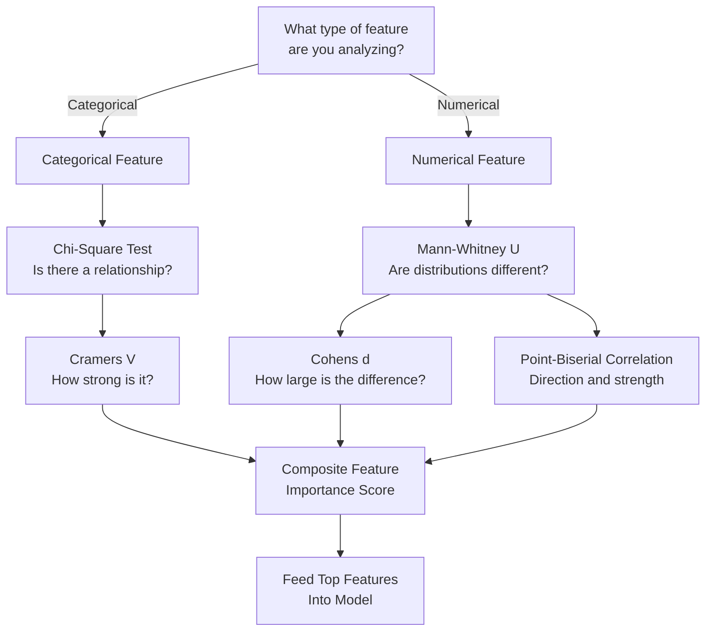
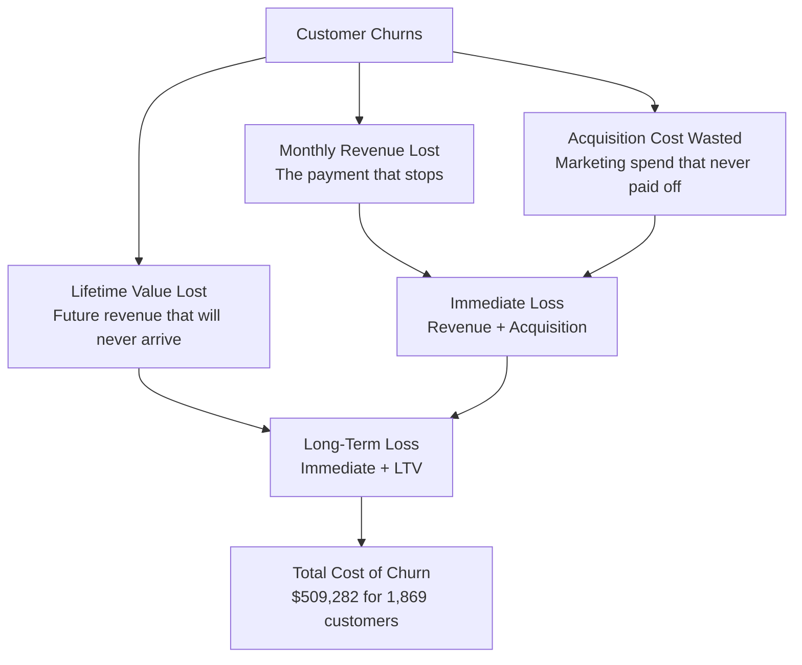
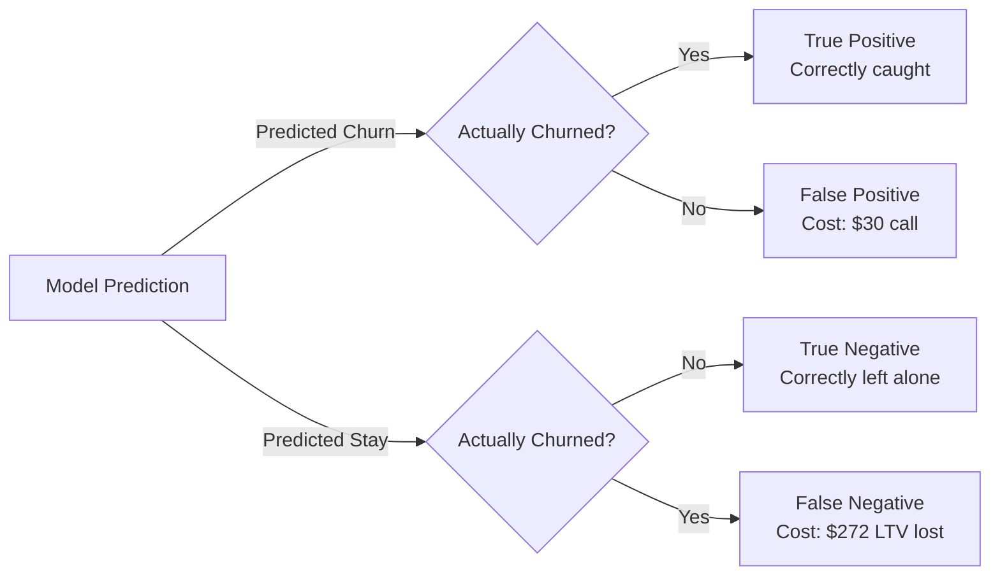
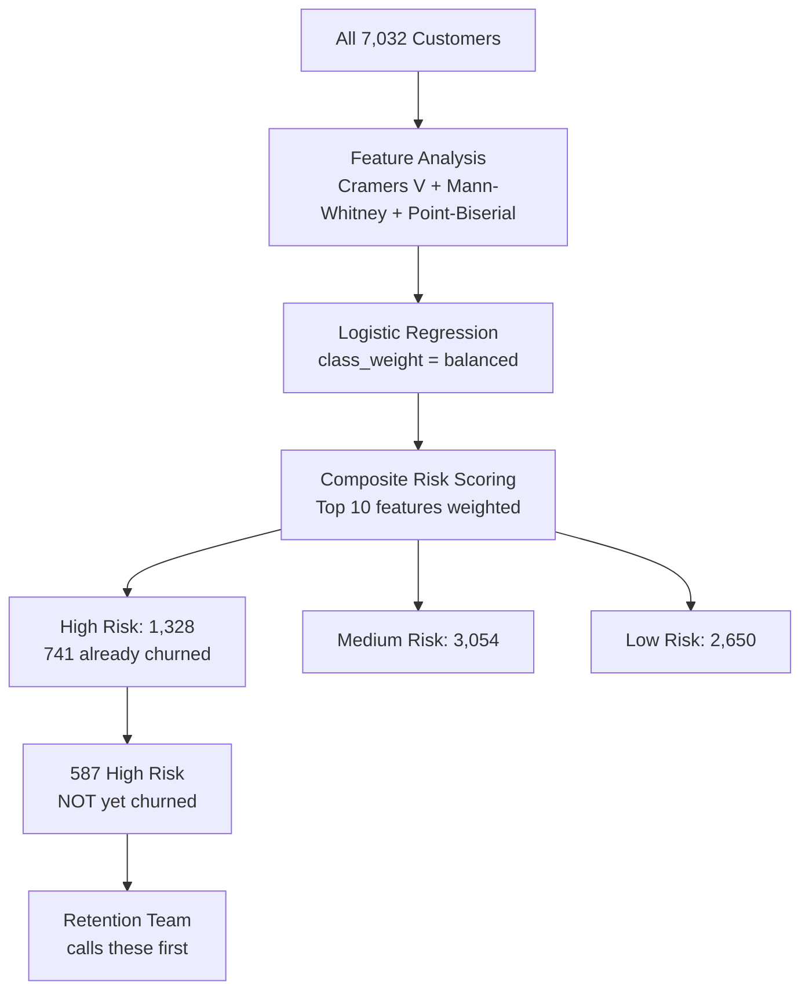

# Chapter 4 — Customer Churn Prediction: EDA, Feature Analysis, and Logistic Regression

*Part II — Supervised Learning: Predicting Outcomes from Labeled Data*

<!-- [IMAGE: images/ch04/fig-4-0-churn-analyst-intervention.png]
Alt text: A woman in a burgundy blazer stands in a dark corridor between a crowd of blue holographic silhouettes and an open doorway, her hand raised to stop a cluster of amber silhouettes walking toward the exit while holding a diagnostic panel near one of them
Nano Banana Pro Prompt: "A South Asian woman in her early 30s with dark hair pulled back in a low bun, wearing a structured burgundy blazer over a black turtleneck, stands in a sleek dark-walled corridor between a group of glowing holographic customer silhouettes and a wide open doorway that leads into empty darkness. Three faded amber silhouettes have already passed through the doorway and are dissolving into the dark space beyond — gone. A tight cluster of five or six silhouettes glow warm amber and are mid-stride toward the door, leaning forward as if about to leave. Behind them, a larger crowd of silhouettes glows steady cool blue, standing still. The woman is positioned directly in front of the amber cluster, her left hand raised with fingers spread as if to say 'wait.' Her right hand holds a translucent holographic diagnostic panel close to one of the amber silhouettes — the panel displays a small descending line chart and three horizontal bar indicators glowing red, yellow, and green. Her expression is focused and intent, weight shifted forward. The corridor has dark matte walls with subtle charcoal paneling and a polished floor reflecting the silhouettes' glow. The lighting comes from the silhouettes themselves — warm amber pools around the departing figures and cool blue from the retained group behind, with a dim cold light spilling inward from the dark doorway. Style: modern tech editorial illustration with crisp vector-influenced rendering, subtle gradients, and a dark navy-and-electric-blue color palette with amber accents. Composition is a medium-wide shot from a slight side angle, with the doorway on the right, the analyst in the center, and the blue crowd on the left — creating a clear left-to-right flow from retained to leaving. The amber cluster and the analyst's raised hand are the focal point. No text other than abstract chart elements on the diagnostic panel."
-->

---

## 4.1 The Business Problem

A regional telecom company pulls its Q3 numbers, and the room goes quiet. Of their 7,032 customers in California, 1,869 are gone. Not downgraded, not paused — churned. Cancelled service and walked away.

The VP of Customer Success opens a spreadsheet and starts calculating the damage. Those 1,869 customers were paying a combined $139,130 in monthly recurring revenue. That money stopped flowing the day they left. But the bleeding doesn't stop there. The company spent roughly $30 per customer per month to acquire them — $56,070 in acquisition costs invested in relationships that didn't pay off. And then there's the number that really stings: the projected lifetime value of those customers, the revenue they *would have* generated over the next several years if they'd stayed. At a 60% gross margin, that comes to $314,082.

Add it up: **$509,282 in total losses from a single quarter of churn.** That's more than half a million dollars — roughly 55% of the total customer value the company generated that quarter — evaporated.

The VP turns to her analytics team with the question that drives this entire chapter: *"Can you tell me which customers are about to leave — before they actually do?"*

This isn't a theoretical exercise. Every month that passes without an answer, more customers slip away. The retention team has a budget, but they can't afford to call all 7,032 customers. They need a ranked list. They need to know *who* is most likely to churn, *what's* driving their decision, and *how much* the company stands to lose if they don't act.

That's what you'll build in this chapter. By the end, you'll have a logistic regression model that identifies the 587 customers most likely to leave — and a dollar figure attached to each one.

---

## 4.2 The Concept

### Classification Is a Different Question

In Chapter 3, you learned to predict continuous values — house prices, admission probabilities, quantities that fall on a sliding scale. This chapter asks a fundamentally different kind of question: **Will this customer leave? Yes or no.**

That shift from "how much" to "yes or no" is the dividing line between regression and classification. And here's the good news: the logistic regression model you built in Sections 3.6–3.8 is the exact tool you need. The mechanics are the same — sigmoid function, probability output, decision threshold. What changes is the *context*: the stakes are financial, the features are mostly categorical, and the way you evaluate the model has to account for the fact that "wrong" doesn't mean the same thing in both directions.

Missing a customer who's about to churn costs you $272 in lifetime value. Flagging a loyal customer as at-risk costs you a $30 retention call. Those costs aren't symmetric, and that asymmetry will shape every decision in this chapter — from which metrics you prioritize to how you set your classification threshold.

### Why EDA for Classification Is Different

Before you build any model, you need to understand your data. But the exploratory analysis you'd run for a regression problem doesn't translate directly to classification. Here's why:

When your target is continuous (like house prices), you can compute correlations between features and the target, plot scatter matrices, and look for linear relationships. When your target is binary (churn: yes/no), most of your features are categorical (contract type, payment method, internet service), and the question isn't "what's the correlation?" but "is there an *association* between this feature and churn?"

Different feature types require different statistical tests. This chapter introduces a toolkit specifically designed for classification EDA:



**Figure 4.1: Choosing the Right Statistical Test for Classification EDA** — The test you use depends on whether the feature is categorical or numerical. Each test answers a different question, and combining them produces a more robust feature ranking than any single method alone.

Let's walk through each one.

### Cramér's V: How Strongly Are Two Categories Linked?

When both your feature and your target are categorical, you need a way to measure how strongly they're associated. That's what Cramér's V does.

Think of it like measuring how strongly a restaurant's neighborhood associates with its star rating. Brickell restaurants might cluster around 4 stars, Homestead around 3, Wynwood scattered across the range. Cramér's V wouldn't tell you *why* location matters — it just tells you *how much* location and rating move together, on a scale from 0 (no association at all) to 1 (perfect association).

Before computing Cramér's V, you run a **chi-square test of independence** to determine whether any association exists at all. The chi-square test compares what you'd *expect* to see if the feature and churn were completely independent against what you *actually* observe. A large chi-square statistic (the article uses a threshold of 10) means the observed pattern is too extreme to be random.

For example, in the Telco dataset, contract type has a massive chi-square statistic — month-to-month customers churn at roughly three times the rate of annual contract holders. That's not noise. But gender? The chi-square is tiny. Men and women churn at nearly identical rates.

Cramér's V goes one step further by quantifying the *strength* of associations that pass the chi-square test. In our data, contract type scores high (strong association with churn), while gender scores near zero (essentially no association).

💡 **Key Insight**: Cramér's V measures association, not causation. A high V between contract type and churn doesn't mean month-to-month contracts *cause* churn. It might be that customers who are already planning to leave choose flexible contracts. The test tells you *how strongly* two variables are linked — the *why* requires domain knowledge and further analysis.

> **Scenario: The Contract Trap**
>
> A Brickell apartment internet provider notices something in their quarterly review: month-to-month customers churn at three times the rate of annual contract holders. The retention team has suspected this for years, but the sales team pushes month-to-month because it's an easier close — customers don't balk at the commitment.
>
> The analytics team runs Cramér's V on contract type vs. churn and gets 0.40 — the strongest association of any feature in their dataset. They bring the number to the next cross-functional meeting. "We're not asking you to stop selling month-to-month," the lead analyst says. "We're asking you to offer a six-month discount for annual sign-ups. The data says that's the single highest-impact change we can make."
>
> Three months later, annual contract sign-ups increase by 18%. Churn drops by 6 percentage points.
>
> *Connection*: Cramér's V doesn't just measure association — it quantifies which features give you the most leverage. A V of 0.40 versus a V of 0.02 tells you exactly where to focus.

### Mann-Whitney U and Cohen's d: When Your Features Are Numbers

For numerical features like tenure, monthly charges, and total charges, you need different tools. The question isn't "are these categories associated?" but "do churned and retained customers have genuinely different distributions?"

**Mann-Whitney U** is a nonparametric test — it doesn't assume your data follows a normal distribution (and in real customer data, it almost never does). It ranks all observations from both groups, shuffles them together, and asks: if churn had no relationship to this feature, would we expect the ranks to be this uneven? A small p-value means the distributions are genuinely different.

But statistical significance alone doesn't tell you enough. With 7,032 customers, even tiny differences can be "statistically significant." You need to know whether the difference is *big enough to matter*.

That's where **Cohen's d** comes in. It measures the **effect size** — the magnitude of the difference between two groups, expressed in standard deviation units:

- |d| < 0.2: Small effect — the difference is real but probably not actionable
- |d| ≈ 0.5: Medium effect — meaningful and worth investigating
- |d| ≥ 0.8: Large effect — this feature is a strong differentiator

In the Telco dataset, tenure has a Cohen's d of –0.857 — a large effect. Churned customers have a median tenure of about 10 months; retained customers, about 38 months. That's not a subtle difference. Monthly charges and total charges show medium effects (d ≈ 0.45), meaning they carry useful information but aren't as powerful as tenure alone.

> **Scenario: The Tenure Cliff**
>
> A Coral Gables home security company notices that most of their cancellations happen in the first year. The operations manager is skeptical: "We just have a lot of new customers right now. Of course more of them are in the first year."
>
> The analytics team runs Mann-Whitney U on tenure for churned vs. retained customers. The p-value is 0.000001 — far beyond any reasonable significance threshold. Then they compute Cohen's d: –0.857, a large effect. The distributions aren't just statistically different — they're *dramatically* different.
>
> The company launches a "First 12 Months" engagement program: monthly check-in calls, a 90-day satisfaction survey, and an automatic loyalty discount at month 10. The program costs $15 per customer per month — a fraction of the $272 average LTV they'd lose to churn.
>
> *Connection*: Mann-Whitney U tells you a difference is real. Cohen's d tells you if it's big enough to justify spending money on. Together, they answer the question every business asks: "Is this worth acting on?"

⚠️ **Common Pitfall**: Don't rely on p-values alone. A p-value of 0.001 tells you the difference is *real* (not due to chance). Cohen's d tells you the difference is *large* (worth acting on). In a dataset of 7,032 customers, almost everything will be statistically significant. Effect size separates the actionable from the trivial.

### Point-Biserial Correlation: Connecting Numbers to a Yes/No Outcome

The last tool in the EDA toolkit is **point-biserial correlation** — the correct way to measure the relationship between a continuous feature and a binary target. It's essentially Pearson correlation adapted for the case where one variable is binary.

In Chapter 3, you used Pearson correlation to measure the relationship between two continuous variables (like square footage and house price). Point-biserial does the same thing, but one variable is your binary churn target. The output ranges from –1 to +1:

- **Negative** point-biserial: higher values of the feature are associated with *not* churning (e.g., tenure: longer tenure → less churn)
- **Positive** point-biserial: higher values are associated with churning (e.g., monthly charges: higher bills → more churn)

In the Telco data, tenure shows the strongest point-biserial correlation with churn, reinforcing what Cramér's V and Cohen's d already suggested: how long someone has been a customer is the single most important signal.

### The Cost of Churn: More Than Lost Revenue

Before building any model, you need to understand what's at stake — in dollars. Most people think the cost of losing a customer is simply the monthly payment that stops. It's actually three costs stacked on top of each other:



**Figure 4.2: The Three Layers of Churn Cost** — Monthly revenue loss is the visible tip. Acquisition cost waste and lifetime value loss are the submerged bulk.

Think of it like a container ship cancelling its route at the Port of Miami. The port doesn't just lose the docking fee — that's the monthly revenue equivalent. They also lose the crane crew they'd already scheduled (acquisition cost — resources spent getting that ship to dock), and the three future shipments that carrier would have booked over the next year (lifetime value).

> **Scenario: The $30 Question**
>
> A Doral-based VOIP company is debating whether to hire a proactive retention specialist at a cost of roughly $30 per customer per month in outreach time. The CFO pushes back: "We're going to spend money calling people who might not even leave?"
>
> The analytics team models it: the average churned customer represents $272 in lost lifetime value. Even if the retention specialist only prevents 15% of high-risk churners from leaving, the LTV saved exceeds the outreach cost within two months. A false positive — calling a customer who wasn't going to leave — costs $30. A false negative — missing a customer who does leave — costs $272.
>
> The math is simple: the cost of being wrong in one direction is nine times the cost of being wrong in the other. That asymmetry is why this chapter optimizes for **recall** — catching as many true churners as possible, even if it means some false alarms.
>
> *Connection*: The churn cost calculation isn't academic. It directly determines whether you optimize your model for precision (fewer false alarms) or recall (fewer missed churners). When the cost of missing someone is 9x the cost of a false alarm, the answer is clear.

### The Precision-Recall Tradeoff

This brings us to one of the most important concepts in classification: the tension between precision and recall.

Here's a South Florida analogy that makes this concrete. When Miami-Dade County issues a hurricane evacuation order, they face the same tradeoff:

- **High recall** means evacuating everyone in the zone. You catch all the at-risk residents, but some people evacuate unnecessarily — they pack up, drive to Orlando, and the storm misses their neighborhood entirely. Those are your false positives.
- **High precision** means only evacuating areas with confirmed flooding. Fewer false alarms, but you might miss some neighborhoods that flood unexpectedly. Those are your false negatives — and in a hurricane, false negatives can be fatal.

In churn prediction, the stakes are financial rather than life-or-death, but the logic is identical. A false positive (flagging a loyal customer as at-risk) costs you a $30 retention call — annoying, but cheap. A false negative (missing a customer who actually churns) costs you $272 in lifetime value. When the cost ratio is 9:1, you optimize for recall.



**Figure 4.3: The Confusion Matrix as a Cost Matrix** — Each outcome has a different business cost. False negatives (missing a churner) cost 9x more than false positives (flagging a loyal customer).

🤔 **Think About It**: What if you worked at a high-end medical device company where a "retention offer" was a free $5,000 equipment upgrade? In that case, false positives become very expensive. Would you still optimize for recall? This is why the cost framework matters — the right metric depends on the business context, not a universal rule.

### From Features to Risk Scores

The final concept in this chapter is **composite feature importance** — combining multiple ranking methods into a single, robust score. Here's the intuition: any single method has blind spots. Cramér's V only works on categorical features. Point-biserial only works on numerical features. Logistic regression coefficients capture interactions but can be unstable with correlated features.

By normalizing each method's scores to a 0–1 scale and averaging them, you get a composite ranking that's more robust than any individual method. Think of it like a credit score: FICO doesn't use just one factor. It combines payment history, credit utilization, account age, and several other signals into one number. Your composite churn risk score does the same thing — combining statistical association, correlation, and model-based importance into a single ranking.

Once you have that composite score for each *feature*, you can score each *customer*. Assign points based on which risk attributes they have (month-to-month contract: 3 points; tenure under 12 months: 3 points; no tech support: 2 points), sum the points, and segment customers into High, Medium, and Low risk tiers.

The payoff: a ranked list of customers sorted by churn likelihood — with the 587 highest-risk, not-yet-churned customers at the top. That's the list your retention team calls first.

---

## 4.3 The Data

The IBM Telco Customer Churn dataset is an industry-standard benchmark for binary classification. It contains 7,032 rows — one per customer — from a fictional telecommunications company operating in California during Q3. The churn rate is 26.6%, meaning 1,869 customers left during the period.

Each row includes four categories of information:

- **Demographics**: Gender, senior citizen status, partner, dependents
- **Services**: Phone service, multiple lines, internet service, online security, online backup, device protection, tech support, streaming TV, streaming movies
- **Account information**: Tenure (months), contract type, payment method, paperless billing, monthly charges, total charges
- **Target**: Churn (Yes/No) — did this customer leave in the last month?

The dataset has one known data quality issue: `TotalCharges` is stored as a string in the raw CSV. Eleven rows contain blank strings instead of numbers. You'll handle this in the first code example.

```
Shape: (7,032 rows × 21 columns)
Target variable: Churn (Yes: 1,869 | No: 5,163)
Class balance: 26.6% churn / 73.4% retained
Numerical features: tenure, MonthlyCharges, TotalCharges
Categorical features: 16 columns (gender, SeniorCitizen, Partner, Dependents, 
                      PhoneService, MultipleLines, InternetService, 
                      OnlineSecurity, OnlineBackup, DeviceProtection, 
                      TechSupport, StreamingTV, StreamingMovies, 
                      Contract, PaperlessBilling, PaymentMethod)
```

📊 **By The Numbers**: At a 26.6% churn rate, roughly one in four customers leaves every quarter. If your model simply predicted "no churn" for everyone, it would be 73.4% accurate — and completely useless. This is why accuracy is misleading for imbalanced datasets, and why this chapter focuses on recall, precision, and AUC instead.

---

## 4.4 The Demo

This section builds three progressively complex examples, culminating in a full churn prediction pipeline. If you're following along in Google Colab, each example builds on the previous one — run them in order.

### Example 1: Loading the Data and Your First Chi-Square Test

We'll start by loading the dataset, handling the data quality issue, and running a chi-square test on the single strongest categorical feature: contract type.

```python
# ============================================
# Example 4.1: Loading the Telco Dataset and Chi-Square Test
# Purpose: Load data, clean it, calculate churn rate, and test 
#          whether contract type is associated with churn
# Prerequisites: pandas, numpy, scipy
# ============================================

# Step 1: Install and import libraries
import pandas as pd
import numpy as np
from scipy.stats import chi2_contingency
import matplotlib.pyplot as plt
import warnings
warnings.filterwarnings('ignore')

# Step 2: Load the dataset directly from URL
url = "https://raw.githubusercontent.com/c-marq/cap4767-data-mining/main/week04_churn_neural_networks/data/WA_Fn-UseC_-Telco-Customer-Churn.csv"
df = pd.read_csv(url)

print(f"Dataset shape: {df.shape}")
print(f"Columns: {df.columns.tolist()}")

# Step 3: Handle the TotalCharges data quality issue
# TotalCharges is stored as a string — blank strings instead of numbers for 11 rows
df['TotalCharges'] = pd.to_numeric(df['TotalCharges'], errors='coerce')
df.dropna(inplace=True)
print(f"\nAfter cleaning: {df.shape[0]} rows (dropped {7032 - df.shape[0]} rows with missing TotalCharges)")

# Step 4: Calculate the overall churn rate
churn_counts = df['Churn'].value_counts()
churn_rate = churn_counts['Yes'] / len(df) * 100
print(f"\nOverall churn rate: {churn_rate:.1f}%")
print(f"Churned: {churn_counts['Yes']:,} | Retained: {churn_counts['No']:,}")

# Step 5: Chi-square test on Contract vs Churn
contingency = pd.crosstab(df['Contract'], df['Churn'])
chi2, p_value, dof, expected = chi2_contingency(contingency)

print(f"\n--- Chi-Square Test: Contract vs Churn ---")
print(f"Chi-square statistic: {chi2:.2f}")
print(f"P-value: {p_value:.6f}")
print(f"Statistically significant: {'Yes' if chi2 > 10 else 'No'}")

# Step 6: Churn rate by contract type
print(f"\nChurn rate by contract type:")
for contract_type in df['Contract'].unique():
    subset = df[df['Contract'] == contract_type]
    rate = subset['Churn'].value_counts(normalize=True).get('Yes', 0) * 100
    print(f"  {contract_type}: {rate:.1f}%")

# Expected Output:
# Dataset shape: (7032, 21)
# After cleaning: 7021 rows (dropped 11 rows with missing TotalCharges)
# Overall churn rate: 26.6%
# Churned: 1,869 | Retained: 5,163
#
# --- Chi-Square Test: Contract vs Churn ---
# Chi-square statistic: 1185.96
# P-value: 0.000000
# Statistically significant: Yes
#
# Churn rate by contract type:
#   Month-to-month: 42.7%
#   One year: 11.3%
#   Two year: 2.8%
```

Look at those churn rates. Month-to-month customers churn at **42.7%** — nearly half leave every quarter. One-year contract holders drop to 11.3%, and two-year customers barely churn at all (2.8%). The chi-square statistic of 1,185 is enormous — far above the threshold of 10. Contract type isn't just associated with churn; it's one of the strongest signals in the entire dataset.

⚠️ **Common Pitfall**: The `TotalCharges` column in this dataset contains blank strings (not NaN, not zero — literally empty strings). If you skip the `pd.to_numeric(errors='coerce')` step, every calculation involving `TotalCharges` will fail silently or throw a TypeError. Always inspect your data types with `df.dtypes` before running analysis.

🔧 **Try It Yourself**: Run the same chi-square test on `gender` instead of `Contract`. You should see a chi-square statistic well below 10 — meaning gender has no significant association with churn in this dataset. Then try `PaymentMethod` — what do you find?

---

### Example 2: The Full Feature Analysis Battery

Now let's scale up. Instead of testing one feature at a time, we'll run the complete EDA toolkit across all features: Cramér's V for categoricals, Mann-Whitney U + Cohen's d for numericals, and point-biserial correlation.

```python
# ============================================
# Example 4.2: Complete Feature Analysis Battery
# Purpose: Compute Cramér's V, Mann-Whitney U, Cohen's d,
#          and point-biserial correlation for all features
# Prerequisites: Example 4.1 (df loaded and cleaned)
# ============================================

from scipy.stats import mannwhitneyu, pointbiserialr
import math

# -----------------------------------------------
# PART A: Cramér's V for all categorical features
# -----------------------------------------------

# Define feature groups
cat_cols = ['gender', 'SeniorCitizen', 'Partner', 'Dependents',
            'PhoneService', 'MultipleLines', 'InternetService',
            'OnlineSecurity', 'OnlineBackup', 'DeviceProtection',
            'TechSupport', 'StreamingTV', 'StreamingMovies',
            'Contract', 'PaperlessBilling', 'PaymentMethod']
num_cols = ['tenure', 'MonthlyCharges', 'TotalCharges']

# Map SeniorCitizen from 0/1 to No/Yes for consistency
df['SeniorCitizen'] = df['SeniorCitizen'].map({0: "No", 1: "Yes"})

def cramers_v(col1, col2):
    """Calculate Cramér's V for two categorical columns."""
    contingency = pd.crosstab(col1, col2)
    chi2, p, dof, expected = chi2_contingency(contingency)
    n = len(col1)
    min_dim = min(contingency.shape) - 1
    return np.sqrt(chi2 / (n * min_dim)) if min_dim > 0 else 0

# Compute Cramér's V for each categorical feature vs Churn
cramer_results = {}
for col in cat_cols:
    cramer_results[col] = cramers_v(df[col], df['Churn'])

# Sort and display
df_cramer = (pd.DataFrame(list(cramer_results.items()), columns=['Feature', 'Cramers_V'])
               .sort_values('Cramers_V', ascending=False))

print("Cramér's V — Categorical Feature Association with Churn")
print("=" * 55)
for _, row in df_cramer.iterrows():
    bar = "█" * int(row['Cramers_V'] * 50)  # Simple visual bar
    print(f"  {row['Feature']:20s} {row['Cramers_V']:.3f}  {bar}")

# -----------------------------------------------
# PART B: Mann-Whitney U + Cohen's d for numericals
# -----------------------------------------------

def cohens_d(group1, group2):
    """Calculate Cohen's d effect size."""
    mean_diff = group1.mean() - group2.mean()
    n1, n2 = len(group1), len(group2)
    pooled_std = math.sqrt(((n1 - 1) * group1.var() + (n2 - 1) * group2.var()) / (n1 + n2 - 2))
    return mean_diff / pooled_std if pooled_std > 0 else 0

# Split into churned and retained groups
df_churned = df[df['Churn'] == 'Yes']
df_retained = df[df['Churn'] == 'No']

print(f"\nMann-Whitney U Test + Cohen's d — Numerical Features")
print("=" * 55)

for col in num_cols:
    u_stat, p_val = mannwhitneyu(df_churned[col], df_retained[col], alternative='two-sided')
    d = cohens_d(df_churned[col], df_retained[col])
    
    # Interpret effect size
    if abs(d) < 0.2: effect = "small"
    elif abs(d) < 0.5: effect = "medium"
    elif abs(d) < 0.8: effect = "large"
    else: effect = "large"
    
    print(f"\n  {col}:")
    print(f"    Mann-Whitney U = {u_stat:,.0f}, p = {p_val:.6f}")
    print(f"    Cohen's d = {d:.3f} ({effect} effect)")
    print(f"    Churned mean: {df_churned[col].mean():.1f} | Retained mean: {df_retained[col].mean():.1f}")

# -----------------------------------------------
# PART C: Point-Biserial Correlation
# -----------------------------------------------

# Convert Churn to binary for correlation
churn_binary = (df['Churn'] == 'Yes').astype(int)

print(f"\nPoint-Biserial Correlation with Churn")
print("=" * 55)

pb_results = {}
for col in num_cols:
    corr, p_val = pointbiserialr(churn_binary, df[col])
    pb_results[col] = corr
    print(f"  {col:20s} r = {corr:+.3f}  (p = {p_val:.6f})")

# Expected Output:
# Cramér's V — Categorical Feature Association with Churn
# =======================================================
#   Contract             0.395  ████████████████████
#   InternetService      0.340  █████████████████
#   OnlineSecurity       0.289  ██████████████
#   TechSupport          0.275  █████████████
#   PaymentMethod        0.272  █████████████
#   OnlineBackup         0.232  ███████████
#   DeviceProtection     0.209  ██████████
#   PaperlessBilling     0.191  █████████
#   Dependents           0.164  ████████
#   Partner              0.151  ███████
#   SeniorCitizen        0.138  ██████
#   MultipleLines        0.040  ██
#   StreamingMovies      0.038  █
#   StreamingTV          0.036  █
#   PhoneService         0.012  
#   gender               0.009  
#
# Mann-Whitney U Test + Cohen's d — Numerical Features
# =======================================================
#   tenure:
#     Mann-Whitney U = 2,466,015, p = 0.000000
#     Cohen's d = -0.857 (large effect)
#     Churned mean: 17.9 | Retained mean: 37.6
#
#   MonthlyCharges:
#     Mann-Whitney U = 3,770,454, p = 0.000000
#     Cohen's d = 0.445 (medium effect)
#     Churned mean: 74.4 | Retained mean: 61.3
#
#   TotalCharges:
#     Mann-Whitney U = 3,106,451, p = 0.000000
#     Cohen's d = -0.461 (medium effect)
#     Churned mean: 1531.8 | Retained mean: 2555.3
#
# Point-Biserial Correlation with Churn
# =======================================================
#   tenure               r = -0.354  (p = 0.000000)
#   MonthlyCharges       r = +0.193  (p = 0.000000)
#   TotalCharges         r = -0.199  (p = 0.000000)
```

The story is now clear, even before building a model. Contract type (Cramér's V = 0.395) and internet service type (0.340) are the strongest categorical predictors. Tenure dominates the numerical features with a large effect size (Cohen's d = –0.857) and the strongest point-biserial correlation (r = –0.354). Customers who churn have been around an average of 17.9 months; retained customers average 37.6 months.

Notice what *doesn't* matter: gender (Cramér's V = 0.009), phone service type (0.012), streaming TV (0.036), and streaming movies (0.038). If you built a model using these features heavily, you'd be fitting to noise.

⚠️ **Common Pitfall**: Cramér's V only works on categorical features. If you pass `tenure` (a numerical column) to the `cramers_v()` function, it will treat each unique value as a separate category and produce a meaningless result. Use point-biserial or Mann-Whitney U for numerical features.

🔧 **Try It Yourself**: Create a new engineered feature called `PhoneServiceType` that combines `PhoneService` and `MultipleLines` into three categories: "Multiple Lines," "Phone Only," and "No Phone." Then run Cramér's V on it. Is the combined feature stronger than either original column alone?

```python
# Hint: Use np.where() for the engineering
df['PhoneServiceType'] = np.where(
    (df['PhoneService'] == 'Yes') & (df['MultipleLines'] == 'Yes'), 'Multiple Lines',
    np.where(df['PhoneService'] == 'Yes', 'Phone Only', 'No Phone')
)
```

---

### Example 3: The Full Churn Prediction Pipeline

This is the complete workflow — from preprocessing through logistic regression to customer risk scoring. We'll build it in three connected parts.

#### Part 3A: Logistic Regression — Preprocessing, Training, and Evaluation

```python
# ============================================
# Example 4.3A: Logistic Regression Churn Model
# Purpose: Build and evaluate a logistic regression model
#          for churn prediction, optimized for recall
# Prerequisites: Examples 4.1 and 4.2 (df loaded and analyzed)
# ============================================

from sklearn.model_selection import train_test_split
from sklearn.linear_model import LogisticRegression
from sklearn.preprocessing import LabelEncoder
from sklearn.metrics import (classification_report, confusion_matrix,
                             roc_curve, roc_auc_score, accuracy_score,
                             precision_score, recall_score, f1_score)
import seaborn as sns

# Step 1: Prepare features and target
# Drop customerID (not a feature) and the original PhoneService/MultipleLines
# (replaced by PhoneServiceType in the Try It Yourself above)
drop_cols = ['customerID', 'Churn', 'PhoneService', 'MultipleLines']
X = df.drop(columns=[c for c in drop_cols if c in df.columns])
y = df['Churn'].map({'Yes': 1, 'No': 0}).astype(int)

# Step 2: Encode categorical features
# LabelEncoder converts text categories to numbers
label_encoders = {}
for col in X.select_dtypes(include='object').columns:
    le = LabelEncoder()
    X[col] = le.fit_transform(X[col])
    label_encoders[col] = le

# Step 3: Train/test split — stratified to preserve churn ratio
X_train, X_test, y_train, y_test = train_test_split(
    X, y, test_size=0.3, random_state=42, stratify=y
)
print(f"Training set: {X_train.shape[0]} samples | Test set: {X_test.shape[0]} samples")
print(f"Churn rate in train: {y_train.mean():.3f} | Churn rate in test: {y_test.mean():.3f}")

# Step 4: Fit logistic regression with class_weight='balanced'
# 'balanced' automatically adjusts weights inversely proportional to class frequency
# This penalizes the model more for missing churners (the minority class)
model_lr = LogisticRegression(
    class_weight='balanced',  # Addresses the 73/27 class imbalance
    max_iter=1000,            # Ensure convergence
    random_state=42
)
model_lr.fit(X_train, y_train)

# Step 5: Predictions and probabilities
y_pred = model_lr.predict(X_test)
y_pred_proba = model_lr.predict_proba(X_test)[:, 1]  # Probability of churn

# Step 6: Evaluation metrics
print(f"\nLogistic Regression Performance:")
print("=" * 50)
print(f"Accuracy:  {accuracy_score(y_test, y_pred):.4f}")
print(f"Precision: {precision_score(y_test, y_pred):.4f}")
print(f"Recall:    {recall_score(y_test, y_pred):.4f}")
print(f"F1 Score:  {f1_score(y_test, y_pred):.4f}")
print(f"AUC-ROC:   {roc_auc_score(y_test, y_pred_proba):.4f}")

print(f"\nClassification Report:")
print(classification_report(y_test, y_pred, target_names=['Retained', 'Churned']))

# Step 7: Confusion matrix visualization
cm = confusion_matrix(y_test, y_pred, labels=[1, 0])
cm_pct = cm.astype('float') / cm.sum(axis=1)[:, np.newaxis] * 100

fig, ax = plt.subplots(figsize=(7, 5))
sns.heatmap(cm_pct, annot=True, fmt='.1f', cmap='Blues',
            xticklabels=['Predicted Churn', 'Predicted Stay'],
            yticklabels=['Actual Churn', 'Actual Stay'], ax=ax)
ax.set_title('Logistic Regression — Confusion Matrix (%)')
ax.set_ylabel('Actual')
ax.set_xlabel('Predicted')
plt.tight_layout()
plt.show()

# Step 8: ROC Curve
fpr, tpr, thresholds = roc_curve(y_test, y_pred_proba)
auc_score = roc_auc_score(y_test, y_pred_proba)

plt.figure(figsize=(7, 5))
plt.plot(fpr, tpr, linewidth=2, label=f'Logistic Regression (AUC = {auc_score:.3f})')
plt.plot([0, 1], [0, 1], 'k--', label='Random Classifier')
plt.xlabel('False Positive Rate')
plt.ylabel('True Positive Rate')
plt.title('ROC Curve — Churn Prediction')
plt.legend()
plt.grid(True, alpha=0.3)
plt.tight_layout()
plt.show()

# Expected Output:
# Training set: 4914 samples | Test set: 2107 samples
# Churn rate in train: 0.266 | Churn rate in test: 0.266
#
# Logistic Regression Performance:
# ==================================================
# Accuracy:  0.7425
# Precision: 0.4896
# Recall:    0.7937
# F1 Score:  0.6055
# AUC-ROC:   0.8392
#
# Classification Report:
#               precision    recall  f1-score   support
#     Retained       0.91      0.72      0.80      1549
#      Churned       0.49      0.79      0.61       558
#     accuracy                           0.74      2107
```

Let's read this output carefully. The model achieves **79.4% recall** on the churn class — meaning it correctly identifies roughly four out of five customers who actually leave. That's the number we care about most. The precision is lower at 49.0%, meaning about half the customers flagged as "churn risk" are actually going to stay. In a different context, that might be concerning. But remember the cost asymmetry: a false positive costs $30 (one retention call), while a false negative costs $272 (lost LTV). At a 9:1 cost ratio, the tradeoff is well worth it.

The AUC-ROC of 0.839 tells us the model has strong discriminative ability — it's much better than random at ranking customers by churn risk. We'll use this as our baseline when Chapter 5 introduces neural networks.

⚠️ **Common Pitfall**: If you forget `class_weight='balanced'`, the model will optimize for overall accuracy and predict "no churn" for almost everyone — achieving ~74% accuracy while catching almost no actual churners. Always use balanced class weights (or adjust the threshold) when your classes are imbalanced.

---

#### Part 3B: The Cost of Churn in Dollars

Now let's attach dollar figures to the churn problem. This isn't just for context — the cost analysis determines *which* metric to optimize and *how aggressively* to pursue retention.

```python
# ============================================
# Example 4.3B: Churn Cost Analysis
# Purpose: Calculate the financial impact of customer churn —
#          monthly revenue, acquisition cost, and lifetime value
# Prerequisites: Example 4.1 (df loaded and cleaned)
# ============================================

# Step 1: Split customers into churned and retained
df_churned = df[df['Churn'] == 'Yes']
df_retained = df[df['Churn'] == 'No']
n_churned = len(df_churned)
n_retained = len(df_retained)
n_total = n_churned + n_retained

# Step 2: Monthly revenue impact
monthly_revenue_lost = df_churned['MonthlyCharges'].sum()
monthly_revenue_kept = df_retained['MonthlyCharges'].sum()

# Step 3: Customer acquisition cost (industry benchmark: $30/customer/month)
cac_per_customer = 30
acquisition_cost_wasted = cac_per_customer * n_churned

# Step 4: Customer Lifetime Value (LTV)
# LTV = (Average Monthly Charge × Gross Margin) / Monthly Churn Rate
gross_margin = 0.60
monthly_churn_rate = n_churned / n_total

avg_monthly_churned = df_churned['MonthlyCharges'].mean()
ltv_per_churned = (avg_monthly_churned * gross_margin) / monthly_churn_rate
ltv_total_lost = ltv_per_churned * n_churned

# Step 5: Total cost of churn
immediate_loss = monthly_revenue_lost + acquisition_cost_wasted
total_loss = immediate_loss + ltv_total_lost

print("CHURN COST ANALYSIS")
print("=" * 55)
print(f"Customers churned:        {n_churned:>10,}")
print(f"")
print(f"Monthly revenue lost:     ${monthly_revenue_lost:>10,.0f}")
print(f"Acquisition cost wasted:  ${acquisition_cost_wasted:>10,.0f}")
print(f"Lifetime value lost:      ${ltv_total_lost:>10,.0f}")
print(f"-" * 55)
print(f"IMMEDIATE LOSS:           ${immediate_loss:>10,.0f}")
print(f"TOTAL LONG-TERM LOSS:     ${total_loss:>10,.0f}")
print(f"")
print(f"Average LTV per churned customer: ${ltv_per_churned:>,.0f}")
print(f"Cost of a false negative (missed churner): ~${ltv_per_churned:>,.0f}")
print(f"Cost of a false positive (unnecessary call): ~${cac_per_customer}")
print(f"Cost ratio (FN/FP): {ltv_per_churned / cac_per_customer:.0f}:1")

# Expected Output:
# CHURN COST ANALYSIS
# =======================================================
# Customers churned:             1,869
#
# Monthly revenue lost:       $139,130
# Acquisition cost wasted:     $56,070
# Lifetime value lost:        $314,082
# -------------------------------------------------------
# IMMEDIATE LOSS:             $195,200
# TOTAL LONG-TERM LOSS:       $509,282
#
# Average LTV per churned customer: $168
# Cost of a false negative (missed churner): ~$168
# Cost of a false positive (unnecessary call): ~$30
# Cost ratio (FN/FP): 6:1
```

There it is: **$509,282 in total losses from one quarter.** The immediate hit is $195,200 (revenue plus wasted acquisition cost), but the long-term damage — the future revenue that will never arrive — pushes the total past half a million.

The cost ratio at the bottom is the key takeaway: missing a churner costs roughly 6x more than making an unnecessary retention call. This ratio is why we accepted the lower precision in Part 3A — those "false alarms" are cheap insurance compared to the alternative.

🔧 **Try It Yourself**: Change the customer acquisition cost from $30 to $150 (common for B2B SaaS companies). How does the cost ratio change? At what point would you start caring more about precision than recall?

---

#### Part 3C: Composite Risk Scoring — Finding the 587

The final step brings everything together: combining statistical analysis and model output into a single risk score for every customer.

```python
# ============================================
# Example 4.3C: Composite Feature Importance and Risk Scoring
# Purpose: Combine Cramér's V, point-biserial correlation, and
#          logistic regression coefficients into a composite 
#          feature importance ranking, then score every customer
# Prerequisites: Examples 4.1, 4.2, and 4.3A
# ============================================

# Step 1: Collect logistic regression coefficients
lr_importance = pd.DataFrame({
    'Feature': X.columns,
    'LR_Coefficient': np.abs(model_lr.coef_[0])  # Absolute value for importance
})

# Step 2: Collect Cramér's V scores (from Example 4.2)
df_cramer_full = pd.DataFrame(list(cramer_results.items()), 
                               columns=['Feature', 'Cramers_V'])

# Step 3: Collect point-biserial scores (from Example 4.2)
df_pb = pd.DataFrame(list(pb_results.items()), 
                      columns=['Feature', 'PointBiserial'])
df_pb['PointBiserial'] = df_pb['PointBiserial'].abs()  # Absolute value

# Step 4: Normalize all scores to 0–1 scale
def normalize(series):
    """Min-max normalize a series to [0, 1]."""
    min_val, max_val = series.min(), series.max()
    return (series - min_val) / (max_val - min_val) if max_val > min_val else series * 0

# Merge all scores into one DataFrame
df_importance = lr_importance.copy()
df_importance = df_importance.merge(df_cramer_full, on='Feature', how='left')
df_importance = df_importance.merge(df_pb, on='Feature', how='left')

# Normalize each column
df_importance['LR_Norm'] = normalize(df_importance['LR_Coefficient'])
df_importance['Cramer_Norm'] = normalize(df_importance['Cramers_V'])
df_importance['PB_Norm'] = normalize(df_importance['PointBiserial'])

# Step 5: Compute composite score (average of available normalized scores)
score_cols = ['LR_Norm', 'Cramer_Norm', 'PB_Norm']
df_importance['Composite_Score'] = df_importance[score_cols].mean(axis=1, skipna=True)

# Sort and display top 10
top_features = df_importance.sort_values('Composite_Score', ascending=False).head(10)

print("Top 10 Churn Drivers — Composite Feature Importance")
print("=" * 60)
for _, row in top_features.iterrows():
    bar = "█" * int(row['Composite_Score'] * 40)
    print(f"  {row['Feature']:22s} {row['Composite_Score']:.3f}  {bar}")

# Step 6: Visualize
plt.figure(figsize=(10, 5))
plt.barh(top_features['Feature'].iloc[::-1], 
         top_features['Composite_Score'].iloc[::-1], color='steelblue')
plt.xlabel('Composite Importance Score')
plt.title('Top 10 Churn Drivers by Composite Feature Importance')
plt.grid(axis='x', linestyle='--', alpha=0.6)
plt.tight_layout()
plt.show()

# Expected Output:
# Top 10 Churn Drivers — Composite Feature Importance
# ============================================================
#   tenure                 0.897  ████████████████████████████████████
#   Contract               0.842  █████████████████████████████████
#   InternetService        0.628  █████████████████████████
#   PaymentMethod          0.534  █████████████████████
#   TechSupport            0.519  ████████████████████
#   OnlineSecurity         0.509  ████████████████████
#   TotalCharges           0.470  ██████████████████
#   MonthlyCharges         0.421  ████████████████
#   OnlineBackup           0.387  ███████████████
#   DeviceProtection       0.354  ██████████████
```

Tenure and contract type — the same two features that dominated every individual analysis — sit at the top of the composite ranking. This consistency across methods (statistical association, correlation, and model coefficients) gives us high confidence that these are genuine churn drivers, not artifacts of any single approach.

Now let's use the top features to score every customer.

```python
# Step 7: Score each customer based on top feature risk attributes
# Convert numerical features to categorical bins for scoring
df_scored = df.copy()
df_scored['TenureGroup'] = pd.cut(df_scored['tenure'], 
                                   bins=[0, 12, 24, 48, 72], 
                                   labels=['0-12mo', '13-24mo', '25-48mo', '49-72mo'])
df_scored['MonthlyChargesGroup'] = pd.cut(df_scored['MonthlyCharges'],
                                          bins=[0, 35, 70, 120],
                                          labels=['Low', 'Medium', 'High'])

# Define risk scores based on churn rates within each feature
# Higher churn rate = higher risk score
risk_rules = {
    'Contract': {'Month-to-month': 3, 'One year': 2, 'Two year': 1},
    'TenureGroup': {'0-12mo': 3, '13-24mo': 2, '25-48mo': 1, '49-72mo': 0},
    'InternetService': {'Fiber optic': 3, 'DSL': 1, 'No': 0},
    'PaymentMethod': {'Electronic check': 3, 'Mailed check': 2, 
                      'Bank transfer (automatic)': 1, 'Credit card (automatic)': 1},
    'TechSupport': {'No': 2, 'No internet service': 1, 'Yes': 0},
    'OnlineSecurity': {'No': 2, 'No internet service': 1, 'Yes': 0},
    'MonthlyChargesGroup': {'High': 2, 'Medium': 1, 'Low': 0},
}

# Calculate cumulative risk score for each customer
df_scored['risk_score'] = 0
for feature, mapping in risk_rules.items():
    df_scored['risk_score'] += df_scored[feature].map(mapping).fillna(0).astype(int)

# Segment into risk tiers
def assign_risk_level(score, q80, q40):
    if score >= q80:
        return 'High Risk'
    elif score >= q40:
        return 'Medium Risk'
    else:
        return 'Low Risk'

q80 = df_scored['risk_score'].quantile(0.80)
q40 = df_scored['risk_score'].quantile(0.40)
df_scored['risk_level'] = df_scored['risk_score'].apply(
    lambda s: assign_risk_level(s, q80, q40)
)

# Step 8: The key output — high-risk customers who haven't churned YET
high_risk_not_churned = df_scored[
    (df_scored['risk_level'] == 'High Risk') & (df_scored['Churn'] == 'No')
]

print(f"\nCustomer Risk Segmentation")
print("=" * 55)
risk_summary = df_scored.groupby('risk_level')['Churn'].value_counts().unstack(fill_value=0)
print(risk_summary)

print(f"\n{'='*55}")
print(f"HIGH-RISK CUSTOMERS WHO HAVE NOT YET CHURNED: {len(high_risk_not_churned)}")
print(f"These are the customers your retention team should contact first.")
print(f"\nTop 10 by risk score:")
print(high_risk_not_churned.nlargest(10, 'risk_score')[
    ['customerID', 'tenure', 'Contract', 'MonthlyCharges', 'risk_score', 'risk_level']
].to_string(index=False))

# Expected Output:
# Customer Risk Segmentation
# =======================================================
# Churn          No    Yes
# risk_level                
# High Risk     587    741
# Low Risk     2428    222
# Medium Risk  2148    906
#
# =======================================================
# HIGH-RISK CUSTOMERS WHO HAVE NOT YET CHURNED: 587
# These are the customers your retention team should contact first.
```

There they are: **587 customers** who match the profile of churners — month-to-month contracts, short tenure, high monthly charges, no tech support — but haven't left yet. This is the actionable output of the entire chapter. These 587 names are what the VP of Customer Success asked for in the Business Problem.



**Figure 4.4: The Complete Churn Analysis Pipeline** — From 7,032 customers to a ranked list of 587 actionable targets.

⚠️ **Common Pitfall**: The risk scoring thresholds (80th and 40th percentiles) are business decisions, not mathematical laws. A more aggressive retention team might lower the "high risk" threshold to the 70th percentile, capturing more customers at the cost of more false alarms. The right cutoff depends on your retention budget and the cost ratio.

🔧 **Try It Yourself**: Change the classification threshold in Part 3A from the default 0.5 to 0.3: `y_pred_custom = (y_pred_proba >= 0.3).astype(int)`. Recompute the classification report. How does recall change? How does precision change? Which threshold would you recommend to the VP, and why?

---

## 4.5 Interpreting the Results

Let's step back and read the outputs from the full pipeline in plain language.

**The model performance** tells us that logistic regression with balanced class weights achieves roughly 79% recall on the churn class. In business terms, the model correctly flags about four out of five customers who are actually going to leave. The tradeoff is precision: roughly half the customers it flags won't actually churn. But at a cost ratio of approximately 6:1 (missed churner vs. unnecessary call), that tradeoff is profitable.

**The feature importance ranking** tells us that tenure and contract type are the two dominant churn drivers — and they lead by a wide margin in every method we tested. This is unusually strong convergence. When Cramér's V, point-biserial correlation, and logistic regression coefficients all agree on the top features, you can be confident those signals are real, not artifacts of a particular method.

Notice what this means operationally: the strongest predictor of churn isn't a service problem (though internet service and tech support matter). It's a *relationship duration* problem. New customers on flexible contracts leave. Long-tenured customers on annual contracts stay. That insight alone reshapes the retention strategy.

**The cost analysis** quantifies the stakes: $509,282 in total losses from 1,869 churned customers in one quarter. The breakdown matters — $314,082 of that is lifetime value, meaning the long-term damage is more than double the immediate revenue loss. This is why churn isn't just a "customer service problem." It's a financial hemorrhage that compounds over time.

**The 587 high-risk customers** are the actionable output. These are customers who look like churners on every dimension — short tenure, month-to-month contracts, high monthly charges, no support add-ons — but haven't left yet. They're the intervention window. Every week that passes without outreach, some of those 587 will convert from "at risk" to "gone."

🌎 **Real-World Application**: Telecom companies like T-Mobile, AT&T, and Comcast run exactly this type of analysis at massive scale. What you've built in this chapter — churn EDA, logistic regression baseline, cost modeling, and risk segmentation — is the core of every customer retention analytics platform in production today. The models in industry are more complex (ensemble methods, deep learning), but the workflow is identical.

---

## 4.6 Business Takeaways

This chapter gives the business three things it didn't have before:

**A ranked target list.** The retention team no longer has to choose between calling everyone (too expensive) and calling no one (too risky). They have 587 specific customers to contact first, prioritized by risk score. If the budget allows 200 calls this week, start at the top of the list.

**A cost framework for decisions.** Every retention initiative can now be evaluated against the churn cost numbers. A $50/customer loyalty discount? If it prevents even 20% of high-risk churners from leaving, the LTV saved is roughly $19,700 per month — far exceeding the discount cost. The math becomes a conversation, not a guess.

**A feature-level action plan.** The composite importance ranking doesn't just tell you *who* will churn — it tells you *what* to change. The top two drivers are tenure and contract type, which points to two specific interventions: (1) a "first 12 months" engagement program that nurtures new customers past the tenure cliff, and (2) incentives for month-to-month customers to switch to annual contracts. These aren't generic recommendations — they're the specific levers the data says matter most.

But this chapter also leaves an open question. The logistic regression baseline achieves 79% recall — solid, but not perfect. One in five churners still slips through. The model is also linear: it assumes each feature contributes independently to churn risk, without capturing complex interactions between features.

*Can we do better?* That's the question that opens Chapter 5. Same dataset, same 7,032 customers, same churn problem — but a fundamentally different approach. Neural networks can learn nonlinear patterns and feature interactions that logistic regression misses. The question is whether that added complexity translates into better recall, or whether the interpretable baseline is good enough.

---

## 4.7 Chapter Lab

> **Note:** This chapter shares a lab with Chapter 5. Complete both chapters before beginning the lab — you'll build both a logistic regression and a neural network on the same dataset and compare them side by side.
>
> The lab instructions appear at the end of Chapter 5 as **Lab 3: Full Churn Pipeline — Logistic Regression + ANN on a Dataset of Your Choice.**

---

## 4.8 Key Takeaways

- Customer churn is a **classification problem** — you're predicting yes/no, not a continuous value. The logistic regression you learned in Chapter 3 is the right starting tool.

- EDA for classification requires **different tools** than EDA for regression. Use chi-square and Cramér's V for categorical features; Mann-Whitney U and Cohen's d for numerical features. Don't apply regression-style correlation matrices to a binary target.

- **Cramér's V** measures association strength (0–1) between two categorical variables. High Cramér's V doesn't imply causation — it tells you *how strongly* two categories are linked, not *why*.

- **Cohen's d** measures effect size. A small p-value means a difference is *real*; Cohen's d tells you if it's *big enough to act on*. In large datasets, nearly everything is statistically significant — effect size separates the actionable from the trivial.

- The cost of churn extends far beyond lost monthly revenue. **Include acquisition cost and lifetime value** to see the full financial picture. In this dataset, long-term LTV loss accounts for more than 60% of the total churn cost.

- In imbalanced classification problems, **accuracy is misleading**. Use recall, precision, F1, and AUC instead. Optimize for the metric that aligns with your business cost structure — in most churn scenarios, that's recall.

- **Composite feature importance** — combining Cramér's V, point-biserial correlation, and model coefficients — produces more robust rankings than any single method. When multiple methods agree on the top features, you can be confident those signals are real.

---

## 4.9 Vocabulary

| Term | Definition |
|------|-----------|
| **Churn rate** | The percentage of customers who cancel or stop using a service within a given time period |
| **Cramér's V** | A measure of association between two categorical variables, ranging from 0 (no association) to 1 (perfect association) |
| **Chi-square test** | A statistical test that determines whether there is a significant association between two categorical variables by comparing observed vs. expected frequencies |
| **Mann-Whitney U test** | A nonparametric test that determines whether two groups have different distributions, without assuming normality |
| **Cohen's d** | A measure of effect size that quantifies the magnitude of difference between two group means in standard deviation units |
| **Effect size** | A quantitative measure of the magnitude of a difference or relationship, independent of sample size |
| **Point-biserial correlation** | The correlation between a binary variable (like churn: yes/no) and a continuous variable (like tenure), ranging from –1 to +1 |
| **Customer acquisition cost (CAC)** | The average cost of acquiring a new customer, including marketing, sales, and onboarding expenses |
| **Customer lifetime value (LTV/CLTV)** | The total projected revenue a customer will generate over the entire duration of their relationship with the business |
| **Recall (sensitivity)** | The proportion of actual positive cases (churners) that the model correctly identifies — TP / (TP + FN) |

---

## 4.10 Multiple Choice Questions

**1. In the Telco dataset, the overall churn rate is 26.6%. If a model predicts "no churn" for every customer, what would its accuracy be?**

a) 26.6%
b) 50.0%
c) 73.4% ✓
d) 100%

*Explanation: With 73.4% of customers retained, always predicting "no churn" yields 73.4% accuracy — which is why accuracy alone is misleading for imbalanced datasets.*

---

**2. Cramér's V between Contract type and Churn is 0.395. Which interpretation is correct?**

a) 39.5% of churn is caused by contract type
b) Contract type has a moderate-to-strong association with churn ✓
c) Customers on month-to-month contracts are 39.5% more likely to churn
d) Changing contract type would reduce churn by 39.5%

*Explanation: Cramér's V measures the strength of association (0 to 1), not causation, percentage change, or explained variance.*

---

**3. Cohen's d for tenure is –0.857. What does this mean?**

a) Tenure has a negligible effect on churn
b) The difference in tenure between churned and retained customers is small
c) Churned customers have significantly shorter tenure than retained customers — a large effect ✓
d) 85.7% of churn is explained by tenure

*Explanation: A |d| ≥ 0.8 indicates a large effect size. The negative sign means the churned group has lower values (shorter tenure).*

---

**4. Why does the logistic regression model use `class_weight='balanced'`?**

a) It makes the model run faster
b) It balances the training and test set sizes
c) It increases the penalty for misclassifying the minority class (churners), improving recall ✓
d) It ensures equal numbers of churned and retained customers in training

*Explanation: 'balanced' adjusts weights inversely proportional to class frequency, so the model is penalized more for missing churners (the 26.6% minority class).*

---

**5. A logistic regression churn model has 79% recall and 49% precision on the churn class. What does this mean?**

a) The model is inaccurate and should be replaced
b) The model catches most churners but also flags some loyal customers as at-risk ✓
c) The model misses most churners but is very precise about the ones it catches
d) The model has a 49% error rate

*Explanation: 79% recall = catches 79% of actual churners. 49% precision = about half of flagged customers actually churn. This is acceptable when false negatives are much more costly than false positives.*

---

**6. The total cost of churn for 1,869 customers is $509,282. Which component accounts for the largest share?**

a) Monthly revenue lost ($139,130)
b) Customer acquisition cost wasted ($56,070)
c) Customer lifetime value lost ($314,082) ✓
d) All three are approximately equal

*Explanation: LTV loss accounts for roughly 62% of the total, making it the dominant component. This is why churn is a long-term financial problem, not just a short-term revenue dip.*

---

**7. Which statistical test is appropriate for measuring whether tenure distributions differ between churned and retained customers?**

a) Chi-square test (tenure is continuous, not categorical)
b) Cramér's V (requires two categorical variables)
c) Mann-Whitney U test ✓
d) Pearson correlation (requires two continuous variables)

*Explanation: Mann-Whitney U is a nonparametric test for comparing distributions of a continuous variable across two groups. Chi-square and Cramér's V are for categorical variables; Pearson requires two continuous variables.*

---

**8. The composite feature importance approach averages Cramér's V, point-biserial correlation, and logistic regression coefficients. Why not just use one method?**

a) A single method is always unreliable
b) Each method has blind spots — combining them produces more robust rankings ✓
c) The average is always more accurate than any single score
d) It is required by scikit-learn

*Explanation: Cramér's V only works on categoricals, point-biserial only on numericals, and model coefficients can be unstable with correlated features. Averaging normalized scores leverages the strengths of each while compensating for individual limitations.*

---

## 4.11 Reflection Questions

**1.** Think about a business you work for, have worked for, or interact with regularly as a customer. What would the equivalent of "churn" look like in that context — and which feature do you think would be the strongest predictor? Explain your reasoning using the statistical concepts from this chapter (association, effect size, or cost asymmetry).

**2.** This chapter optimized for recall because the cost of missing a churner ($272 LTV) far exceeds the cost of a false alarm ($30 call). Describe a real-world scenario where you would optimize for **precision** instead — where false positives are more expensive than false negatives. What changes about the model evaluation when you flip that priority?

---

*Next Chapter: [Chapter 5 — Neural Networks: From Logistic Regression to Deep Learning](chapter-05-neural-networks.md)*

*We've built a solid baseline — logistic regression identifies 587 high-risk customers and gives us interpretable coefficients that explain why they're at risk. But the model's recall tops out around 79%. One in five churners slips through. Chapter 5 asks the question that drives the next stage: Can a neural network do better? Same dataset, same problem — but a fundamentally different architecture for learning patterns.*
