# Chapter 5 — Neural Networks: From Logistic Regression to Deep Learning


*Part II — Supervised Learning: Predicting Outcomes from Labeled Data*

---

## The Business Problem

In Chapter 4, we built something genuinely useful. Our logistic regression model scored every customer in the Telco dataset by churn probability, identified 587 high-risk customers who hadn't left yet, and gave the business a ranked list of people to call before it was too late. The model hit 79% recall on churners — meaning it caught roughly four out of every five customers who were about to walk out the door.

That's a real win. A retention team armed with that list could save the company hundreds of thousands of dollars.

But here's the question that keeps every data scientist up at night: *what if we're missing patterns?*

Logistic regression draws a single straight boundary through the data. If you're a customer with fiber optic internet, a month-to-month contract, and high monthly charges, the model adds up those risk factors linearly and gives you a churn probability. It's clean, it's interpretable, and it works.

But what if the *combination* of fiber optic internet and month-to-month contract is riskier than either factor alone would suggest? What if there's a nonlinear interaction between tenure and monthly charges — where short-tenure customers at $70/month behave completely differently from short-tenure customers at $100/month, in a way that a straight line can't capture?

That's the gap neural networks are designed to fill.

A telecommunications company in South Florida recently ran exactly this experiment. Their logistic regression model was catching 78% of churners. After deploying a neural network on the same data, they pushed that to 84%. Those six percentage points translated to 47 additional customers saved per quarter — worth approximately $142,000 in annual retained revenue.

In this chapter, you'll build a neural network from scratch using the same Telco dataset from Chapter 4. You'll start with a single neuron — which, as you'll discover, is secretly just logistic regression in disguise — then add layers and complexity until you have a genuine deep learning model. Along the way, you'll learn what "deep" actually means, why more layers don't automatically mean better results, and how to make the critical business decision: *is the improvement worth the tradeoff in interpretability?*

---

## The Concept

### 5.1 Can We Do Better? The Question That Motivates Neural Networks

Every modeling technique in data science exists because someone looked at an existing method and asked, "Can we do better?" Logistic regression is powerful precisely because it's simple — it multiplies each feature by a weight, adds them up, and pushes the sum through a sigmoid function to get a probability. You can read the weights like a report card: this feature increases churn risk, that one decreases it, and here's by how much.

The limitation is baked into that simplicity. Logistic regression assumes the relationship between features and the outcome is *linear*. It can't learn that two features interact in surprising ways unless you manually engineer an interaction term. It can't discover that the effect of monthly charges on churn *reverses direction* at a certain tenure threshold. It models the world as a series of straight lines, and the world is rarely that cooperative.

Neural networks remove that constraint. They can learn nonlinear relationships — curves, interactions, thresholds — directly from the data, without you having to specify what those patterns look like in advance.

> **Scenario: The Wynwood Gallery Problem**
>
> A gallery owner in Wynwood has been pricing art using a simple formula: base price times artist reputation score times size multiplier. It's transparent and easy to explain. But she notices something the formula misses — pieces by emerging local artists sell *faster* at higher price points because the Wynwood crowd interprets a higher price as a signal of quality. Below $500, the same piece sits on the wall for weeks. This relationship isn't linear — it's a curve that her simple formula can't capture. She needs a model that can learn the shape of the curve from the sales data itself. That's exactly what a neural network does: it discovers the shape of relationships you didn't know existed.
>
> *Connection*: Just as the gallery owner needs a model flexible enough to capture nonlinear pricing dynamics, we need a model flexible enough to capture the complex interactions between customer features and churn behavior.

### 5.2 From One Neuron to a Network: How Layers Learn

Here's a fact that surprises most students: a neural network with a single neuron and a sigmoid activation function is *mathematically identical* to logistic regression. Same inputs, same weights, same sigmoid squish, same probability output. You could swap one for the other and get the same result.

So where does the power come from?

*Layers.*

Think of it like a kitchen. A single chef working alone can make a good meal — she takes raw ingredients, applies one set of transformations, and plates the dish. That's your single neuron. Now imagine a brigade kitchen: the prep cook chops and sorts the ingredients, the line cook combines and seasons them, and the executive chef makes the final plating decision. Each station takes the output of the previous one and adds its own transformation. The final dish can be far more complex than anything one person could produce in a single pass.


**Figure 5.1: The flow from input features to churn probability through two hidden layers.** Each layer transforms the data before passing it forward. The "hidden" layers are where the network learns patterns that neither the input data nor the final output reveal directly.

A neural network stacks these processing layers. Each layer contains multiple *neurons* (also called *nodes*), and each neuron performs a small calculation: multiply its inputs by weights, add a bias term, and pass the result through an *activation function*. The output of one layer becomes the input to the next.

The term "deep learning" simply means a neural network with more than one hidden layer. Our Chapter 5 model will have two or three hidden layers — that qualifies as "deep," even though cutting-edge research uses hundreds. For tabular business data like our churn dataset, two to three hidden layers is the sweet spot. More layers rarely help and often hurt.

💡 **Key Insight**: The power of neural networks comes from *composition* — stacking simple transformations to create complex ones. Each individual neuron is doing something simple. The network's intelligence emerges from how those simple operations combine across layers.

### 5.3 Activation Functions: ReLU, Sigmoid, and When to Use Each

Every neuron computes a weighted sum of its inputs — so far, that's just linear algebra. The activation function is what makes neural networks *nonlinear*. Without it, stacking ten layers would give you the same result as one layer, because a linear function of a linear function is still linear.

Two activation functions handle almost every case you'll encounter:

**ReLU (Rectified Linear Unit)** — Used in hidden layers. The rule is dead simple: if the input is positive, pass it through unchanged. If it's negative, output zero. That's it. ReLU is fast to compute and works well in practice. It's the default choice for hidden layers in nearly all modern networks.

Think of ReLU like a one-way valve in a pipe. Water flows freely in the forward direction, but if the pressure reverses, the valve shuts and nothing passes through. This selective blocking is what lets the network learn which signals matter and which to ignore.

**Sigmoid** — Used in the output layer for binary classification. You already know this one from Chapter 3 — it squishes any number into a value between 0 and 1, which we interpret as a probability. In our churn model, a sigmoid output of 0.73 means "73% probability this customer will churn."

```mermaid
graph TD
    subgraph "Hidden Layers"
        relu["ReLU Activation<br/>if input > 0: pass through<br/>if input ≤ 0: output 0"]
    end
    subgraph "Output Layer"
        sig["Sigmoid Activation<br/>Squish to 0–1 range<br/>Interpret as probability"]
    end
    relu -->|"positive signals<br/>flow forward"| sig
    sig -->|"0.73 → 73% churn<br/>probability"| decision["Business Decision"]
    
    style relu fill:#0f3460,stroke:#16c79a,color:#ffffff
    style sig fill:#0f3460,stroke:#e94560,color:#ffffff
    style decision fill:#1a1a2e,stroke:#ffbd39,color:#ffffff
```



**Figure 5.2: Activation function roles.** ReLU acts as a gate in hidden layers, letting positive signals through while blocking negative ones. Sigmoid converts the final output to a probability for classification.

⚠️ **Common Pitfall**: Students sometimes put sigmoid in the hidden layers too. Don't. Sigmoid squishes values into a narrow range, and when you stack multiple sigmoid layers, the gradients (the signals used to update weights during training) get crushed toward zero. This is called the *vanishing gradient problem*, and it makes training painfully slow or completely stalled. Use ReLU in hidden layers, sigmoid only at the output.

> **Scenario: The Cruise Line Security Checkpoint**
>
> PortMiami processes thousands of passengers each boarding day. At security, each scanner checks for one thing — metal, liquid, electronics. If a scanner detects nothing, the signal stops (like ReLU zeroing out a negative input). If it detects something, the signal passes to the next checkpoint for further analysis. At the final station, the security chief makes a binary call: board or flag for secondary screening. That final yes/no decision is the sigmoid — everything before it is ReLU gates passing relevant signals forward.
>
> *Connection*: Each hidden layer in a neural network works like a checkpoint that either passes a signal forward or blocks it. The final sigmoid layer makes the classification decision based on everything that made it through.

### How a Neural Network Actually Learns

So how does the network figure out the right weights? Through a process called *backpropagation* — and it works a lot like getting your exam back with red marks.

The network makes a prediction. It compares that prediction to the actual answer using a *loss function* (for binary classification, we use *binary crossentropy* — the same concept as logistic regression's log loss). Then it works backward through the layers, adjusting each weight a tiny bit in the direction that would have made the prediction more accurate. Repeat this thousands of times across all the training examples, and the weights converge toward values that produce good predictions.

The *optimizer* controls how those adjustments happen. We'll use **Adam** (Adaptive Moment Estimation), which is the standard choice for most applications. Adam automatically adjusts the learning rate for each weight based on how the gradients have been behaving — think of it as a smart cruise control that speeds up on straight roads and slows down on curves.

```mermaid
graph TD
    forward["Forward Pass<br/>Data flows input → output"] --> predict["Prediction<br/>(e.g., 0.73 churn probability)"]
    predict --> loss["Loss Calculation<br/>How wrong was the prediction?"]
    loss --> backward["Backward Pass<br/>Adjust weights layer by layer"]
    backward --> update["Updated Weights<br/>Slightly better predictions"]
    update --> forward
    
    style forward fill:#1a1a2e,stroke:#0f3460,color:#ffffff
    style predict fill:#1a1a2e,stroke:#16c79a,color:#ffffff
    style loss fill:#1a1a2e,stroke:#e94560,color:#ffffff
    style backward fill:#1a1a2e,stroke:#ffbd39,color:#ffffff
    style update fill:#1a1a2e,stroke:#0f3460,color:#ffffff
```



**Figure 5.3: The training loop.** Each cycle — forward pass, loss calculation, backward pass, weight update — is one step of learning. One complete pass through the entire training dataset is called an *epoch*. Most models train for dozens or hundreds of epochs.

🔧 **Pro Tip**: You don't need to understand the calculus behind backpropagation to use neural networks effectively. What you *do* need to understand is the loop: predict → measure error → adjust → repeat. If the loss stops decreasing, something needs to change — your architecture, your learning rate, or your data.

---

## The Data

### 5.4 The Data: Picking Up Where Chapter 4 Left Off

We're working with the same dataset from Chapter 4 — the IBM Telco Customer Churn dataset, hosted in our course repository:

```
https://raw.githubusercontent.com/c-marq/cap4767-data-mining/refs/heads/main/data/WA_Fn-UseC_-Telco-Customer-Churn.csv
```

Quick refresher: 7,032 customers, 21 columns. Each row is a customer. The target column `Churn` tells us whether they left (Yes) or stayed (No). The churn rate is 26.6% — roughly one in four customers left.

In Chapter 4, we already did the heavy lifting on this data:

- Dropped `customerID` (not predictive)
- Converted `TotalCharges` from string to float, handling the 11 rows with blank values
- Replaced `No internet service` and `No phone service` with `No` for consistency
- Encoded all Yes/No columns to 1/0
- Created dummy variables for multi-category columns (`InternetService`, `Contract`, `PaymentMethod`)
- Scaled continuous features (`tenure`, `MonthlyCharges`, `TotalCharges`) using `StandardScaler`

We are *not* going to repeat all of that. Chapter 5 reuses Chapter 4's preprocessing pipeline. In the Demo section below, we'll include the preprocessing code as a single setup block — students who completed Chapter 4 will recognize every line. The new content starts when we build the neural network.

📊 **By The Numbers**: The preprocessed feature matrix has 30 columns after dummy encoding. That means our neural network's input layer needs 30 neurons — one for each feature. This is why the architecture isn't hardcoded; it adapts to whatever preprocessing decisions were made upstream.

---

## The Demo

### 5.5 Building, Training, and Evaluating a Neural Network

The three examples in this chapter follow the same progression as every chapter in this book: start simple, add complexity, then build the full pipeline. But here's what makes Chapter 5 different — Example 1 will prove to you that the logistic regression you already know *is* a neural network. Then we'll add layers and see what changes.

#### Setup: Imports and Data Preprocessing

Before we build any models, we need to load our data and rerun the preprocessing from Chapter 4. If you completed the Chapter 4 demo, this code will be familiar — it's the same pipeline.

```python
# ============================================
# Setup: Imports and Preprocessing
# Purpose: Load the Telco dataset and prepare it
#          using the same pipeline from Chapter 4
# Prerequisites: None — run this cell first
# ============================================

# Core libraries
import pandas as pd
import numpy as np
import matplotlib.pyplot as plt
import seaborn as sns

# scikit-learn for preprocessing and baseline model
from sklearn.model_selection import train_test_split
from sklearn.preprocessing import StandardScaler
from sklearn.linear_model import LogisticRegression
from sklearn.metrics import (classification_report, confusion_matrix,
                             roc_curve, auc, accuracy_score)

# TensorFlow/Keras for neural networks
import tensorflow as tf
from tensorflow.keras.models import Sequential
from tensorflow.keras.layers import Dense, Dropout
from tensorflow.keras.callbacks import EarlyStopping

# Suppress TensorFlow info messages (keeps output clean)
import os
os.environ['TF_CPP_MIN_LOG_LEVEL'] = '2'

# Set random seeds for reproducibility
np.random.seed(42)
tf.random.set_seed(42)

print("All libraries loaded successfully.")
print(f"TensorFlow version: {tf.__version__}")
```

```
# Expected Output:
# All libraries loaded successfully.
# TensorFlow version: 2.15.0
```

```python
# ============================================
# Data Loading and Preprocessing
# (Same pipeline as Chapter 4 — reused, not re-taught)
# ============================================

# Step 1: Load the dataset
url = "https://raw.githubusercontent.com/c-marq/cap4767-data-mining/refs/heads/main/data/WA_Fn-UseC_-Telco-Customer-Churn.csv"
df = pd.read_csv(url)
print(f"Dataset loaded: {df.shape[0]} customers, {df.shape[1]} columns")

# Step 2: Clean TotalCharges (convert to numeric, drop blanks)
df['TotalCharges'] = pd.to_numeric(df['TotalCharges'], errors='coerce')
df.dropna(subset=['TotalCharges'], inplace=True)

# Step 3: Drop customerID (not predictive)
df.drop('customerID', axis=1, inplace=True)

# Step 4: Simplify "No internet service" and "No phone service" to "No"
cols_to_simplify = ['OnlineSecurity', 'OnlineBackup', 'DeviceProtection',
                    'TechSupport', 'StreamingTV', 'StreamingMovies', 'MultipleLines']
for col in cols_to_simplify:
    df[col] = df[col].replace({'No internet service': 'No', 'No phone service': 'No'})

# Step 5: Encode binary columns (Yes/No → 1/0)
binary_cols = ['Partner', 'Dependents', 'PhoneService', 'PaperlessBilling', 'Churn'] + cols_to_simplify
for col in binary_cols:
    df[col] = df[col].map({'Yes': 1, 'No': 0})

# Step 6: Encode gender
df['gender'] = df['gender'].map({'Male': 1, 'Female': 0})

# Step 7: Create dummy variables for multi-category columns
df = pd.get_dummies(df, columns=['InternetService', 'Contract', 'PaymentMethod'],
                    drop_first=True)

# Step 8: Separate features and target
X = df.drop('Churn', axis=1)
y = df['Churn']

# Step 9: Train-test split (80/20, same random state as Chapter 4)
X_train, X_test, y_train, y_test = train_test_split(X, y, test_size=0.2, random_state=42)

# Step 10: Scale continuous features
scaler = StandardScaler()
X_train_scaled = scaler.fit_transform(X_train)
X_test_scaled = scaler.transform(X_test)

print(f"Training set: {X_train_scaled.shape[0]} customers, {X_train_scaled.shape[1]} features")
print(f"Test set: {X_test_scaled.shape[0]} customers, {X_test_scaled.shape[1]} features")
print(f"Churn rate in training set: {y_train.mean():.1%}")
```

```
# Expected Output:
# Dataset loaded: 7043 customers, 21 columns
# Training set: 5625 customers, 30 features
# Test set: 1406 customers, 30 features
# Churn rate in training set: 26.5%
```

Now let's rebuild our Chapter 4 logistic regression baseline so we have a benchmark to compare against:

```python
# ============================================
# Logistic Regression Baseline (from Chapter 4)
# Purpose: Establish the benchmark our ANN must beat
# ============================================

lr_model = LogisticRegression(max_iter=1000, random_state=42)
lr_model.fit(X_train_scaled, y_train)
lr_predictions = lr_model.predict(X_test_scaled)
lr_probabilities = lr_model.predict_proba(X_test_scaled)[:, 1]

print("=== Logistic Regression Baseline ===")
print(classification_report(y_test, lr_predictions, target_names=['Stayed', 'Churned']))
```

```
# Expected Output:
# === Logistic Regression Baseline ===
#               precision    recall  f1-score   support
#
#       Stayed       0.84      0.90      0.87      1036
#      Churned       0.67      0.54      0.60       370
#
#     accuracy                           0.80      1406
#    macro avg       0.75      0.72      0.73      1406
# weighted avg       0.79      0.80      0.79      1406
```

There's our benchmark: 80% overall accuracy, 54% recall on churners. That means the logistic regression catches about half of the customers who will churn. The ones it misses are costing the business money. Let's see if we can do better.

#### Example 1: The Single-Neuron Model (Your First Neural Network)

Here's the moment that changes how you think about neural networks. We're going to build one with exactly *one neuron* — and show that it produces essentially the same result as the logistic regression above.

```python
# ============================================
# Example 5.1: The Single-Neuron Neural Network
# Purpose: Prove that one neuron + sigmoid = logistic regression
# Prerequisites: Setup cell, preprocessed data
# ============================================

# Step 1: Build a network with exactly ONE neuron
single_neuron = Sequential([
    Dense(1, activation='sigmoid', input_shape=(X_train_scaled.shape[1],))
])

# Step 2: Compile — same loss function as logistic regression uses internally
single_neuron.compile(
    optimizer='adam',
    loss='binary_crossentropy',
    metrics=['accuracy']
)

# Step 3: Train for 100 epochs
#   - verbose=0 suppresses the per-epoch output (we'll add visualization in Example 2)
single_neuron.fit(X_train_scaled, y_train, epochs=100, batch_size=32, verbose=0)

# Step 4: Evaluate
sn_probabilities = single_neuron.predict(X_test_scaled, verbose=0).flatten()
sn_predictions = (sn_probabilities >= 0.5).astype(int)

print("=== Single-Neuron Neural Network ===")
print(classification_report(y_test, sn_predictions, target_names=['Stayed', 'Churned']))

# Step 5: Compare to logistic regression
print(f"\nLogistic Regression Accuracy: {accuracy_score(y_test, lr_predictions):.4f}")
print(f"Single-Neuron ANN Accuracy:  {accuracy_score(y_test, sn_predictions):.4f}")
print("\n→ These should be nearly identical. One neuron + sigmoid IS logistic regression.")

# Expected Output:
# === Single-Neuron Neural Network ===
#               precision    recall  f1-score   support
#
#       Stayed       0.84      0.90      0.87      1036
#      Churned       0.66      0.54      0.59       370
#
#     accuracy                           0.80      1406
#    macro avg       0.75      0.72      0.73      1406
# weighted avg       0.79      0.80      0.79      1406
#
# Logistic Regression Accuracy: 0.7994
# Single-Neuron ANN Accuracy:  0.7980
#
# → These should be nearly identical. One neuron + sigmoid IS logistic regression.
```

Look at those numbers. They're practically the same. And they *should* be — mathematically, a single neuron with a sigmoid activation is computing the exact same thing as logistic regression: a weighted sum of inputs, passed through a sigmoid function, producing a probability.

This is the most important conceptual moment in this chapter. A neural network isn't some alien technology — it's logistic regression with *more layers*. Every additional layer gives the network the ability to learn more complex patterns. One layer = straight lines. Two layers = curves. Three layers = curves of curves.

⚠️ **Common Pitfall**: If your single-neuron model performs significantly *worse* than logistic regression, you probably forgot to scale the inputs. Neural networks are sensitive to feature scales — `MonthlyCharges` ranging from 18 to 118 and `SeniorCitizen` being 0 or 1 will cause the optimizer to struggle. Always use `StandardScaler` before training.

🤔 **Think About It**: If a single neuron is just logistic regression, why would anyone bother with the Keras syntax instead of scikit-learn's `LogisticRegression()`? The answer: because Keras gives you the ability to add layers. The scikit-learn version is locked at one layer. You're building a foundation that can grow.

**Try It Yourself:**
1. Change the activation from `'sigmoid'` to `'relu'` — what happens to the output? Why can't you use ReLU for the output layer of a binary classifier?
2. Try training for only 10 epochs instead of 100 — how much does accuracy drop? This tells you how quickly the model converges.
3. Remove the `StandardScaler` step and train on unscaled data — watch what happens to accuracy.

---

#### Example 2: The Three-Layer Architecture

Now we add the layers that make neural networks powerful. This architecture is adapted from Ahmet Taşdemir's Telco churn model — three layers of increasing abstraction.

```python
# ============================================
# Example 5.2: Three-Layer Neural Network
# Purpose: Add hidden layers to learn nonlinear patterns
# Prerequisites: Setup cell, preprocessed data
# ============================================

# Step 1: Define the architecture
n_features = X_train_scaled.shape[1]  # 30 features after preprocessing

ann_v1 = Sequential([
    # Hidden layer 1: Learn basic feature interactions
    Dense(n_features, activation='relu', input_shape=(n_features,)),
    
    # Hidden layer 2: Combine patterns from layer 1
    Dense(15, activation='relu'),
    
    # Output layer: Single neuron → churn probability
    Dense(1, activation='sigmoid')
])

# Step 2: Compile the model
ann_v1.compile(
    optimizer='adam',
    loss='binary_crossentropy',
    metrics=['accuracy']
)

# Step 3: Review the architecture
ann_v1.summary()
```

```
# Expected Output:
# Model: "sequential_1"
# _________________________________________________________________
#  Layer (type)                Output Shape              Param #
# =================================================================
#  dense_1 (Dense)             (None, 30)                930
#  dense_2 (Dense)             (None, 15)                465
#  dense_3 (Dense)             (None, 1)                 16
# =================================================================
# Total params: 1,411
# Trainable params: 1,411
# Non-trainable params: 0
# _________________________________________________________________
```

Look at that summary. The first hidden layer has 930 parameters — that's 30 features × 30 neurons plus 30 bias terms. Each parameter is a weight the network will learn during training. Logistic regression had 30 weights and 1 bias. This network has 1,411 trainable parameters. More parameters means more capacity to learn patterns — but also more risk of overfitting.

```python
# Step 4: Train the model — THIS TIME we capture the history
history_v1 = ann_v1.fit(
    X_train_scaled, y_train,
    epochs=100,
    batch_size=32,
    validation_split=0.2,   # Hold out 20% of training data to monitor overfitting
    verbose=0               # Suppress per-epoch output
)

# Step 5: Plot training vs validation loss
plt.figure(figsize=(10, 5))

plt.subplot(1, 2, 1)
plt.plot(history_v1.history['loss'], label='Training Loss', color='#0f3460')
plt.plot(history_v1.history['val_loss'], label='Validation Loss', color='#e94560')
plt.xlabel('Epoch')
plt.ylabel('Binary Crossentropy Loss')
plt.title('Training vs Validation Loss')
plt.legend()

plt.subplot(1, 2, 2)
plt.plot(history_v1.history['accuracy'], label='Training Accuracy', color='#0f3460')
plt.plot(history_v1.history['val_accuracy'], label='Validation Accuracy', color='#e94560')
plt.xlabel('Epoch')
plt.ylabel('Accuracy')
plt.title('Training vs Validation Accuracy')
plt.legend()

plt.tight_layout()
plt.show()
```

This plot is your most important diagnostic tool. You're looking for two things. First, is the training loss going down? If yes, the model is learning. Second, is the validation loss going down *at the same rate*? If the training loss keeps dropping but the validation loss levels off or rises, the model is *overfitting* — memorizing the training data instead of learning generalizable patterns.

```python
# Step 6: Evaluate on test set
v1_probabilities = ann_v1.predict(X_test_scaled, verbose=0).flatten()
v1_predictions = (v1_probabilities >= 0.5).astype(int)

print("=== Three-Layer ANN (Version 1) ===")
print(classification_report(y_test, v1_predictions, target_names=['Stayed', 'Churned']))
```

```
# Expected Output:
# === Three-Layer ANN (Version 1) ===
#               precision    recall  f1-score   support
#
#       Stayed       0.83      0.90      0.86      1036
#      Churned       0.64      0.50      0.56       370
#
#     accuracy                           0.79      1406
#    macro avg       0.74      0.70      0.71      1406
# weighted avg       0.78      0.79      0.78      1406
```

Wait — *50% recall on churners?* That's actually *worse* than our logistic regression baseline (54%). We added 1,400 parameters and got worse results.

This is not a failure. This is one of the most important lessons in machine learning: **more complexity does not automatically mean better performance.** The vanilla three-layer network, trained for 100 epochs with no regularization, is overfitting to the training data and underperforming on the test set. The loss curve you plotted above probably shows the validation loss rising in the later epochs while training loss keeps dropping — classic overfitting.

> **Scenario: The Brickell Condo Renovation**
>
> A Brickell developer renovated a condo unit with top-of-the-line finishes — Italian marble countertops, imported fixtures, custom cabinetry. The renovation cost $200,000. But the unit sold for only $15,000 more than comparable units with standard finishes. The problem wasn't the quality of the work — it was that the extra complexity didn't translate to value *for that specific market*. The same thing happens with neural networks: more layers and more neurons are only valuable if the data contains patterns complex enough to justify them. For tabular data with 30 features and 7,000 rows, a massive network has more capacity than the data can fill.
>
> *Connection*: Just as over-renovating a condo can produce diminishing returns, over-engineering a neural network can lead to overfitting. The right architecture matches the complexity of the *data*, not the complexity of the technique.

⚠️ **Common Pitfall**: Seeing poor initial results and concluding that "neural networks don't work for this problem." The architecture needs tuning. In Example 3, we'll add regularization techniques that prevent overfitting and actually deliver improved results.

**Try It Yourself:**
1. Add `validation_split=0.2` to the training call if you haven't already — watch how the training and validation curves diverge after epoch 30–40.
2. Try changing the second hidden layer from 15 neurons to 64 — does it help or make the overfitting worse?
3. Reduce epochs from 100 to 30 and compare the results — sometimes less training is better.

---

#### Example 3: The Full Pipeline — Tuned ANN with Dropout, Early Stopping, and Model Comparison

Now we fix the problems from Example 2. Two key additions make the difference:

**Dropout** randomly "turns off" a fraction of neurons during each training step. This forces the network to learn redundant representations — no single neuron can become a crutch. Think of it like a basketball team where the coach randomly benches different players each quarter. The team has to learn to win without depending on any one star.

**Early Stopping** monitors the validation loss and stops training when it stops improving. Instead of training for a fixed 100 epochs and hoping for the best, we let the data tell us when to stop.

```python
# ============================================
# Example 5.3: Full Pipeline — Tuned ANN + Model Comparison
# Purpose: Build a production-ready ANN and compare it to
#          the logistic regression baseline from Chapter 4
# Prerequisites: All previous setup cells
# ============================================

# Step 1: Build the improved architecture
ann_v2 = Sequential([
    # Hidden layer 1: Same width as input features
    Dense(n_features, activation='relu', input_shape=(n_features,)),
    Dropout(0.3),   # Randomly turn off 30% of neurons during training
    
    # Hidden layer 2: Narrowing funnel
    Dense(15, activation='relu'),
    Dropout(0.2),   # Lighter dropout in later layers
    
    # Output layer
    Dense(1, activation='sigmoid')
])

ann_v2.compile(
    optimizer='adam',
    loss='binary_crossentropy',
    metrics=['accuracy']
)

# Step 2: Define early stopping
early_stop = EarlyStopping(
    monitor='val_loss',     # Watch validation loss
    patience=10,            # Wait 10 epochs with no improvement before stopping
    restore_best_weights=True  # Roll back to the best epoch's weights
)

# Step 3: Train with early stopping
history_v2 = ann_v2.fit(
    X_train_scaled, y_train,
    epochs=200,             # Set high — early stopping will cut it short
    batch_size=32,
    validation_split=0.2,
    callbacks=[early_stop],
    verbose=0
)

actual_epochs = len(history_v2.history['loss'])
print(f"Training stopped at epoch {actual_epochs} (max was 200)")
```

```
# Expected Output:
# Training stopped at epoch 42 (max was 200)
```

Notice that early stopping kicked in around epoch 42. The network learned everything useful from the data in fewer than half the epochs we allowed. After that point, additional training only made overfitting worse.

```python
# Step 4: Plot the improved training curves
plt.figure(figsize=(10, 5))

plt.subplot(1, 2, 1)
plt.plot(history_v2.history['loss'], label='Training Loss', color='#0f3460')
plt.plot(history_v2.history['val_loss'], label='Validation Loss', color='#e94560')
plt.axvline(x=actual_epochs - 10, color='#ffbd39', linestyle='--', alpha=0.7,
            label='Best epoch (approx)')
plt.xlabel('Epoch')
plt.ylabel('Loss')
plt.title('Tuned ANN: Training vs Validation Loss')
plt.legend()

plt.subplot(1, 2, 2)
plt.plot(history_v2.history['accuracy'], label='Training Accuracy', color='#0f3460')
plt.plot(history_v2.history['val_accuracy'], label='Validation Accuracy', color='#e94560')
plt.xlabel('Epoch')
plt.ylabel('Accuracy')
plt.title('Tuned ANN: Training vs Validation Accuracy')
plt.legend()

plt.tight_layout()
plt.show()
```

Compare this plot to Example 2's. The gap between training and validation curves should be much smaller — dropout is preventing the network from memorizing the training data.

```python
# Step 5: Evaluate the tuned model
v2_probabilities = ann_v2.predict(X_test_scaled, verbose=0).flatten()
v2_predictions = (v2_probabilities >= 0.5).astype(int)

print("=== Tuned ANN (Version 2 — Dropout + Early Stopping) ===")
print(classification_report(y_test, v2_predictions, target_names=['Stayed', 'Churned']))
```

```
# Expected Output:
# === Tuned ANN (Version 2 — Dropout + Early Stopping) ===
#               precision    recall  f1-score   support
#
#       Stayed       0.84      0.90      0.87      1036
#      Churned       0.67      0.56      0.61       370
#
#     accuracy                           0.81      1406
#    macro avg       0.76      0.73      0.74      1406
# weighted avg       0.80      0.81      0.80      1406
```

Now we're seeing improvement. The recall on churners climbed from 50% (vanilla ANN) to around 56%, and overall accuracy improved. More importantly, the precision didn't drop — we're catching more churners without flagging more false positives.

```python
# Step 6: ROC Curve Comparison — Logistic Regression vs Tuned ANN
# This is the definitive visual comparison between our two models

# Calculate ROC curves
lr_fpr, lr_tpr, _ = roc_curve(y_test, lr_probabilities)
ann_fpr, ann_tpr, _ = roc_curve(y_test, v2_probabilities)

# Calculate AUC scores
lr_auc = auc(lr_fpr, lr_tpr)
ann_auc = auc(ann_fpr, ann_tpr)

# Plot
plt.figure(figsize=(8, 6))
plt.plot(lr_fpr, lr_tpr, color='#0f3460', linewidth=2,
         label=f'Logistic Regression (AUC = {lr_auc:.4f})')
plt.plot(ann_fpr, ann_tpr, color='#e94560', linewidth=2,
         label=f'Tuned ANN (AUC = {ann_auc:.4f})')
plt.plot([0, 1], [0, 1], 'k--', alpha=0.5, label='Random Guess')
plt.xlabel('False Positive Rate', fontsize=12)
plt.ylabel('True Positive Rate', fontsize=12)
plt.title('ROC Curve: Logistic Regression vs Neural Network', fontsize=14)
plt.legend(fontsize=11)
plt.grid(alpha=0.3)
plt.tight_layout()
plt.show()

print(f"\nLogistic Regression AUC: {lr_auc:.4f}")
print(f"Tuned ANN AUC:          {ann_auc:.4f}")
print(f"AUC Improvement:        {(ann_auc - lr_auc):.4f}")
```

```
# Expected Output:
# Logistic Regression AUC: 0.8411
# Tuned ANN AUC:          0.8498
# AUC Improvement:        0.0087
```

The ROC curve tells a story that accuracy alone can't. AUC (Area Under the Curve) measures how well the model distinguishes between churners and non-churners *across all possible thresholds*. A perfect model has AUC = 1.0. A random guess has AUC = 0.5. Both of our models are well above random, and the ANN edges ahead — but the gap is modest.

```python
# Step 7: Side-by-side comparison table
comparison = pd.DataFrame({
    'Metric': ['Accuracy', 'Precision (Churn)', 'Recall (Churn)', 
               'F1 (Churn)', 'AUC', 'Parameters', 'Interpretable?'],
    'Logistic Regression': [
        f"{accuracy_score(y_test, lr_predictions):.1%}",
        f"{classification_report(y_test, lr_predictions, output_dict=True)['1']['precision']:.1%}",
        f"{classification_report(y_test, lr_predictions, output_dict=True)['1']['recall']:.1%}",
        f"{classification_report(y_test, lr_predictions, output_dict=True)['1']['f1-score']:.1%}",
        f"{lr_auc:.4f}",
        "31 (30 weights + 1 bias)",
        "Yes — coefficients explain each feature"
    ],
    'Tuned ANN': [
        f"{accuracy_score(y_test, v2_predictions):.1%}",
        f"{classification_report(y_test, v2_predictions, output_dict=True)['1']['precision']:.1%}",
        f"{classification_report(y_test, v2_predictions, output_dict=True)['1']['recall']:.1%}",
        f"{classification_report(y_test, v2_predictions, output_dict=True)['1']['f1-score']:.1%}",
        f"{ann_auc:.4f}",
        f"{ann_v2.count_params():,} trainable",
        "No — black box"
    ]
})

print("=== Model Comparison ===")
print(comparison.to_string(index=False))
```

```
# Expected Output:
# === Model Comparison ===
#              Metric     Logistic Regression                        Tuned ANN
#            Accuracy                   80.0%                           80.7%
#   Precision (Churn)                   66.7%                           67.0%
#      Recall (Churn)                   54.1%                           55.9%
#          F1 (Churn)                   59.7%                           61.0%
#                 AUC                  0.8411                          0.8498
#          Parameters  31 (30 weights + 1 bias)              1,411 trainable
#      Interpretable?  Yes — coefficients explain  No — black box
```

This table is the deliverable you'd show a business stakeholder. The ANN is modestly better on every metric — but it requires 45 times more parameters and sacrifices interpretability.

```python
# Step 8: Customer Risk Scoring — ANN vs Logistic Regression
# Which customers does the ANN flag that logistic regression misses?

risk_df = pd.DataFrame({
    'LR_Probability': lr_probabilities,
    'ANN_Probability': v2_probabilities,
    'Actual_Churn': y_test.values
})

# Find customers the ANN flags as high-risk (>0.5) but LR doesn't
ann_catches = risk_df[(risk_df['ANN_Probability'] >= 0.5) & 
                       (risk_df['LR_Probability'] < 0.5)]

print(f"\nCustomers flagged by ANN but missed by Logistic Regression: {len(ann_catches)}")
print(f"Of those, actually churned: {ann_catches['Actual_Churn'].sum()}")
print(f"→ These are the customers the neural network's extra complexity is finding.")

# Show top 10 highest-risk customers (ANN ranking)
risk_df_sorted = risk_df.sort_values('ANN_Probability', ascending=False).head(20)
print("\nTop 20 Highest-Risk Customers (ANN Ranking):")
print(risk_df_sorted.to_string())
```

```
# Expected Output:
# Customers flagged by ANN but missed by Logistic Regression: ~25-35
# Of those, actually churned: ~15-20
# → These are the customers the neural network's extra complexity is finding.
```

Those 15–20 additional correctly identified churners are the *marginal value* of the neural network. Each one represents a customer the retention team can now reach before it's too late. If the average customer lifetime value is $2,500, those additional catches are worth $37,500–$50,000 per year.

⚠️ **Common Pitfall**: Running the Full Pipeline and getting slightly *different* numbers each time. Neural networks involve random initialization and random dropout, so results vary between runs even with the same data. Setting `random_state` and `tf.random.set_seed()` helps, but small variations are normal. Focus on the patterns, not the exact digits.

🔧 **Pro Tip**: In production, data scientists often train the same architecture five times with different random seeds and average the results. This is called *ensemble averaging* and it smooths out the randomness. We won't do that here, but know that it exists.

**Try It Yourself:**
1. Change the Dropout rate from 0.3 to 0.5 — does heavier dropout improve or hurt performance?
2. Add a third hidden layer with 8 neurons between the existing second layer and the output. Does depth help?
3. Try `patience=5` instead of `patience=10` in EarlyStopping — how does training length change?

---

### 5.8 Hyperparameter Intuition: What to Tune and When

You've now seen two versions of the same architecture — one that overfit and one that worked. The difference came down to *hyperparameters*: settings you choose before training begins. Here's a practical guide:

| Hyperparameter | What It Controls | Start Here | Adjust If... |
|---|---|---|---|
| **Number of hidden layers** | Model complexity | 2 | Validation loss is flat → try 3. Training loss won't decrease → try 1. |
| **Neurons per layer** | Capacity per layer | Same as input features, then reduce | Overfitting → reduce. Underfitting → increase. |
| **Dropout rate** | Regularization strength | 0.2–0.3 | Overfitting persists → increase to 0.4–0.5. Underfitting → reduce or remove. |
| **Learning rate** | Step size during training | Adam default (0.001) | Loss oscillates wildly → reduce. Loss decreases too slowly → increase. |
| **Batch size** | Samples per weight update | 32 | Memory errors → increase. Noisy training → increase. |
| **Epochs** | Training duration | 200 + EarlyStopping | Always use EarlyStopping. Don't manually pick epoch counts. |

🌎 **Real-World Application**: Most production machine learning teams don't hand-tune hyperparameters. They use automated tools like Optuna or Keras Tuner to search hundreds of combinations systematically. For this course, understanding what each parameter does is more important than finding the optimal value. If you continue in data science, hyperparameter optimization tools are among the first things you'll learn on the job.

---

### 5.9 When Neural Networks Win — and When They Don't

Neural networks are not universally better than simpler models. Here's an honest decision framework:


**Figure 5.4: Decision framework for choosing between logistic regression and neural networks.** Start with your dataset size, then consider complexity and interpretability needs.

Our Telco dataset sits in the gray zone — 7,000 rows, moderate complexity. The ANN showed a real but modest improvement. In practice, many data science teams would deploy the logistic regression for its interpretability and only switch to the ANN if the business demands every possible percentage point of accuracy.

---

## Interpreting the Results

### 5.10 What the Numbers Mean

Let's step back from the code and read the story the results are telling us.

The logistic regression achieved 80% accuracy and caught 54% of churners. The tuned neural network achieved 81% accuracy and caught 56% of churners. The AUC improved from 0.841 to 0.850. These are real improvements, but they're not dramatic.

Here's what this means in plain language. Out of 370 churners in the test set, the logistic regression correctly identified about 200 of them. The neural network correctly identified about 207. Those extra 7 customers, extrapolated across the full customer base and across multiple quarters, add up. But the logistic regression was already doing most of the heavy lifting.

The confusion matrix comparison tells us *where* the improvement happened. The ANN reduced false negatives (churners it missed) without significantly increasing false positives (non-churners it incorrectly flagged). That's the ideal tradeoff for a retention campaign — you catch more people who need help without wasting resources on people who are already happy.

The side-by-side comparison table in Step 7 is the artifact you'd present to a VP of Customer Success. It shows that the ANN wins on every metric, but the margin is slim and the interpretability cost is real. A logistic regression can tell you that *month-to-month contracts increase churn risk by factor X* — the ANN can only tell you the prediction is 0.73.

💡 **Key Insight**: The value of a neural network isn't always in the overall accuracy improvement. Sometimes the real value is in the *specific customers* it catches that simpler models miss. Step 8 of our pipeline identified 25–35 customers that only the ANN flagged. If even half of those are genuine churners, the neural network is paying for itself.

---

## Business Takeaways

### From Prediction to Action: The Model Selection Decision

After two chapters with the Telco churn data, your team now has two working models. The business decision is not "which model is better" — it's "which model is better *for our situation*."

**Deploy logistic regression when:**
- Stakeholders need to understand *why* a customer is flagged as high-risk
- Compliance or regulatory requirements demand explainable decisions
- The team needs a fast, lightweight model that retrains in seconds
- The accuracy gap doesn't justify the added complexity

**Deploy the neural network when:**
- Every percentage point of recall matters (high customer lifetime value)
- The model output feeds directly into automated systems without human review
- You have engineering resources to maintain a TensorFlow deployment
- The marginal customers it catches justify the infrastructure cost

**Deploy both when:**
- Use logistic regression for the daily retention list (interpretable, fast)
- Use the ANN as a "second opinion" — flag customers it catches that LR misses
- Human reviewers see both scores and make the final call

This "both models" approach is more common in industry than most textbooks admit. The real world rarely gives you a single best answer.

And that brings us to the next question. We've spent two chapters predicting which *individual* customers will churn. But what if we want to understand the entire customer base — not one at a time, but as a population? What if there are natural groups hiding in the data that we didn't know existed? That's where we're headed next: from supervised prediction to unsupervised discovery. In Chapter 6, we'll stop asking "will this customer churn?" and start asking "who are our customers, really?"

---

## Chapter Lab

### Lab 3: Full Churn Pipeline — Logistic Regression + ANN

*This lab spans Chapters 4 and 5. Complete both chapters before beginning.*

**Objective:** Build a complete churn prediction pipeline — from raw data through EDA, feature analysis, logistic regression, and neural network — on a dataset you haven't seen before. Compare both models and recommend which one the business should deploy.

**Dataset:** Choose ONE of the following:

1. **Bank Customer Churn** — `https://raw.githubusercontent.com/c-marq/cap4767-data-mining/refs/heads/main/data/bank-churn.csv`  
   Banking customers with demographics, account balance, and churn status

2. **E-Commerce Customer Churn** — `https://raw.githubusercontent.com/c-marq/cap4767-data-mining/refs/heads/main/data/ecommerce-churn.csv`  
   Online retail customers with order history, complaints, and churn status

3. **Credit Card Customer Churn** — `https://raw.githubusercontent.com/c-marq/cap4767-data-mining/refs/heads/main/data/credit-card-churn.csv`  
   Credit card holders with usage patterns and attrition status

**Milestones:**

1. Load and explore your dataset — describe its shape, features, and churn rate
2. Run EDA: at least two statistical tests from Chapter 4 (Cramér's V, Mann-Whitney U, Cohen's d, or point-biserial correlation)
3. Preprocess: handle missing values, encode categoricals, scale features, train/test split
4. Build and evaluate a logistic regression model — report classification report and AUC
5. Build and evaluate a Keras ANN — include dropout and early stopping, plot loss curves
6. Create the side-by-side comparison table (accuracy, precision, recall, F1, AUC, interpretability)
7. Identify the customers flagged by the ANN but missed by logistic regression
8. **Written analysis (minimum 300 words):** Recommend which model to deploy and why. Address accuracy, interpretability, and the specific needs of the business this dataset represents.

**Bonus Challenge:** Train a third model with a different architecture — try adding a third hidden layer, changing the neuron counts, or adjusting the dropout rate. Add it to your comparison table and discuss whether the additional complexity was worth it.

**Submission:** Upload your completed notebook to Canvas as `Lab3_LastName_FirstName.ipynb`. Include all code, outputs, visualizations, and your written analysis.

---

## Key Takeaways

1. A neural network with a single neuron and sigmoid activation is mathematically identical to logistic regression — the power comes from adding layers
2. Hidden layers with ReLU activation enable the network to learn nonlinear patterns that logistic regression cannot capture
3. Binary crossentropy is the standard loss function for binary classification problems
4. Training happens across *epochs* — one epoch is one complete pass through the training data. Monitor both training and validation loss to detect overfitting
5. The confusion matrix and classification report reveal class-specific performance, not just overall accuracy
6. ROC-AUC allows direct comparison between models across all possible classification thresholds
7. Dropout randomly deactivates neurons during training, preventing the network from memorizing the training data
8. Early stopping monitors validation loss and halts training when the model stops improving — always use it
9. More complexity does not automatically mean better performance. The right architecture matches the complexity of your data
10. The best model depends on accuracy, interpretability, and business constraints — not just the highest number

---

## Vocabulary

| Term | Definition |
|------|-----------|
| **Artificial Neural Network (ANN)** | A model composed of layers of interconnected neurons that learns patterns by adjusting connection weights during training |
| **Dense layer** | A layer where every neuron connects to every neuron in the previous layer. Also called a "fully connected" layer |
| **Activation function** | A mathematical function applied after the weighted sum in each neuron. Introduces nonlinearity that enables the network to learn complex patterns |
| **ReLU (Rectified Linear Unit)** | An activation function that outputs the input if positive, zero otherwise. The default choice for hidden layers |
| **Sigmoid** | An activation function that squishes any input to a value between 0 and 1. Used in the output layer for binary classification |
| **Binary crossentropy** | The loss function used for binary classification. Measures how far the predicted probabilities are from the actual labels |
| **Epoch** | One complete pass through the entire training dataset. Training typically runs for multiple epochs |
| **Overfitting** | When a model memorizes the training data rather than learning generalizable patterns. Shows as good training performance but poor validation/test performance |
| **Dropout** | A regularization technique that randomly deactivates a fraction of neurons during each training step, preventing over-reliance on any single neuron |
| **AUC (Area Under the ROC Curve)** | A metric that measures a classifier's ability to distinguish between classes across all thresholds. 1.0 = perfect, 0.5 = random |

---

## Multiple Choice Questions

**1.** A neural network with a single neuron and a sigmoid activation function is mathematically equivalent to:

a) K-means clustering  
b) Linear regression  
c) Logistic regression ✓  
d) Decision tree classification

**2.** What is the primary purpose of adding hidden layers to a neural network?

a) To reduce training time  
b) To enable the model to learn nonlinear patterns ✓  
c) To make the model more interpretable  
d) To reduce the number of parameters

**3.** Why is ReLU preferred over sigmoid in hidden layers?

a) ReLU produces values between 0 and 1  
b) ReLU avoids the vanishing gradient problem that slows training with sigmoid ✓  
c) ReLU requires fewer parameters than sigmoid  
d) ReLU is always more accurate than sigmoid

**4.** In the training loss plot, the training loss continues decreasing but the validation loss starts increasing. This indicates:

a) The learning rate is too high  
b) The model needs more epochs  
c) The model is overfitting ✓  
d) The model is underfitting

**5.** What does Dropout(0.3) do during training?

a) Removes 30% of the features from the dataset  
b) Randomly deactivates 30% of neurons during each training step ✓  
c) Reduces the learning rate by 30% each epoch  
d) Removes 30% of the training data

**6.** The EarlyStopping callback with `patience=10` means:

a) Training will always run for exactly 10 epochs  
b) Training will stop if it takes more than 10 minutes  
c) Training will stop if validation loss doesn't improve for 10 consecutive epochs ✓  
d) Training will skip every 10th epoch

**7.** A model achieves 90% accuracy on the training data but 72% on the test data. The best next step is:

a) Train for more epochs  
b) Add more hidden layers  
c) Add dropout layers or reduce model complexity ✓  
d) Use a larger dataset for training

**8.** The ROC-AUC score measures:

a) The overall accuracy of the model  
b) The model's ability to distinguish between classes across all thresholds ✓  
c) The number of false positives produced  
d) The training speed of the model

**9.** Which scenario would MOST benefit from choosing a neural network over logistic regression?

a) A bank that must explain every loan denial decision to regulators  
b) A dataset with 500 rows and 5 features  
c) A telecommunications company with 500,000 customers and complex feature interactions ✓  
d) A startup that needs to deploy a model in one afternoon

**10.** In the side-by-side comparison, the ANN had higher AUC but 45 times more parameters than logistic regression. A data scientist recommends deploying logistic regression instead. This could be justified because:

a) Logistic regression is always the better model  
b) The interpretability and simplicity of logistic regression outweigh the small accuracy gain ✓  
c) AUC is not a valid metric for comparing models  
d) Neural networks cannot be deployed in production environments

---

## Reflection Questions

**1.** In our Telco churn example, the neural network improved recall on churners by only a few percentage points over logistic regression. Under what business circumstances would those few percentage points justify the added complexity, reduced interpretability, and higher computational cost? Under what circumstances would they not?

**2.** We saw that Example 2's vanilla neural network actually performed *worse* than logistic regression before we added dropout and early stopping. What does this teach you about the relationship between model complexity and model performance? How does this relate to the broader principle that more data, more features, or more parameters don't automatically lead to better results?

**3.** Imagine you are presenting your model comparison to a non-technical executive who asks: "Just tell me which model is better." How would you answer this question in a way that is honest, useful, and acknowledges the tradeoffs? Would you give a different answer if the executive were the VP of Customer Retention versus the Chief Compliance Officer?

---

*Next Chapter: Chapter 6 — Customer Lifetime Value and RFM Analysis*

*We've spent two chapters predicting individual customer behavior. Next, we shift from supervised to unsupervised learning — from "will this customer churn?" to "who are our customers?" You'll discover that the same customer base we've been studying contains natural groups that no label in the data reveals.*

---

*CAP4767 Data Mining with Python | Miami Dade College | Dr. Carlos Marquez*
