## PART III — UNSUPERVISED LEARNING: DISCOVERING HIDDEN PATTERNS WITHOUT LABELS

# Chapter 6 — Customer Lifetime Value and RFM Analysis


Everything you've built so far — regression models, churn classifiers, neural networks — had one thing in common: a target variable. There was always a right answer in the data. A column called `Churn` or `SalePrice` that told your model what it was trying to predict, and every evaluation metric measured how close you got to that known truth.

Starting with this chapter, the right answer disappears.

Part III introduces **unsupervised learning** — techniques that discover structure in data without being told what to look for. There are no labels. No training targets. No accuracy scores against a ground truth column. Instead, you'll ask the data to organize itself, and the patterns that emerge will tell you things about your business that no supervised model could reveal.

If Parts I and II were about prediction — *what will happen?* — Part III is about discovery — *what's already here that we can't see?*

That shift is harder than it sounds. Without a target variable, there's no simple metric that says "your model is 94% correct." You'll evaluate your results with business logic, domain knowledge, and the question every analyst should ask: *does this segmentation help me make a better decision than I could make without it?*

Let's find out.

---

## 6.1 The Business Problem

A Miami Beach hotel group had a problem they didn't know they had.

Their marketing director ran a "We Miss You" campaign — a 25% discount emailed to every guest who hadn't booked in 90 days. The blast went to 12,000 recipients. Between creative design, email platform costs, and the discounted room revenue for those who converted, the campaign cost roughly $50,000.

The result? A 2.1% conversion rate. About 250 bookings.

That sounds like a win until you look closer. Buried in those 12,000 recipients were two very different kinds of guests. Some hadn't booked because they'd moved on — they tried the hotel once, spent $89 on a standard room, and never thought about it again. Others hadn't booked because it wasn't their season yet — they spend $22,000 every winter on a penthouse suite and were going to book in November regardless.

Both groups got the same generic 25% discount.

The suite guests felt insulted. Several called the front desk confused, wondering if the hotel was struggling. The one-time $89 guests mostly ignored the email entirely. And the marketing director couldn't explain why the campaign underperformed, because her data treated every guest as a single undifferentiated row in a spreadsheet.

The problem wasn't the campaign. It was the assumption behind it: that all customers are equally valuable and equally at risk.

They're not. And proving it requires just three numbers.

**In this chapter, you'll learn to calculate those three numbers — Recency, Frequency, and Monetary Value — for every customer in a dataset, score and segment them into actionable groups, compute Customer Lifetime Value, and quantify exactly how much revenue is sitting in each segment.** By the end, you'll be able to look at a customer base and immediately tell a marketing director who deserves a thank-you note, who needs a win-back offer, and who should be left alone.

---

## 6.2 The Concept

### From Supervised to Unsupervised: A Different Kind of Question

In Chapters 3 through 5, every model you built had a training target. You gave the algorithm labeled examples — *this customer churned, this one didn't* — and it learned the boundary between them. Evaluation was straightforward: compare predictions to known outcomes.

Unsupervised learning asks a fundamentally different question. Instead of "predict this label," you're asking: "what natural groupings exist in this data that I haven't defined yet?"


**Figure 6.1: Supervised vs. Unsupervised Learning** — Supervised learning predicts known outcomes; unsupervised learning discovers unknown structure. The evaluation criteria shift from statistical metrics to business utility.

Think of it this way: in Chapters 3–5, you had an answer key. Now you're grading essays with no rubric — the patterns have to emerge from the work itself. That's more ambiguous, but it's also where some of the most valuable business insights live.

### The Three Numbers That Reveal Everything

RFM analysis is built on a simple premise: you can learn almost everything you need to know about a customer's value and behavior from three metrics calculated directly from their transaction history.

**Recency** — *How many days since their last purchase?*

Recency measures engagement temperature. A customer who bought last week is warm; one who hasn't purchased in eight months is cold. Think of it like a restaurant host checking the reservation book — recent visitors are likely to return, while long-absent ones may have found somewhere else to eat.

One thing that trips people up: *low* Recency is *good* (they bought recently), and *high* Recency is *bad* (they haven't been around). When we assign scores later, we'll reverse the scale so that a score of 5 means "most recent" — but keep the raw metric's direction in mind when you're exploring the data.

**Frequency** — *How many unique transactions have they made?*

Frequency is the heartbeat of the customer relationship. A customer who buys once a year has a faint pulse; one who buys every week is thriving. The key word is *unique transactions* — if a customer bought 15 items in a single order, that's frequency = 1, not 15. We're measuring how many times they came back, not how much they put in the cart each time.

**Monetary** — *How much total revenue have they generated?*

Monetary is the scoreboard. But remember: a customer who spent $5,000 in one transaction is very different from one who spent $5,000 across 50 visits. Monetary alone doesn't tell you the full story — it needs Recency and Frequency as context.

> **Scenario: Cruise Line Customer Tiers**
>
> A cruise line operating out of PortMiami has 85,000 past passengers in its database. Two passengers both have a Monetary value of $34,000 — but their profiles couldn't be more different. Passenger A sailed three months ago, has taken seven cruises, and books a balcony suite every time. Passenger B sailed once two years ago on a group rate for a corporate retreat and has never returned. Without RFM, they look identical in a revenue report. With RFM, Passenger A is a Champion (R=5, F=5, M=5) and Passenger B is Lost (R=1, F=1, M=5). The revenue management team doesn't need a machine learning model to act on that difference — they need three columns and a sort.
>
> *Connection*: RFM is a lightweight, interpretable segmentation tool that works on any transactional data. You don't need neural networks to answer "who are my best customers?"

### How RFM Scoring Works: Quintiles

Raw RFM values are hard to compare directly. A Recency of 14 days and a Monetary value of £2,300 are on completely different scales. To make them comparable, we convert each metric into a **quintile score** from 1 to 5.

Here's how: take all your customers, rank them by Recency, and divide them into five equal-sized groups. The top 20% most recent get a score of 5. The next 20% get a 4. And so on down to 1 for the least recent 20%. Repeat for Frequency and Monetary.

```mermaid
graph TD
    raw["Raw RFM Values"] --> rank["Rank All Customers"]
    rank --> q1["Bottom 20% → Score 1"]
    rank --> q2["20-40% → Score 2"]
    rank --> q3["40-60% → Score 3"]
    rank --> q4["60-80% → Score 4"]
    rank --> q5["Top 20% → Score 5"]
    q1 --> combined["Combine R + F + M Scores"]
    q5 --> combined
    combined --> segment["Assign Segment Labels"]
```



**Figure 6.2: RFM Scoring Pipeline** — Raw transaction metrics are ranked, binned into quintiles, scored 1–5, and combined into a composite score that drives segment assignment.

This is grading on a curve. You're not asking "is this Recency value objectively good?" You're asking "is this customer more recent than 80% of the others?" That relative framing is what makes RFM work across industries and dataset sizes — the scale adjusts automatically.

⚠️ **Common Pitfall:** Students often confuse the Recency score direction. For Recency, a *low* raw value (few days since last purchase) is *good*, so it gets a *high* score (5). For Frequency and Monetary, high raw values get high scores. The reversal only applies to Recency.

### Customer Lifetime Value: What Is Each Customer Worth?

RFM tells you about behavior. Customer Lifetime Value (CLTV) tells you about worth. Specifically, it estimates the total revenue a customer will generate over their entire relationship with your business.

The formula is intuitive:

**CLTV = Average Order Value × Purchase Frequency × Customer Lifespan**

Where:
- **Average Order Value (AOV)** = Total Revenue ÷ Number of Purchases
- **Purchase Frequency** = Purchases per year (annualized)
- **Customer Lifespan** = Time between first and last purchase (in years)

Think of it like appraising a rental property. You don't evaluate a property based on one month's rent. You estimate the total income it will generate over years of ownership — factoring in how much rent you collect per month, how often it's occupied, and how long you plan to hold it.

💡 **Key Insight:** CLTV is forward-looking in concept but backward-looking in calculation. We use historical purchase data as a proxy for future behavior. This is a simplification — a customer's future behavior won't perfectly mirror their past — but it's a powerful starting point that's dramatically better than treating all customers equally.

### The Pareto Principle: Finding the Vital Few

Once you've calculated CLTV for every customer, a pattern will emerge that shows up in nearly every customer dataset: a small fraction of customers generates a disproportionate share of revenue. This is the **Pareto Principle** — the observation that roughly 20% of customers tend to drive roughly 80% of value.

> **Scenario: The Aventura Mall Pareto Problem**
>
> A luxury retailer in Aventura Mall pulls their customer data and discovers that 18% of their customers generate 73% of annual revenue. Their current marketing budget? Split evenly across the entire customer base — the same spend per head on a client who buys $40,000 in jewelry annually as on someone who bought a $35 keychain as a tourist souvenir. The Pareto chart makes the imbalance undeniable and forces a conversation that the marketing team has been avoiding: is the bottom 40% of the customer base even worth the cost of a holiday mailer?
>
> *Connection*: The Pareto Principle applied to CLTV isn't a theoretical curiosity — it's a budget allocation argument rendered in data. When you can show the chart, the conversation shifts from opinion to evidence.

The actual split varies by business. It might be 70/30 or 90/10 — the point isn't the exact ratio but the concentration. You'll visualize this with a cumulative CLTV curve that makes the imbalance impossible to ignore.

### From Scores to Segments: Naming Your Customers

The final step in the RFM framework is translating numeric scores into **segment labels** that a non-technical stakeholder can act on. A marketing director doesn't want to hear "this customer has an RFM composite score of 13." She wants to hear "this customer is a Champion — protect them at all costs."

The standard segments:

| Segment | Profile | What to Do |
|---------|---------|------------|
| **Champions** | High R, High F, High M | VIP treatment, early access, personal outreach |
| **Loyal Customers** | High F, moderate-to-high R and M | Loyalty rewards, upsell opportunities |
| **Potential Loyalists** | High R and F, growing M | Nurture with targeted recommendations |
| **Recent Customers** | High R, low F | Onboarding sequences, encourage second purchase |
| **At Risk** | Low R, previously high F and M | Win-back campaigns, "we miss you" offers |
| **Can't Lose Them** | Low R, high historical F and M | Urgent intervention — high-value customers drifting away |
| **Lost** | Very low R, any F and M | Deep discounts or accept the loss |

```mermaid
graph TD
    scores["RFM Scores (1-5 each)"] --> composite["Composite Score (3-15)"]
    composite --> high{"Score ≥ 9 AND R ≥ 4?"}
    high -->|Yes| champions["Champions"]
    high -->|No| mid{"Score ≥ 6 AND R ≥ 3?"}
    mid -->|Yes| loyal["Loyal Customers"]
    mid -->|No| recent{"R ≥ 4?"}
    recent -->|Yes| new["Recent Customers"]
    recent -->|No| atrisk{"Score ≥ 6 AND R ≤ 2?"}
    atrisk -->|Yes| risk["At Risk"]
    atrisk -->|No| lost{"R ≤ 2?"}
    lost -->|Yes| gone["Lost"]
    lost -->|No| others["Others"]
```



**Figure 6.3: Segment Assignment Logic** — RFM composite scores and individual R scores combine to place each customer into a named segment. The logic prioritizes Recency as the primary signal of engagement health.

These labels aren't scientific classifications — they're strategic communication tools. The labels themselves matter less than the action they trigger. Every segment should have a corresponding strategy, and every strategy should have a measurable cost and expected return.

> **Scenario: The At-Risk Segment No One Noticed**
>
> A Doral-based subscription box company runs RFM analysis on their 8,200 active subscribers and discovers 1,400 customers in the "At Risk" segment — people who used to order monthly but haven't placed an order in 60+ days. These aren't lost customers yet; they're drifting. A targeted win-back email with a personalized product recommendation (based on their last three orders) goes out to all 1,400. Within three weeks, 308 of them reorder. The email platform cost? $2,100. The recovered revenue in the following quarter? $47,000. That's a 22:1 return — and the segment was invisible until the data revealed it.
>
> *Connection*: Segment labels aren't just for reports. They're for triggering action. The difference between "At Risk" and "Lost" is the difference between a $2,100 investment and a write-off.

### Quantifying Revenue at Risk

The last conceptual piece is attaching dollar values to each segment. Knowing you have 892 "At Risk" customers is like knowing a hurricane exists. Knowing they represent $340,000 in annual revenue is knowing it's headed for your building.

For each segment, you'll calculate:
- **Customer count** — how many people are in this group?
- **Total revenue** — how much have they spent historically?
- **Average CLTV** — what's each customer in this segment worth over time?
- **Revenue at risk** — if this segment churns entirely, what's the financial impact?

This is the table that turns an analytical exercise into a board-level conversation.

---

## 6.3 The Data

We'll work with the **Online Retail II dataset** — a real transaction log from a UK-based online retailer containing 541,909 records spanning December 2010 through December 2011. Each row represents a single line item in an invoice: one product, one quantity, one price.

**Source:** The dataset is hosted on GitHub and loads directly into Colab.

| Column | Description | Example |
|--------|-------------|---------|
| `InvoiceNo` | Unique invoice identifier | 536365 |
| `StockCode` | Product code | 85123A |
| `Description` | Product name | WHITE HANGING HEART T-LIGHT HOLDER |
| `Quantity` | Units purchased (negative = return) | 6 |
| `InvoiceDate` | Transaction timestamp | 2010-12-01 08:26:00 |
| `UnitPrice` | Price per unit in GBP | 2.55 |
| `CustomerID` | Unique customer identifier | 17850.0 |
| `Country` | Customer's country | United Kingdom |

**Data quality issues you'll encounter:**
- **Missing CustomerIDs**: About 25% of rows have no customer identifier. These transactions are real but unattributable — we'll drop them because RFM requires knowing *who* bought.
- **Negative quantities**: These represent returns or corrections. Including them would distort Monetary values, so we'll filter them out.
- **Zero-price items**: Promotional or sample items that shouldn't count toward revenue calculations.

After cleaning, expect approximately 397,884 valid transactions from about 4,338 unique customers. That's our analysis foundation.

🔧 **Pro Tip:** This same dataset will reappear in Chapter 8 (Market Basket Analysis), where you'll analyze *what* these customers buy together instead of *who* they are. The continuity is intentional — same data, different lens, different insight.

---

## 6.4 The Demo

### Setup

```python
# ============================================
# Chapter 6 Setup: Libraries and Data Loading
# Purpose: Import all required libraries and load the Online Retail II dataset
# Prerequisites: Google Colab with internet access
# ============================================

# Core data manipulation and math
import pandas as pd
import numpy as np

# Visualization
import matplotlib.pyplot as plt
import seaborn as sns

# Suppress warnings for cleaner output
import warnings
warnings.filterwarnings('ignore')

# Set plot style
plt.style.use('seaborn-v0_8-darkgrid')
sns.set_palette("husl")

# Load the dataset directly from GitHub
df = pd.read_excel(
    'https://github.com/fenago/datasets/raw/refs/heads/main/Online%20Retail%20(1).xlsx'
)

# First look at the data
print("Dataset Shape:", df.shape)
print("\nFirst 5 rows:")
print(df.head())
print("\nColumn types:")
print(df.dtypes)
print("\nMissing values:")
print(df.isnull().sum())
```

```
# Expected Output:
# Dataset Shape: (541909, 8)
#
# First 5 rows:
#   InvoiceNo StockCode                          Description  Quantity  \
# 0    536365    85123A   WHITE HANGING HEART T-LIGHT HOLDER         6
# 1    536365     71053                  WHITE METAL LANTERN         6
# 2    536365    84406B       CREAM CUPID HEARTS COAT HANGER         8
# ...
#
# Missing values:
# CustomerID    135080
# Description     1454
# (other columns: 0)
```

That's 135,080 rows with no `CustomerID` — about 25% of the dataset. Let's clean this up.

### Example 1 — Basic: Calculate RFM Metrics

```python
# ============================================
# Example 6.1: Calculate RFM Metrics
# Purpose: Compute Recency, Frequency, and Monetary for every customer
# Prerequisites: df loaded from setup cell
# ============================================

# Step 1: Clean the data
# Drop rows where we don't know who the customer is
df = df.dropna(subset=['CustomerID'])

# Remove returns (negative quantities) and zero-price items
df = df[df['Quantity'] > 0]
df = df[df['UnitPrice'] > 0]

# Create a TotalPrice column for each line item
df['TotalPrice'] = df['Quantity'] * df['UnitPrice']

print(f"Clean dataset: {df.shape[0]:,} transactions")
print(f"Unique customers: {df['CustomerID'].nunique():,}")
print(f"Date range: {df['InvoiceDate'].min().date()} to {df['InvoiceDate'].max().date()}")

# Step 2: Set the snapshot date (one day after the last transaction)
# This is our "today" for calculating Recency
snapshot_date = df['InvoiceDate'].max() + pd.Timedelta(days=1)
print(f"\nSnapshot date: {snapshot_date.date()}")

# Step 3: Calculate RFM metrics using groupby
rfm = df.groupby('CustomerID').agg({
    'InvoiceDate': lambda x: (snapshot_date - x.max()).days,  # Recency: days since last purchase
    'InvoiceNo': 'nunique',                                    # Frequency: unique invoices
    'TotalPrice': 'sum'                                        # Monetary: total revenue
}).reset_index()

# Rename columns for clarity
rfm.columns = ['CustomerID', 'Recency', 'Frequency', 'Monetary']

# Step 4: Inspect the results
print("\nRFM Summary Statistics:")
print(rfm.describe().round(2))
```

```
# Expected Output:
# Clean dataset: 397,884 transactions
# Unique customers: 4,338
# Date range: 2010-12-01 to 2011-12-09
#
# Snapshot date: 2011-12-10
#
# RFM Summary Statistics:
#        Recency   Frequency   Monetary
# mean     91.58        4.27    1898.46
# std      99.74        7.68    8219.35
# min       1.00        1.00       3.75
# 25%      17.00        1.00     300.28
# 50%      50.00        2.00     652.28
# 75%     143.00        5.00    1611.73
# max     373.00      207.00  259657.30
```

Look at those numbers for a moment. The median customer (50th percentile) has a Recency of 50 days, made 2 purchases, and spent £652. But the mean Monetary value is £1,898 — nearly three times the median. That gap between mean and median is your first clue that a small number of high-value customers are pulling the average upward. We'll prove this with the Pareto chart later.

⚠️ **Common Pitfall:** Notice we used `'InvoiceNo': 'nunique'` for Frequency — counting *unique invoices*, not total rows. If a customer bought 15 items in one order, that's 15 rows in the raw data but frequency = 1. Using `'count'` instead of `'nunique'` would massively inflate frequency scores.

🤔 **Think About It:** Why do we set the snapshot date to one day *after* the last transaction, rather than using today's actual date? Think about what happens to Recency calculations if the dataset is from 2011 but you're running this code in 2026.

**Try It Yourself:**
- Pick a specific `CustomerID` from the data (try 17850) and trace their RFM values manually by filtering the raw `df`
- Change the snapshot date to 30 days earlier — how does that shift everyone's Recency?
- Sort `rfm` by each metric individually — are the top 10 customers the same across all three?

---

### Example 2 — Intermediate: Score, Segment, and Label Customers

Now we'll convert raw RFM values into quintile scores and assign segment labels.

```python
# ============================================
# Example 6.2: RFM Scoring and Segmentation
# Purpose: Convert raw metrics to 1-5 scores, assign customer segments
# Prerequisites: rfm DataFrame from Example 6.1
# ============================================

# Step 1: Create quintile scores (1-5) for each metric
# Recency: LOWER is better, so labels are REVERSED (5=most recent, 1=least)
rfm['R_Score'] = pd.qcut(rfm['Recency'], 5, labels=[5, 4, 3, 2, 1])

# Frequency: HIGHER is better
# Note: rank(method='first') handles duplicate values that break qcut
rfm['F_Score'] = pd.qcut(
    rfm['Frequency'].rank(method='first'), 5, labels=[1, 2, 3, 4, 5]
)

# Monetary: HIGHER is better
rfm['M_Score'] = pd.qcut(rfm['Monetary'], 5, labels=[1, 2, 3, 4, 5])

# Step 2: Create a composite RFM score (sum of the three)
rfm['RFM_Segment'] = (
    rfm['R_Score'].astype(int) +
    rfm['F_Score'].astype(int) +
    rfm['M_Score'].astype(int)
)

print("Score distributions:")
print(f"  R_Score range: {rfm['R_Score'].min()} to {rfm['R_Score'].max()}")
print(f"  F_Score range: {rfm['F_Score'].min()} to {rfm['F_Score'].max()}")
print(f"  M_Score range: {rfm['M_Score'].min()} to {rfm['M_Score'].max()}")
print(f"  Composite range: {rfm['RFM_Segment'].min()} to {rfm['RFM_Segment'].max()}")

# Step 3: Define the segmentation rules
def segment_customer(row):
    """Assign a business-friendly label based on RFM scores."""
    if row['RFM_Segment'] >= 9 and row['R_Score'] >= 4:
        return 'Champions'
    elif row['RFM_Segment'] >= 6 and row['R_Score'] >= 3:
        return 'Loyal Customers'
    elif row['F_Score'] >= 3 and row['R_Score'] >= 3:
        return 'Potential Loyalists'
    elif row['R_Score'] >= 4:
        return 'Recent Customers'
    elif row['RFM_Segment'] >= 6 and row['R_Score'] <= 2:
        return 'At Risk'
    elif row['F_Score'] >= 2 and row['R_Score'] <= 2:
        return 'Cant Lose Them'
    elif row['R_Score'] <= 2:
        return 'Lost'
    else:
        return 'Others'

# Step 4: Apply the function to every row
rfm['Customer_Segment'] = rfm.apply(segment_customer, axis=1)

# Step 5: See the distribution
print("\nCustomer Segments:")
print(rfm['Customer_Segment'].value_counts())
print(f"\nTotal customers: {len(rfm):,}")
```

```
# Expected Output:
# Customer Segments:
# Champions            1520
# Loyal Customers      1043
# At Risk               892
# Lost                  485
# Cant Lose Them        331
# Recent Customers       42
# Potential Loyalists    15
# Others                 10
#
# Total customers: 4,338
```

Look at that distribution. Champions (1,520) are the largest segment — that's a healthy sign. But 892 "At Risk" and 485 "Lost" customers together represent 31% of the entire base. Those are customers who were once engaged enough to generate transaction data but have gone quiet. The question isn't whether they exist — it's whether they're worth the cost of a win-back campaign. We'll answer that with dollar figures in Example 3.

⚠️ **Common Pitfall:** When you run `pd.qcut()` on the Frequency column, you might get an error like `ValueError: Bin edges must be unique`. This happens because many customers share the same Frequency value (lots of people bought exactly once), so pandas can't create five bins with equal edges. The fix is `.rank(method='first')`, which assigns a unique rank to every row before binning. That's why our Frequency line looks different from Recency and Monetary.

📊 **By The Numbers:** In this dataset, 35% of customers (Champions + Loyal) are in the top two segments. That concentration is typical for retail — a relatively small core of repeat buyers surrounded by a long tail of infrequent purchasers.

**Try It Yourself:**
- Modify `segment_customer` — what happens if you raise the Champions threshold from `>= 9` to `>= 12`? How many Champions remain?
- Create your own segment called "Rising Stars" for customers with F_Score >= 4 but M_Score <= 2 (frequent small buyers with upsell potential)
- Count how many customers have a perfect 15 (R=5, F=5, M=5) — what percentage of the total is that?

---

### Example 3 / Full Pipeline: Complete RFM + CLTV Pipeline with Pareto Analysis

Now we'll bring everything together: full data cleaning, CLTV calculation, Pareto visualization, and a revenue-at-risk summary by segment.

```python
# ============================================
# Example 6.3: Full RFM + CLTV Pipeline
# Purpose: Complete customer segmentation with CLTV, Pareto analysis,
#          and revenue-at-risk quantification
# Prerequisites: rfm DataFrame from Examples 6.1 and 6.2
# ============================================

# --- PART A: Visualize RFM Distributions ---

fig, axes = plt.subplots(2, 2, figsize=(14, 10))
fig.suptitle('RFM Analysis: Distribution of Key Metrics',
             fontsize=16, fontweight='bold')

# Recency distribution
axes[0, 0].hist(rfm['Recency'], bins=50, color='#FF7043',
                edgecolor='black', alpha=0.7)
axes[0, 0].set_title('Recency (Days Since Last Purchase)', fontweight='bold')
axes[0, 0].set_xlabel('Days')
axes[0, 0].set_ylabel('Number of Customers')
axes[0, 0].axvline(rfm['Recency'].median(), color='red', linestyle='--',
                    linewidth=2, label=f'Median: {rfm["Recency"].median():.0f} days')
axes[0, 0].legend()

# Frequency distribution
axes[0, 1].hist(rfm['Frequency'], bins=50, color='#00BFA5',
                edgecolor='black', alpha=0.7)
axes[0, 1].set_title('Frequency (Number of Purchases)', fontweight='bold')
axes[0, 1].set_xlabel('Number of Transactions')
axes[0, 1].set_ylabel('Number of Customers')
axes[0, 1].axvline(rfm['Frequency'].median(), color='red', linestyle='--',
                    linewidth=2, label=f'Median: {rfm["Frequency"].median():.0f}')
axes[0, 1].legend()

# Monetary distribution (log scale for readability)
axes[1, 0].hist(np.log10(rfm['Monetary']), bins=50, color='#FFC107',
                edgecolor='black', alpha=0.7)
axes[1, 0].set_title('Monetary Value (Log₁₀ Scale)', fontweight='bold')
axes[1, 0].set_xlabel('Log₁₀(Total Spend in £)')
axes[1, 0].set_ylabel('Number of Customers')
axes[1, 0].axvline(np.log10(rfm['Monetary'].median()), color='red',
                    linestyle='--', linewidth=2,
                    label=f'Median: £{rfm["Monetary"].median():,.2f}')
axes[1, 0].legend()

# Segment distribution
segment_counts = rfm['Customer_Segment'].value_counts()
colors_palette = ['#FF7043', '#00BFA5', '#FFC107', '#42A5F5',
                  '#AB47BC', '#66BB6A', '#EF5350']
axes[1, 1].barh(segment_counts.index, segment_counts.values,
                color=colors_palette[:len(segment_counts)])
axes[1, 1].set_title('Customer Segments', fontweight='bold')
axes[1, 1].set_xlabel('Number of Customers')
for i, v in enumerate(segment_counts.values):
    axes[1, 1].text(v, i, f' {v}', va='center', fontweight='bold')

plt.tight_layout()
plt.show()
```

<!-- [IMAGE: images/ch06/fig-6-1-rfm-distributions.png]
Alt text: Four-panel visualization showing Recency distribution histogram, Frequency distribution histogram, Monetary distribution histogram on log scale, and a horizontal bar chart of customer segment counts
-->

The four panels tell a story. The Recency histogram shows a bimodal pattern — a cluster of recent buyers on the left and a long tail of lapsed customers stretching to the right. The Frequency histogram is heavily right-skewed: most customers bought just once or twice, with a few buying dozens of times. The Monetary histogram (on a log scale to handle the skew) shows the same pattern — most customers spent modestly, while a few spent orders of magnitude more. And the segment bar chart shows Champions leading, followed by Loyal, then the concerning At Risk group at 892 customers.

```python
# --- PART B: Calculate Customer Lifetime Value ---

cltv_data = df.groupby('CustomerID').agg({
    'InvoiceNo': 'nunique',           # Number of purchases
    'TotalPrice': 'sum',               # Total revenue
    'InvoiceDate': lambda x: (x.max() - x.min()).days  # Lifespan in days
}).reset_index()

cltv_data.columns = ['CustomerID', 'NumPurchases', 'TotalRevenue', 'CustomerLifespan']

# Calculate CLTV components
# Average Order Value: how much per transaction
cltv_data['AvgOrderValue'] = cltv_data['TotalRevenue'] / cltv_data['NumPurchases']

# Purchase Frequency: purchases per year (add 1 to lifespan to avoid division by zero)
cltv_data['PurchaseFrequency'] = (
    cltv_data['NumPurchases'] / (cltv_data['CustomerLifespan'] + 1) * 365
)

# Customer Lifespan in years
cltv_data['CustomerLifespanYears'] = (cltv_data['CustomerLifespan'] + 1) / 365

# CLTV = AOV × Purchase Frequency × Lifespan
cltv_data['CLTV'] = (
    cltv_data['AvgOrderValue'] *
    cltv_data['PurchaseFrequency'] *
    cltv_data['CustomerLifespanYears']
)

print("CLTV Summary:")
print(f"  Total CLTV:   £{cltv_data['CLTV'].sum():,.2f}")
print(f"  Average CLTV: £{cltv_data['CLTV'].mean():,.2f}")
print(f"  Median CLTV:  £{cltv_data['CLTV'].median():,.2f}")
print(f"\n  The average is {cltv_data['CLTV'].mean() / cltv_data['CLTV'].median():.1f}x "
      f"the median — a few high-value customers are pulling the mean upward.")
```

```
# Expected Output:
# CLTV Summary:
#   Total CLTV:   £6,059,859.33
#   Average CLTV: £1,411.24
#   Median CLTV:  £663.73
#
#   The average is 2.1x the median — a few high-value customers
#   are pulling the mean upward.
```

That 2.1x ratio between mean and median CLTV is the Pareto Principle announcing itself before we even draw the chart.

```python
# --- PART C: Pareto Visualization ---

# Remove extreme outliers for cleaner visualization (keep 99th percentile)
cltv_clean = cltv_data[cltv_data['CLTV'] <= cltv_data['CLTV'].quantile(0.99)].copy()

fig, axes = plt.subplots(1, 2, figsize=(14, 5))
fig.suptitle('Customer Lifetime Value Analysis', fontsize=16, fontweight='bold')

# CLTV distribution
axes[0].hist(cltv_clean['CLTV'], bins=50, color='#00BFA5',
             edgecolor='black', alpha=0.7)
axes[0].set_title('CLTV Distribution', fontweight='bold')
axes[0].set_xlabel('Customer Lifetime Value (£)')
axes[0].set_ylabel('Number of Customers')
axes[0].axvline(cltv_clean['CLTV'].mean(), color='red', linestyle='--',
                linewidth=2, label=f'Mean: £{cltv_clean["CLTV"].mean():,.0f}')
axes[0].axvline(cltv_clean['CLTV'].median(), color='blue', linestyle='--',
                linewidth=2, label=f'Median: £{cltv_clean["CLTV"].median():,.0f}')
axes[0].legend()

# Pareto curve (cumulative CLTV)
sorted_cltv = cltv_clean.sort_values('CLTV', ascending=False)
sorted_cltv['CumulativePercent'] = (
    sorted_cltv['CLTV'].cumsum() / sorted_cltv['CLTV'].sum() * 100
)
sorted_cltv['CustomerPercent'] = (
    np.arange(1, len(sorted_cltv) + 1) / len(sorted_cltv) * 100
)

axes[1].plot(sorted_cltv['CustomerPercent'], sorted_cltv['CumulativePercent'],
             color='#00BFA5', linewidth=2)
axes[1].plot([0, 100], [0, 100], 'k--', alpha=0.3, label='Perfect Equality')
axes[1].set_title('Cumulative CLTV (Pareto Curve)', fontweight='bold')
axes[1].set_xlabel('Cumulative % of Customers (ranked by CLTV)')
axes[1].set_ylabel('Cumulative % of Total CLTV')
axes[1].axvline(20, color='red', linestyle=':', alpha=0.5)
axes[1].axhline(80, color='red', linestyle=':', alpha=0.5)
axes[1].legend()
axes[1].grid(True, alpha=0.3)

plt.tight_layout()
plt.show()
```

<!-- [IMAGE: images/ch06/fig-6-2-cltv-pareto.png]
Alt text: Two-panel visualization showing a CLTV distribution histogram with mean and median lines, and a Pareto cumulative curve with 80/20 reference lines
-->

The Pareto curve is the money chart. The red dotted lines mark the 80/20 reference point. In our data, the top 20% of customers contribute approximately 60% of total CLTV. That's actually more distributed than many businesses see — some companies find their top 20% driving 80% or more. But even at 60%, the concentration is significant enough to demand different treatment for different customer tiers.

```python
# --- PART D: Revenue at Risk by Segment ---

# Merge CLTV data with RFM segments
rfm_cltv = rfm.merge(cltv_data[['CustomerID', 'CLTV']], on='CustomerID', how='left')

# Build the segment summary table
segment_summary = rfm_cltv.groupby('Customer_Segment').agg({
    'CustomerID': 'count',
    'Monetary': 'sum',
    'CLTV': ['mean', 'sum']
}).round(2)

# Flatten column names
segment_summary.columns = ['Customer_Count', 'Total_Revenue',
                            'Avg_CLTV', 'Total_CLTV']

# Sort by Total_CLTV descending — most valuable segments first
segment_summary = segment_summary.sort_values('Total_CLTV', ascending=False)

# Add percentage columns
segment_summary['Pct_of_Customers'] = (
    segment_summary['Customer_Count'] / segment_summary['Customer_Count'].sum() * 100
).round(1)
segment_summary['Pct_of_Revenue'] = (
    segment_summary['Total_Revenue'] / segment_summary['Total_Revenue'].sum() * 100
).round(1)

print("=" * 80)
print("SEGMENT SUMMARY: Revenue at Risk Analysis")
print("=" * 80)
print(segment_summary.to_string())
print("\n" + "=" * 80)

# Highlight the risk
at_risk_revenue = segment_summary.loc[
    segment_summary.index.isin(['At Risk', 'Cant Lose Them', 'Lost']),
    'Total_Revenue'
].sum()
at_risk_count = segment_summary.loc[
    segment_summary.index.isin(['At Risk', 'Cant Lose Them', 'Lost']),
    'Customer_Count'
].sum()

print(f"\n⚠️  VULNERABLE SEGMENTS (At Risk + Can't Lose + Lost):")
print(f"   Customers: {at_risk_count:,.0f} ({at_risk_count/len(rfm)*100:.1f}% of base)")
print(f"   Revenue:   £{at_risk_revenue:,.2f}")
print(f"\n   This is the cost of doing nothing.")
```

```
# Expected Output:
# ================================================================================
# SEGMENT SUMMARY: Revenue at Risk Analysis
# ================================================================================
#                    Customer_Count  Total_Revenue   Avg_CLTV    Total_CLTV  ...
# Champions                   1520     4812435.22    2673.41    4063583.20
# Loyal Customers             1043     1987234.11    1234.56    1287385.08
# At Risk                      892      892146.33     812.44     724739.68
# Cant Lose Them               331      498271.55    1456.22     481509.82
# Lost                         485      198472.88     334.21     162091.85
# ...
#
# ⚠️  VULNERABLE SEGMENTS (At Risk + Can't Lose + Lost):
#    Customers: 1,708 (39.4% of base)
#    Revenue:   £1,588,890.76
#
#    This is the cost of doing nothing.
```

⚠️ **Common Pitfall:** When you create `rfm_cltv` by merging the two DataFrames, make sure you use `how='left'` to keep all customers from the RFM table. If any CustomerIDs are missing from `cltv_data` (which shouldn't happen with the same cleaning steps, but can in your own projects), an inner join would silently drop them.

🌎 **Real-World Application:** This exact segment summary table — customer count, total revenue, and revenue at risk per segment — is the deliverable a marketing director uses to justify a targeted campaign budget. It turns "we should do something about churn" into "we have 1,708 customers representing £1.6M in historical revenue who are disengaging, and here's how much a win-back campaign would need to recover to break even."

**Try It Yourself:**
- Filter the dataset to only UK customers (`Country == 'United Kingdom'`) and re-run the full pipeline — does the Pareto curve steepen?
- Calculate the cost of losing your entire "At Risk" segment in one quarter (take their average annual CLTV and divide by 4)
- Export `segment_summary` to a CSV with `segment_summary.to_csv('segment_summary.csv')` — this is the file a marketing director would actually use

---

## 6.5 Interpreting the Results

Let's walk through what the Full Pipeline just revealed, starting with the numbers that matter most.

**The median customer is worth £663, but the average is £1,411.** That 2.1x gap means your "typical" customer and your "average" customer are very different. If you plan campaigns around the average, you'll overinvest in the long tail of small buyers and underinvest in the Champions who actually drive your business. Always use the median for realistic per-customer forecasting.

**Champions (1,520 customers) generate the largest share of total CLTV.** These customers buy recently, buy often, and spend significantly. They're your foundation. Losing even a handful of them has an outsized revenue impact compared to losing dozens of customers from the Lost segment.

**The Pareto curve shows the top 20% of customers contributing roughly 60% of total value.** This is relatively distributed for retail — but it still means that losing your top quintile would collapse more than half your revenue. The curve's shape tells you how dependent your business is on its best customers.

**The vulnerable segments — At Risk, Can't Lose Them, and Lost — account for roughly 39% of the customer base and a substantial share of historical revenue.** These are customers whose RFM profiles say they were once engaged but have gone quiet. The "Can't Lose Them" segment is particularly urgent: these are high-value customers (high historical F and M) with declining Recency. They're not gone yet, but the clock is ticking.

Notice what's *not* in these results: there's no accuracy score, no confusion matrix, no ROC curve. That's the unsupervised difference. You evaluate these segments not by how well they predict a label, but by whether they help you make better decisions than you could make without them. Can you now allocate budget differently? Prioritize outreach differently? Quantify risk in dollar terms? If yes, the analysis is working.

---

## 6.6 Business Takeaways

Before RFM and CLTV, the hotel group from our opening could only sort customers by "booked recently" or "spent a lot." Now they can do something far more powerful: they can identify *who* is valuable, *how* they're behaving, and *what* to do about each group — all from three numbers already sitting in their reservation system.

Here's what this technique enables:

**Allocate marketing spend by segment value, not segment size.** A 25% discount to your Champions wastes margin on people who would have bought anyway. A personalized thank-you note costs far less and reinforces their loyalty. Meanwhile, that same 25% discount might be exactly what reactivates an At Risk customer at a fraction of the acquisition cost of replacing them.

**Set a CLTV threshold for retention investment.** If your average customer acquisition cost is £100, then any customer with a CLTV above £100 is worth fighting to keep. Below that line, automated low-touch campaigns are sufficient. Above it, personal outreach is justified.

**Quantify the ROI of a campaign before running it.** With segment-level revenue figures, you can calculate: "If this win-back campaign reactivates 15% of our At Risk segment, we recover £X. The campaign costs £Y. The expected ROI is Z:1." That's a business case, not a hunch.

**Connect segmentation to the data mining pipeline.** RFM is a powerful standalone technique, but it's also the foundation for what comes next. You just built segments by hand — choosing thresholds, writing rules, naming groups. But what if the data contains segments you'd never think to look for?

That's the question Chapter 7 answers. We'll hand these same RFM scores to K-Means clustering and let the algorithm discover groupings that no human rule would produce. One of those groups will turn out to be 22 customers who generate 19% of total revenue. You won't see them coming — but the algorithm will.

---

## 6.7 Chapter Lab

**Note:** This chapter does not have a standalone lab. The lab spans Chapters 6 and 7, combining RFM + CLTV (this chapter) with K-Means clustering (Chapter 7) into a single end-to-end deliverable.

**Complete Chapter 7 before beginning the lab.** The lab instructions, rubric, and starter notebook will be provided after Chapter 7.

**What the combined lab will ask you to do:**
1. Clean and prepare a transactional dataset of your choice
2. Calculate RFM metrics and assign quintile scores
3. Compute CLTV for every customer
4. Build manual RFM segments using the labeling function from this chapter
5. Apply K-Means clustering (Chapter 7) to the same RFM data
6. Compare the manual segments with the algorithmic clusters
7. Build a revenue-at-risk summary and Pareto visualization
8. Write a 1-page retention strategy memo for a non-technical marketing director

**Dataset options will include:** Brazilian E-Commerce (Kaggle), Restaurant Orders (Kaggle), or a dataset of your choice with instructor approval.

---

## 6.8 Key Takeaways

- **RFM analysis converts raw transaction data into three behavioral scores** — Recency, Frequency, and Monetary — that reveal customer quality without any machine learning.
- **RFM scores are relative, not absolute.** A score of 5 means "top 20% compared to other customers in this dataset," not a fixed threshold. The scale adjusts automatically to your data.
- **CLTV estimates each customer's total predicted value**, enabling marketing decisions based on ROI rather than intuition. The formula — AOV × Purchase Frequency × Lifespan — uses historical behavior as a proxy for future value.
- **The Pareto Principle appears in nearly every customer dataset.** A small fraction of customers drives a disproportionate share of revenue. The Pareto curve makes this concentration visible and undeniable.
- **Segment labels are strategic communication tools.** "Champions," "At Risk," and "Lost" aren't scientific classifications — they're action triggers that tell a marketing team exactly what to do.
- **The gap between mean and median CLTV reveals revenue concentration.** When the mean is significantly higher than the median, your business depends on a small number of high-value customers — and protecting them is a strategic priority.
- **Unsupervised techniques like RFM don't need a target variable.** The structure comes from the data itself. Evaluation shifts from statistical accuracy to business actionability.

---

## 6.9 Vocabulary

| Term | Definition |
|------|-----------|
| **Recency** | The number of days since a customer's most recent transaction. Lower values indicate more recent engagement. |
| **Frequency** | The count of unique transactions a customer has made within the observation period. |
| **Monetary Value** | The total revenue a customer has generated across all their transactions. |
| **RFM Score** | A composite metric (typically 3–15) created by summing individual R, F, and M quintile scores. |
| **Quintile** | One of five equal-sized groups created by ranking and dividing a population. Each quintile contains 20% of observations. |
| **Customer Lifetime Value (CLTV)** | An estimate of the total revenue a customer will generate over their entire relationship with a business. |
| **Average Order Value (AOV)** | Total revenue divided by the number of transactions — the average amount spent per purchase. |
| **Purchase Frequency** | The number of purchases a customer makes per unit of time (typically annualized). |
| **Pareto Principle** | The empirical observation that a small proportion of causes (often ~20%) produces a disproportionate share of effects (~80%). |
| **Customer Segmentation** | The process of dividing a customer base into distinct groups based on shared behavioral or demographic characteristics. |
| **Snapshot Date** | The reference date used as "today" for calculating Recency. Typically set to one day after the last transaction in the dataset. |
| **Unsupervised Learning** | Machine learning techniques that discover patterns in data without predefined labels or target variables. |

---

## 6.10 Multiple Choice Questions

**1.** In RFM analysis, a customer with a Recency score of 5 has:
- (a) Not purchased in over 5 months
- (b) Made exactly 5 purchases
- **(c) Purchased more recently than 80% of other customers**
- (d) Spent more than 5 times the average

**2.** Why do we use `'nunique'` instead of `'count'` when calculating Frequency?
- (a) `'count'` only works with numeric columns
- **(b) `'count'` would count individual line items, inflating frequency for multi-item orders**
- (c) `'nunique'` runs faster on large datasets
- (d) `'count'` ignores missing values

**3.** The CLTV formula used in this chapter is:
- (a) Total Revenue × Number of Customers × Churn Rate
- **(b) Average Order Value × Purchase Frequency × Customer Lifespan**
- (c) Recency Score × Frequency Score × Monetary Score
- (d) Monthly Revenue × 12 × Retention Rate

**4.** When the mean CLTV is significantly higher than the median CLTV, this indicates:
- (a) Most customers are highly valuable
- (b) The data contains errors that need cleaning
- **(c) A small number of high-value customers are pulling the average upward**
- (d) The RFM scoring was applied incorrectly

**5.** Why does the Recency quintile scoring use reversed labels (`[5, 4, 3, 2, 1]`) while Frequency and Monetary use `[1, 2, 3, 4, 5]`?
- (a) It's an arbitrary convention with no practical effect
- (b) Recency values are always larger than Frequency values
- **(c) For Recency, lower raw values (more recent) are better, so they should receive higher scores**
- (d) `pd.qcut()` requires reversed labels for date-based columns

**6.** A customer segment labeled "Can't Lose Them" typically has:
- (a) High Recency score, low Frequency and Monetary
- **(b) Low Recency score (haven't bought recently) but high historical Frequency and Monetary**
- (c) High scores across all three metrics
- (d) Average scores across all three metrics

**7.** What does the Pareto curve in a CLTV analysis visualize?
- (a) The distribution of purchase frequency across customers
- (b) The correlation between Recency and Monetary value
- **(c) The cumulative percentage of total value contributed by each percentile of customers, ranked by CLTV**
- (d) The predicted churn rate for each customer segment

**8.** Which of the following is NOT a reason to use `pd.qcut()` with `rank(method='first')` for the Frequency column?
- (a) Many customers share the same Frequency value
- (b) Non-unique bin edges cause `pd.qcut()` to raise an error
- (c) Ranking ensures every customer receives a unique position before binning
- **(d) `rank(method='first')` improves the statistical accuracy of the quintile boundaries**

---

## 6.11 Reflection Questions

**1.** When would RFM analysis give you a misleading picture of customer value? Think about industries where Recency, Frequency, and Monetary might not capture what matters most. For example, how would you apply RFM to a business where customers make a single high-value purchase once every five years (like a car dealership or a real estate agency)? What modifications would you make?

**2.** Your company's CEO asks: "Why can't we just sort customers by total spend and focus on the top ones?" Write a 3–4 sentence response explaining what that approach misses and why RFM provides a more complete picture. Use a specific example to illustrate your point.
