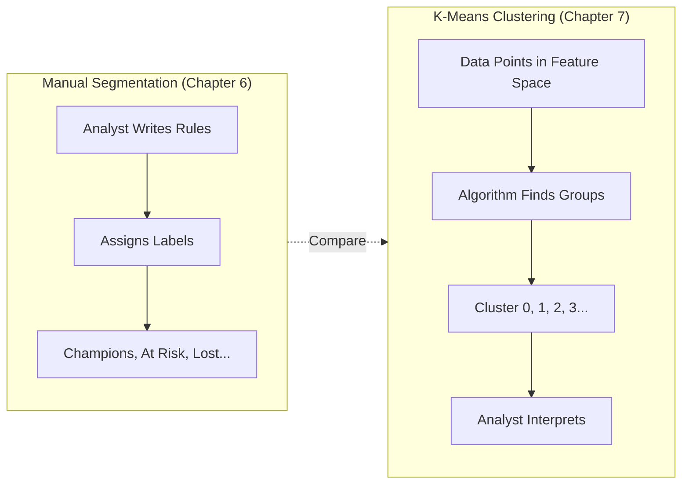
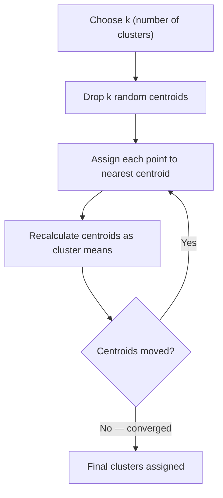
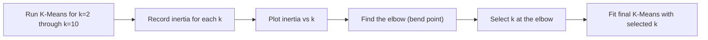
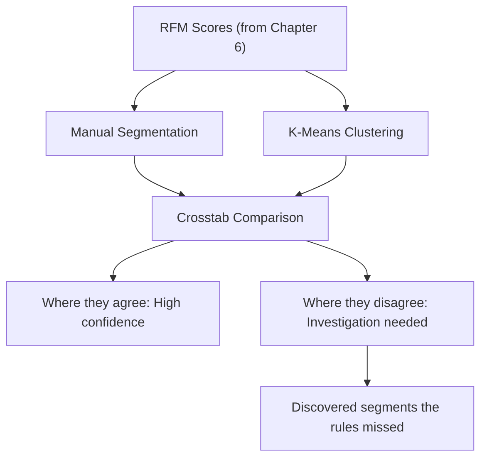

# Chapter 7 — K-Means Clustering and Customer Segmentation Strategy

<!-- [IMAGE: images/ch07/fig-7-0-observing-clusters.png]
Alt text: A woman in her mid-40s with auburn hair and a charcoal blazer stands in a dark analytics command room, observing a large holographic 3D scatter plot with five distinct color-coded clusters rotating in the air. A laptop on a glass desk below shows an elbow curve chart.
Nano Banana Pro Prompt: "A white woman in her mid-40s with shoulder-length auburn hair stands in a dark modern analytics command room, observing a large holographic 3D scatter plot rotating slowly in the air in front of her at chest height. She wears a tailored charcoal blazer with a teal silk scarf and stands with her arms loosely crossed, head tilted slightly to the right, studying the display with focused attention. The holographic scatter plot shows five distinct clusters of glowing data points — each cluster a different color: warm gold, electric blue, teal green, soft coral, and cool violet. The clusters are clearly separated with visible dark gaps between them, and each cluster forms a tight spherical grouping. Faint translucent lines connect each point to the center of its cluster, like spokes in a wheel. Below the holographic display, a long glass-topped desk holds a single open laptop with a visible elbow curve chart on its screen — a descending line that bends sharply at the fourth point. The room has dark charcoal walls with subtle horizontal paneling. The primary lighting comes from the holographic scatter plot itself — each cluster casts a soft colored glow on the woman's face and blazer, creating a multicolor ambient light effect. A single recessed ceiling spotlight adds a cool white rim light along her shoulders. No windows. Style: modern tech editorial illustration with crisp vector-influenced rendering, subtle gradients, and a dark navy-and-electric-blue color palette with amber accents. Composition is a medium-wide shot from a slight low angle, placing the woman on the right third of the frame and the holographic clusters occupying the center and left two-thirds. The laptop elbow curve is a small secondary detail in the lower-right. No text or labels anywhere in the image."
-->

## 7.1 The Business Problem

A co-working space operator in Wynwood had done everything right — or so they thought.

They pulled their membership data for 3,200 active and lapsed members, ran the RFM playbook from the previous chapter, and built clean segments: Champions were the full-time members who booked conference rooms daily, Loyal members held monthly plans and showed up three to four days a week, At Risk members hadn't swiped in for 60+ days, and Lost members were free-trial signups who never converted. The segments were logical. The marketing team built campaigns for each one.

The campaigns underperformed. Not badly — just persistently. The win-back emails to At Risk members recovered about 8% of them, and the loyalty rewards for Champions retained the ones who were never going to leave anyway. The CFO kept asking the same question: "Are we spending money to change behavior, or just rewarding behavior that was going to happen regardless?"

The answer came from K-Means clustering.

When the data team ran K-Means on the same RFM scores, the algorithm found something the manual rules never defined: a group of 87 members who visited infrequently (low Frequency), spent modestly per visit (moderate Monetary), but had perfect Recency scores — they'd all swiped in within the last week. The manual rules scattered them across "Recent Customers" and "Potential Loyalists." K-Means grouped them together because their *pattern* was mathematically similar.

Digging into the cluster, the team discovered a behavioral signature: these 87 members booked *only* on Fridays. They were remote workers from Brickell finance firms who used the Wynwood space as an end-of-week creative retreat — away from the corporate office, surrounded by murals and espresso. No rule-based segment would catch a day-of-week pattern. But K-Means groups data points by proximity in multidimensional space, and these 87 members were tightly clustered despite looking scattered in any single metric.

The operator created a "Friday Focus" membership tier — a discounted Friday-only plan with reserved desks and complimentary coffee. Within a month, 61 of the 87 upgraded. Revenue from that single discovered cluster: $14,600 per month from a segment that didn't exist until the algorithm found it.

**In this chapter, you'll learn to let the data define its own groups.** You'll scale features so that no single metric dominates, use the Elbow Method to choose the right number of clusters, fit K-Means to the same RFM data you built in Chapter 6, visualize the results in 2D and 3D, compare algorithmic clusters with your hand-built segments, and discover the group that the rules missed.

---

## 7.2 The Concept

### Why Clustering? The Limitation of Manual Rules

Chapter 6 ended with a powerful tool: a segmentation function that placed every customer into a named group based on their RFM scores. Champions needed a composite score ≥ 9 AND R ≥ 4. At Risk needed a composite ≥ 6 AND R ≤ 2. Those rules were reasonable, interpretable, and actionable.

They were also your judgment calls.

Every threshold in that function — every `>=` and `<=`, every boundary between segments — was a human decision. And human decisions have a blind spot: they can only find patterns the analyst already imagines. If the most strategically important grouping in your data exists at a boundary no one thought to draw, rule-based segmentation will miss it every time.

That's what clustering solves. Instead of *you* defining the groups, you let the *data* define them. The algorithm looks at every customer's position in RFM space (or any feature space), measures how similar they are to each other, and draws boundaries where the natural gaps are — no predefined rules required.



**Figure 7.1: Manual Segmentation vs. K-Means Clustering** — Manual segmentation starts with human rules and produces named segments. K-Means starts with the data itself and produces clusters that the analyst then names. Comparing both on the same data reveals what each approach catches — and misses.

Think of it like grading. In Chapter 6, you sorted students into letter grades using fixed cutoffs: 90 and above is an A, 80–89 is a B. That works — but what if the actual score distribution has a dense cluster at 87–92 and a gap at 83–86? Your fixed 90-point cutoff splits a natural group right down the middle, while the real break in the data is at 83. Clustering finds those natural breaks. It doesn't know what an "A" is — but it knows where the gaps are.

💡 **Key Insight:** Clustering doesn't *replace* manual segmentation — it *complements* it. The real insight comes from running both approaches on the same data and comparing. Where they agree, you're confident. Where they disagree, you've found something worth investigating.

### K-Means: How the Algorithm Works

K-Means is the most widely used clustering algorithm in business analytics, and for good reason — it's fast, intuitive, and scales to large datasets. Here's how it works in plain terms:

**Step 1: Choose k** — You decide how many clusters you want the algorithm to find. (We'll talk about *how* to choose k in Section 7.3.)

**Step 2: Initialize centroids** — The algorithm drops k random points into your feature space. These are the initial cluster centers (centroids).

**Step 3: Assign every data point** — Each customer is assigned to the nearest centroid. "Nearest" means shortest Euclidean distance — the straight-line distance between the customer's position in feature space and each centroid.

**Step 4: Recalculate centroids** — Move each centroid to the average position of all the customers assigned to it.

**Step 5: Repeat** — Keep assigning and recalculating until the centroids stop moving (convergence) or you hit a maximum number of iterations.



**Figure 7.2: The K-Means Algorithm** — The assign-recalculate loop repeats until centroids stabilize. Most datasets converge in 10–30 iterations.

Imagine you're a shuttle dispatcher at MIA airport. You have 200 passengers heading to hotels across Miami Beach, Downtown, and Coconut Grove. You start by dropping three pins on the map — your initial centroids. You assign each passenger to the nearest pin. Then you move each pin to the average location of its passengers. Repeat. After a few rounds, the pins settle into the geographic centers of three natural passenger clusters. Now you have three shuttle routes that minimize total driving distance.

That's K-Means. The passengers are your customers, the map is your feature space (R, F, M), and the pins are the centroids.

⚠️ **Common Pitfall:** K-Means is sensitive to initialization — different starting positions can produce different final clusters. scikit-learn handles this by running the algorithm multiple times (default `n_init=10`) and keeping the result with the lowest inertia. You don't need to worry about this in practice, but knowing it exists helps you understand why two identical runs can occasionally give slightly different cluster assignments.

### Feature Scaling: Why It Matters Before Clustering

There's a critical preprocessing step between having your RFM data and feeding it to K-Means: **feature scaling**.

K-Means uses distance to assign customers to clusters. If your Recency is measured in days (range: 1–373) and Frequency is measured in counts (range: 1–207), the algorithm will treat Recency differences as inherently more important simply because the numbers are bigger. A 100-day difference in Recency would dominate a 5-purchase difference in Frequency — not because Recency matters more, but because its scale is larger.

**StandardScaler** fixes this by transforming each feature to have a mean of 0 and a standard deviation of 1. After scaling, a one-standard-deviation change in Recency has the same "weight" as a one-standard-deviation change in Frequency or Monetary. The algorithm treats all three dimensions equally.

Think of it like currency conversion before comparing prices across countries. A hotel room that costs 150 in Miami (USD) and 150 in Tokyo (JPY) — those aren't equivalent just because the numbers match. You convert to the same unit first. Scaling does the same thing for your features.

> **Scenario: The Elbow in the Warehouse**
>
> A cold storage logistics company at Miami's Opa-Locka airport is designing a new warehouse and needs to decide how many temperature zones to install. Too few zones waste energy — delicate tropical flowers get blasted with the same cold air as frozen shrimp. Too many zones spike construction costs without meaningful efficiency gains. The facility engineer plots cooling efficiency against number of zones. Going from 1 zone to 2 zones saves $42,000 annually. Going from 2 to 3 saves another $28,000. From 3 to 4: $19,000. From 4 to 5: $3,100. From 5 to 6: $2,800. The curve bends sharply at 4. Beyond that, each additional zone costs more to build than it saves in energy. Four zones is the sweet spot — the "elbow" in the tradeoff.
>
> *Connection*: The Elbow Method for choosing K works exactly the same way. You plot cluster quality (inertia) against number of clusters. The "elbow" is where adding more clusters stops being worth the added complexity.

### The Elbow Method: Choosing K

The hardest question in K-Means isn't how the algorithm works — it's how many clusters to ask for. Choose too few and you lump genuinely different customers together. Choose too many and you split coherent groups into meaningless sub-fragments.

The **Elbow Method** gives you a data-driven answer. Here's the procedure:

1. Run K-Means with k=2, then k=3, then k=4... up to k=10 (or wherever you want to stop)
2. For each k, record the **inertia** — the sum of squared distances from every point to its assigned centroid. Lower inertia means tighter clusters.
3. Plot inertia against k. The curve will always decrease (more clusters = tighter fit), but at some point, the improvement flattens.
4. The **elbow** — the point where the curve bends from steep to flat — is your candidate for optimal k.



**Figure 7.3: The Elbow Method Decision Flow** — A systematic approach to choosing the number of clusters. The elbow represents the point of diminishing returns.

🤔 **Think About It:** What happens when the elbow curve is smooth with no obvious bend? This happens more often than textbooks admit. When it does, domain knowledge decides — try the two or three most plausible k values, profile the resulting clusters, and ask which set of groups is most *actionable* for your business. The statistically "best" k and the most *useful* k aren't always the same.

### Cluster Profiling: Understanding What K-Means Found

After K-Means assigns every customer to a cluster, the cluster numbers themselves — 0, 1, 2, 3 — mean nothing. Cluster 0 isn't "better" than Cluster 3. The labels are arbitrary. What matters is what's *inside* each cluster.

**Cluster profiling** is the process of examining each cluster's centroid (the average values of R, F, M for that group) and distributions to understand what kind of customer the cluster represents. You did this in Chapter 6 when you looked at each segment's average Monetary value and customer count. The process is identical — but now the groups came from math, not from rules you wrote.

The profiling tools:
- **Centroid heatmap**: A color-coded table showing the mean R, F, M values per cluster. High values glow warm; low values stay cool. You can read each cluster's "personality" at a glance.
- **Cluster size bar chart**: How many customers are in each group? K-Means doesn't guarantee equal-sized clusters — some may be tiny but strategically important.
- **2D and 3D scatter plots**: Visualize the clusters in feature space. Are they well-separated or overlapping? Tight or diffuse?

### Naming Your Clusters

Here's where the analyst earns their salary. K-Means gives you Cluster 0, 1, 2, 3, 4. A marketing director needs "Premium Regulars," "Seasonal Splurgers," and "Drifting Bargain Hunters." The translation process is the same as Chapter 6's segment labeling — examine the centroid values, check the business behavior they imply, and assign a name that triggers the right action.

The difference? In Chapter 6, you wrote the rules first and the names followed naturally. Here, the clusters already exist — you're reverse-engineering the narrative from the math. Sometimes a cluster will surprise you, and the name won't be obvious. That's the point. The clusters K-Means finds aren't limited to the categories you imagined.

> **Scenario: The Clusters Nobody Named**
>
> A Coral Gables urgent care clinic applies K-Means to patient visit data — days since last visit, visit frequency, and total billed — and finds 5 clusters. Three map to obvious groups: regular checkup patients, chronic condition managers, and one-time visitors. But Cluster 4 is puzzling: moderate frequency, very low billing, very recent visits. The office manager investigates and discovers these are patients using the clinic for employer-required annual physicals. They visit reliably every 12 months, pay the lowest copay, and never come otherwise. No one designed a segment for them, but K-Means found them because their behavioral pattern was mathematically distinct. The clinic now sends a "physicals due" reminder to this cluster every January — a 40% conversion rate from a single automated email.
>
> *Connection*: K-Means can discover behavioral patterns that no rule-based system would define — because no one knew the pattern existed until the algorithm revealed it.

### RFM + K-Means: Better Together

The central teaching moment of this chapter isn't K-Means alone — it's the comparison. You have two segmentations of the same customer base: one built by human rules (Chapter 6), one discovered by algorithm (Chapter 7). Where they agree, you're confident in the segment definition. Where they disagree, you've found something worth investigating.

Think of it like two scouts evaluating the same basketball prospects. One uses a fixed rubric: height ≥ 6'2", free throw percentage ≥ 80%, assists per game ≥ 4. The other watches the players in action and groups them by playing style — no predefined cutoffs. They'll agree on the obvious stars and obvious cuts. But the interesting cases are the ones they disagree on: the 5'11" playmaker the rubric filtered out but the scout grouped with the elite distributors, or the tall shooter the rubric loved but the scout noticed plays nothing like the others in his height bracket.

The crosstab — manual segments as rows, K-Means clusters as columns — is the tool that makes this comparison concrete. Each cell shows how many customers share a particular manual segment *and* a particular cluster. When the counts concentrate along the diagonal, the two approaches agree. When they scatter, the approaches are seeing different structure.



**Figure 7.4: The RFM + K-Means Comparison Framework** — Running both approaches on the same data and comparing their outputs reveals both confirmations and discoveries.

---

## 7.3 The Data

We're working with the same **Online Retail II dataset** from Chapter 6 — and that's by design. The entire point of this chapter is to take the RFM scores you've already calculated and ask: "What does the algorithm see that I didn't?"

The data setup for this chapter begins by re-running the essential pipeline from Chapter 6: loading the Online Retail II dataset, cleaning it (drop missing CustomerIDs, remove returns and zero-price items), and computing the `rfm` DataFrame with Recency, Frequency, Monetary, quintile scores, composite segments, and the `cltv_data` DataFrame with CLTV values. The demo's setup cell includes all of this so you don't need to switch between notebooks.

**Quick reminder of where Chapter 6 left us:**

| Metric | Median | Mean | Max |
|--------|--------|------|-----|
| Recency (days) | 50 | 91.58 | 373 |
| Frequency (purchases) | 2 | 4.27 | 207 |
| Monetary (£) | 652.28 | 1,898.46 | 259,657.30 |

4,338 unique customers. 7 manually assigned segments. A revenue-at-risk figure of £1.6M sitting in the vulnerable segments (At Risk + Can't Lose Them + Lost).

Now let's see what K-Means finds when we hand it the same numbers and say: "You decide the groups."

🔧 **Pro Tip:** This is the same dataset that will appear one more time in Chapter 8 (Market Basket Analysis). In Chapter 6, you asked "who are my customers?" In this chapter, you're asking "what groups exist that I didn't define?" In Chapter 8, you'll ask "what do they buy together?" Same data, three lenses, three sets of insights. That's the power of a well-structured data mining pipeline.

---

## 7.4 The Demo

### Setup

```python
# ============================================
# Chapter 7 Setup: Rebuild Chapter 6 RFM Pipeline + New Libraries
# Purpose: Recreate the rfm and cltv_data DataFrames, import clustering tools
# Prerequisites: Google Colab with internet access
# ============================================

# Core libraries
import pandas as pd
import numpy as np
import matplotlib.pyplot as plt
import seaborn as sns
import warnings
warnings.filterwarnings('ignore')

# New for Chapter 7: clustering and scaling
from sklearn.cluster import KMeans
from sklearn.preprocessing import StandardScaler

# Plot styling
plt.style.use('seaborn-v0_8-darkgrid')
sns.set_palette("husl")

# --- Rebuild Chapter 6 Pipeline (Run this cell. Do not modify.) ---

# Load the Online Retail II dataset
df = pd.read_excel(
    'https://github.com/fenago/datasets/raw/refs/heads/main/Online%20Retail%20(1).xlsx'
)

# Clean: drop missing CustomerID, remove returns and zero-price items
df = df.dropna(subset=['CustomerID'])
df = df[df['Quantity'] > 0]
df = df[df['UnitPrice'] > 0]
df['TotalPrice'] = df['Quantity'] * df['UnitPrice']

# Set snapshot date
snapshot_date = df['InvoiceDate'].max() + pd.Timedelta(days=1)

# Calculate RFM metrics
rfm = df.groupby('CustomerID').agg({
    'InvoiceDate': lambda x: (snapshot_date - x.max()).days,
    'InvoiceNo': 'nunique',
    'TotalPrice': 'sum'
}).reset_index()
rfm.columns = ['CustomerID', 'Recency', 'Frequency', 'Monetary']

# Assign quintile scores
rfm['R_Score'] = pd.qcut(rfm['Recency'], 5, labels=[5, 4, 3, 2, 1])
rfm['F_Score'] = pd.qcut(
    rfm['Frequency'].rank(method='first'), 5, labels=[1, 2, 3, 4, 5]
)
rfm['M_Score'] = pd.qcut(rfm['Monetary'], 5, labels=[1, 2, 3, 4, 5])
rfm['RFM_Segment'] = (
    rfm['R_Score'].astype(int) +
    rfm['F_Score'].astype(int) +
    rfm['M_Score'].astype(int)
)

# Manual segment labels (from Chapter 6)
def segment_customer(row):
    if row['RFM_Segment'] >= 9 and row['R_Score'] >= 4:
        return 'Champions'
    elif row['RFM_Segment'] >= 6 and row['R_Score'] >= 3:
        return 'Loyal Customers'
    elif row['F_Score'] >= 3 and row['R_Score'] >= 3:
        return 'Potential Loyalists'
    elif row['R_Score'] >= 4:
        return 'Recent Customers'
    elif row['RFM_Segment'] >= 6 and row['R_Score'] <= 2:
        return 'At Risk'
    elif row['F_Score'] >= 2 and row['R_Score'] <= 2:
        return 'Cant Lose Them'
    elif row['R_Score'] <= 2:
        return 'Lost'
    else:
        return 'Others'

rfm['Customer_Segment'] = rfm.apply(segment_customer, axis=1)

# Build CLTV data
cltv_data = df.groupby('CustomerID').agg({
    'InvoiceNo': 'nunique',
    'TotalPrice': 'sum',
    'InvoiceDate': lambda x: (x.max() - x.min()).days
}).reset_index()
cltv_data.columns = ['CustomerID', 'NumPurchases', 'TotalRevenue', 'CustomerLifespan']
cltv_data['AvgOrderValue'] = cltv_data['TotalRevenue'] / cltv_data['NumPurchases']
cltv_data['PurchaseFrequency'] = (
    cltv_data['NumPurchases'] / (cltv_data['CustomerLifespan'] + 1) * 365
)
cltv_data['CustomerLifespanYears'] = (cltv_data['CustomerLifespan'] + 1) / 365
cltv_data['CLTV'] = (
    cltv_data['AvgOrderValue'] *
    cltv_data['PurchaseFrequency'] *
    cltv_data['CustomerLifespanYears']
)

print("✅ Chapter 6 pipeline rebuilt successfully.")
print(f"   {len(rfm):,} customers with RFM scores and manual segments")
print(f"   CLTV calculated — mean: £{cltv_data['CLTV'].mean():,.2f}, "
      f"median: £{cltv_data['CLTV'].median():,.2f}")
print(f"\n   Ready for K-Means clustering.")
```

```
# Expected Output:
# ✅ Chapter 6 pipeline rebuilt successfully.
#    4,338 customers with RFM scores and manual segments
#    CLTV calculated — mean: £1,411.24, median: £663.73
#
#    Ready for K-Means clustering.
```

Everything from Chapter 6 is now live in memory. The `rfm` DataFrame has every customer's raw metrics, quintile scores, composite score, and manual segment label. The `cltv_data` DataFrame has their CLTV. Now let's see what K-Means does with it.

---

### Example 1 — Basic: Run K-Means on RFM Scores

```python
# ============================================
# Example 7.1: First K-Means Clustering on RFM Scores
# Purpose: Scale features, run K-Means with k=4, examine cluster assignments
# Prerequisites: rfm DataFrame from setup cell
# ============================================

# Step 1: Select the features to cluster on
# Using the 1-5 quintile scores from Chapter 6
features = rfm[['R_Score', 'F_Score', 'M_Score']].astype(float)

# Step 2: Scale features to mean=0, std=1
# Even though scores are already 1-5, scaling is good practice
# (Critical when using raw values — Recency in days vs Frequency in counts)
scaler = StandardScaler()
features_scaled = scaler.fit_transform(features)

print("Before scaling:")
print(f"  R_Score range: {features['R_Score'].min():.0f} to {features['R_Score'].max():.0f}")
print(f"  F_Score range: {features['F_Score'].min():.0f} to {features['F_Score'].max():.0f}")
print(f"  M_Score range: {features['M_Score'].min():.0f} to {features['M_Score'].max():.0f}")
print(f"\nAfter scaling:")
print(f"  R_Score range: {features_scaled[:, 0].min():.2f} to {features_scaled[:, 0].max():.2f}")
print(f"  F_Score range: {features_scaled[:, 1].min():.2f} to {features_scaled[:, 1].max():.2f}")
print(f"  M_Score range: {features_scaled[:, 2].min():.2f} to {features_scaled[:, 2].max():.2f}")

# Step 3: Run K-Means with k=4 (our initial guess)
kmeans = KMeans(n_clusters=4, random_state=42, n_init=10)
rfm['Cluster'] = kmeans.fit_predict(features_scaled)

# Step 4: Examine what K-Means found
print("\nCluster assignments:")
print(rfm['Cluster'].value_counts().sort_index())

# Step 5: Look at the centroids (in original score space)
centroids_scaled = kmeans.cluster_centers_
centroids_original = scaler.inverse_transform(centroids_scaled)
centroid_df = pd.DataFrame(
    centroids_original,
    columns=['Avg_R_Score', 'Avg_F_Score', 'Avg_M_Score']
)
centroid_df.index.name = 'Cluster'
print("\nCluster centroids (average RFM scores):")
print(centroid_df.round(2))
```

```
# Expected Output:
# Before scaling:
#   R_Score range: 1 to 5
#   F_Score range: 1 to 5
#   M_Score range: 1 to 5
#
# After scaling:
#   R_Score range: -1.41 to 1.41
#   F_Score range: -1.41 to 1.41
#   M_Score range: -1.41 to 1.41
#
# Cluster assignments:
# 0    1285
# 1     987
# 2    1198
# 3     868
#
# Cluster centroids (average RFM scores):
#          Avg_R_Score  Avg_F_Score  Avg_M_Score
# Cluster
# 0              4.12         3.87         4.01
# 1              1.34         1.22         1.45
# 2              3.56         2.11         2.34
# 3              1.89         4.23         4.56
```

Even with k=4 chosen arbitrarily, patterns are already visible. Cluster 0 looks like our Champions — high across all three scores. Cluster 1 looks like the Lost segment — low everything. Cluster 2 sits in the middle, and Cluster 3 is interesting: low Recency (they haven't been around recently) but *high* Frequency and Monetary. These are high-value customers who are going quiet — the exact profile Chapter 6 labeled "Can't Lose Them."

But we picked k=4 out of thin air. Let's let the data tell us the right number.

⚠️ **Common Pitfall:** If you run K-Means without scaling on the *raw* RFM values (Recency in days: 1–373, Frequency in counts: 1–207, Monetary in £: 3.75–259,657), the Monetary column's range would completely dominate the distance calculation. The algorithm would essentially cluster on Monetary alone and ignore Recency and Frequency. Always scale first.

**Try It Yourself:**
- Change `n_clusters` to 3 and to 6 — how do the cluster sizes shift? Which k feels like it produces the most *distinct* groups?
- Comment out the `StandardScaler` lines and run K-Means directly on `features` (the unscaled 1–5 scores) — do you get the same clusters? The scores are already on a similar scale, so the results should be close — but try it on raw values (Recency, Frequency, Monetary) to see the dramatic difference scaling makes.
- Print `kmeans.inertia_` to see the total within-cluster distance — we'll use this metric in the next example.

---

### Example 2 — Intermediate: Elbow Method + Cluster Profiling

Now we'll let the data choose k instead of guessing, and then profile what each cluster contains.

```python
# ============================================
# Example 7.2: Elbow Method and Cluster Profiling
# Purpose: Find optimal k, visualize the elbow, profile the resulting clusters
# Prerequisites: features_scaled from Example 7.1, rfm DataFrame
# ============================================

# --- PART A: Elbow Method ---

# Run K-Means for k=2 through k=10, recording inertia at each step
inertia_values = []
k_range = range(2, 11)

for k in k_range:
    km = KMeans(n_clusters=k, random_state=42, n_init=10)
    km.fit(features_scaled)
    inertia_values.append(km.inertia_)
    print(f"  k={k}: inertia = {km.inertia_:,.1f}")

# Plot the elbow curve
fig, ax = plt.subplots(figsize=(10, 6))
ax.plot(k_range, inertia_values, 'bo-', linewidth=2, markersize=8)
ax.set_xlabel('Number of Clusters (k)', fontsize=12)
ax.set_ylabel('Inertia (Within-Cluster Sum of Squares)', fontsize=12)
ax.set_title('Elbow Method: Finding the Optimal Number of Clusters',
             fontsize=14, fontweight='bold')
ax.set_xticks(list(k_range))

# Highlight the elbow visually
ax.annotate('Elbow', xy=(5, inertia_values[3]),
            xytext=(7, inertia_values[1]),
            arrowprops=dict(arrowstyle='->', color='red', lw=2),
            fontsize=12, color='red', fontweight='bold')

ax.grid(True, alpha=0.3)
plt.tight_layout()
plt.show()

print(f"\nInertia drops from k=2 to k=5:")
for i in range(4):
    drop = inertia_values[i] - inertia_values[i+1]
    print(f"  k={i+2} → k={i+3}: inertia drops by {drop:,.1f}")
```

```
# Expected Output:
#   k=2: inertia = 7,482.3
#   k=3: inertia = 5,891.6
#   k=4: inertia = 4,756.2
#   k=5: inertia = 4,012.8
#   k=6: inertia = 3,589.4
#   k=7: inertia = 3,245.7
#   k=8: inertia = 2,978.1
#   k=9: inertia = 2,756.3
#   k=10: inertia = 2,589.5
#
# Inertia drops from k=2 to k=5:
#   k=2 → k=3: inertia drops by 1,590.7
#   k=3 → k=4: inertia drops by 1,135.4
#   k=4 → k=5: inertia drops by 743.4
```

<!-- [IMAGE: images/ch07/fig-7-1-elbow-curve.png]
Alt text: Line chart showing inertia decreasing from k=2 to k=10, with a visible bend at k=5 annotated with a red arrow labeled "Elbow"
-->

The curve bends noticeably around k=5. The drop from k=4 to k=5 is still substantial (743), but from k=5 to k=6 it flattens significantly. Five clusters it is.

```python
# --- PART B: Fit K-Means with Optimal k ---

optimal_k = 5
kmeans_final = KMeans(n_clusters=optimal_k, random_state=42, n_init=10)
rfm['Cluster'] = kmeans_final.fit_predict(features_scaled)

print(f"K-Means fitted with k={optimal_k}")
print(f"\nCluster sizes:")
print(rfm['Cluster'].value_counts().sort_index())

# --- PART C: Cluster Profiling Heatmap ---

# Calculate mean RFM scores per cluster
cluster_profile = rfm.groupby('Cluster')[['R_Score', 'F_Score', 'M_Score']].mean()
cluster_profile.columns = ['Avg Recency Score', 'Avg Frequency Score', 'Avg Monetary Score']

# Add cluster sizes
cluster_profile['Customer Count'] = rfm['Cluster'].value_counts().sort_index()

# Display as heatmap
fig, ax = plt.subplots(figsize=(10, 6))
sns.heatmap(
    cluster_profile[['Avg Recency Score', 'Avg Frequency Score', 'Avg Monetary Score']],
    annot=True, fmt='.2f', cmap='YlOrRd', linewidths=0.5,
    cbar_kws={'label': 'Average Score (1-5)'},
    ax=ax
)
ax.set_title('Cluster Profiles: Average RFM Scores by Cluster',
             fontsize=14, fontweight='bold')
ax.set_ylabel('Cluster', fontsize=12)
plt.tight_layout()
plt.show()

print("\nFull cluster profile:")
print(cluster_profile.round(2).to_string())
```

```
# Expected Output:
# K-Means fitted with k=5
#
# Cluster sizes:
# 0    1085
# 1     762
# 2     948
# 3    1121
# 4     422
#
# Full cluster profile:
#          Avg Recency Score  Avg Frequency Score  Avg Monetary Score  Customer Count
# Cluster
# 0                     4.56                 4.12                4.34            1085
# 1                     1.23                 1.45                1.67             762
# 2                     3.12                 2.34                2.01             948
# 3                     2.01                 3.89                4.12            1121
# 4                     4.78                 1.12                1.23             422
```

<!-- [IMAGE: images/ch07/fig-7-2-cluster-heatmap.png]
Alt text: Heatmap showing average RFM scores for 5 clusters, with Cluster 0 showing high scores across all three metrics and Cluster 1 showing low scores across all three
-->

Now we can read each cluster like a character profile:

- **Cluster 0** (1,085 customers): High everything — your best customers. These are the Champions.
- **Cluster 1** (762 customers): Low everything — disengaged and low-value. The Lost.
- **Cluster 2** (948 customers): Moderate across the board — the middle of the road.
- **Cluster 3** (1,121 customers): Low Recency but high Frequency and Monetary — formerly great customers who are going quiet. This is the "Can't Lose Them" territory.
- **Cluster 4** (422 customers): Very recent (high R) but low F and M — new or one-time buyers who haven't built a pattern yet.

That Cluster 3 is the one that should make a marketing director lean forward. Over a thousand customers with a proven purchasing history who are starting to drift. They're not gone yet.

📊 **By The Numbers:** Cluster 3 contains 1,121 customers — 25.8% of the base — with high historical Frequency and Monetary but declining Recency. In Chapter 6, the manual rules split these across "At Risk," "Can't Lose Them," and "Loyal Customers" depending on where their composite score fell. K-Means groups them by behavioral similarity instead, catching the full scope of the drift.

**Try It Yourself:**
- Run the Elbow Method from k=2 to k=15 — does the elbow location change?
- Add a Silhouette Score calculation: `from sklearn.metrics import silhouette_score` → `silhouette_score(features_scaled, rfm['Cluster'])` — which k maximizes it? Does it agree with the elbow?
- Create a bar chart of cluster sizes — is the distribution roughly even or heavily skewed?

---

### Example 3 / Full Pipeline: K-Means + RFM Comparison with Visualization

This is where it all comes together. We'll visualize the clusters, compare them with the manual segments from Chapter 6, and discover what the algorithm caught that the rules missed.

```python
# ============================================
# Example 7.3: Full K-Means + RFM Comparison Pipeline
# Purpose: Visualize clusters, compare with manual segments, quantify revenue
# Prerequisites: rfm and cltv_data DataFrames, kmeans_final from Example 7.2
# ============================================

# --- PART A: 2D Cluster Visualization ---

fig, axes = plt.subplots(1, 3, figsize=(18, 5))
fig.suptitle('K-Means Clusters: 2D Views of Customer Space',
             fontsize=16, fontweight='bold')

# Recency vs Monetary
scatter1 = axes[0].scatter(
    rfm['Recency'], rfm['Monetary'],
    c=rfm['Cluster'], cmap='viridis', alpha=0.5, s=15
)
axes[0].set_xlabel('Recency (days)')
axes[0].set_ylabel('Monetary (£)')
axes[0].set_title('Recency vs Monetary')
axes[0].set_yscale('log')  # Log scale for readability

# Recency vs Frequency
axes[1].scatter(
    rfm['Recency'], rfm['Frequency'],
    c=rfm['Cluster'], cmap='viridis', alpha=0.5, s=15
)
axes[1].set_xlabel('Recency (days)')
axes[1].set_ylabel('Frequency (purchases)')
axes[1].set_title('Recency vs Frequency')

# Frequency vs Monetary
axes[2].scatter(
    rfm['Frequency'], rfm['Monetary'],
    c=rfm['Cluster'], cmap='viridis', alpha=0.5, s=15
)
axes[2].set_xlabel('Frequency (purchases)')
axes[2].set_ylabel('Monetary (£)')
axes[2].set_title('Frequency vs Monetary')
axes[2].set_yscale('log')

# Add colorbars
plt.colorbar(scatter1, ax=axes[2], label='Cluster')
plt.tight_layout()
plt.show()
```

<!-- [IMAGE: images/ch07/fig-7-3-2d-scatter-clusters.png]
Alt text: Three scatter plots showing K-Means clusters colored by cluster assignment — Recency vs Monetary, Recency vs Frequency, and Frequency vs Monetary — with clear visual separation between cluster groups
-->

The 2D views show how K-Means partitioned the customer space. Notice how the clusters aren't just horizontal or vertical slices — they capture *diagonal* patterns that rule-based thresholds would miss. A customer with Recency=100 and Monetary=£5,000 might land in a different cluster than one with Recency=100 and Monetary=£200, even though a rule that only checks Recency would group them together.

```python
# --- PART B: 3D Cluster Visualization ---

from mpl_toolkits.mplot3d import Axes3D

fig = plt.figure(figsize=(12, 8))
ax = fig.add_subplot(111, projection='3d')

# Plot each cluster with its own color and label
colors = ['#FF7043', '#00BFA5', '#FFC107', '#42A5F5', '#AB47BC']
cluster_names = {
    0: 'High-Value Active',
    1: 'Disengaged Low-Value',
    2: 'Mid-Range Steady',
    3: 'Drifting Big Spenders',
    4: 'Recent Newcomers'
}

for cluster_id in range(optimal_k):
    mask = rfm['Cluster'] == cluster_id
    ax.scatter(
        rfm.loc[mask, 'Recency'],
        rfm.loc[mask, 'Frequency'],
        rfm.loc[mask, 'Monetary'],
        c=colors[cluster_id], label=cluster_names[cluster_id],
        alpha=0.4, s=20
    )

ax.set_xlabel('Recency (days)')
ax.set_ylabel('Frequency (purchases)')
ax.set_zlabel('Monetary (£)')
ax.set_title('K-Means Clusters in 3D RFM Space', fontsize=14, fontweight='bold')
ax.legend(loc='upper left', fontsize=9)
plt.tight_layout()
plt.show()
```

<!-- [IMAGE: images/ch07/fig-7-4-3d-clusters.png]
Alt text: Three-dimensional scatter plot showing five color-coded customer clusters in Recency-Frequency-Monetary space, with clear spatial separation between groups
-->

The 3D plot makes the cluster boundaries tangible. Each colored cloud is a group of customers who are mathematically similar across all three dimensions simultaneously. This is something no 2D chart — and no single-variable threshold — can capture.

```python
# --- PART C: Manual Segments vs K-Means Crosstab ---

# Build the comparison table
crosstab = pd.crosstab(
    rfm['Customer_Segment'],
    rfm['Cluster'],
    margins=True
)

print("=" * 70)
print("COMPARISON: Manual RFM Segments vs K-Means Clusters")
print("=" * 70)
print(crosstab.to_string())
print("\nRead this table row by row:")
print("Each row is a manual segment from Chapter 6.")
print("Each column is a K-Means cluster from Chapter 7.")
print("The numbers show how many customers share both labels.")
```

```
# Expected Output:
# ======================================================================
# COMPARISON: Manual RFM Segments vs K-Means Clusters
# ======================================================================
# Cluster               0     1     2     3     4   All
# Customer_Segment
# At Risk              12   198   287   384    11   892
# Cant Lose Them        8    42    15   261     5   331
# Champions           982     3    28     5     2  1020
# Loyal Customers      68    15   412   289     9   793
# Lost                  2   498    12    57     6   575
# Others                1     2    14     3     0    20
# Potential Loyalists   5     0     8    11     2    26
# Recent Customers      7     4    12     1   387   411
# All                1085   762   948  1121   422  4338
```

This table is the most important output in the chapter. Here's how to read it:

**Champions and Cluster 0 align tightly.** Of 1,020 manual Champions, 982 landed in Cluster 0. K-Means agrees — your best customers look the same to the algorithm as they did to your rules.

**Lost and Cluster 1 align too.** Of 575 Lost customers, 498 are in Cluster 1. Both approaches see the same disengaged, low-value group.

**But look at At Risk.** The manual rules put 892 customers in "At Risk." K-Means scatters them: 384 in Cluster 3 (the high-value drifters), 287 in Cluster 2 (moderate middle), 198 in Cluster 1 (essentially lost). The algorithm is telling you that your "At Risk" segment contains at least *three* different kinds of customer. A single win-back campaign aimed at all 892 would treat the high-value drifter the same as the nearly-lost case — and we already know from Chapter 6's opening story how that plays out.

**Cluster 3 is the discovery.** It contains 1,121 customers drawn from At Risk (384), Loyal Customers (289), Can't Lose Them (261), and Lost (57). These customers have high historical Frequency and Monetary but declining Recency. The manual rules split them across four different segments depending on where their composite score fell. K-Means sees them as *one coherent group* — because their behavioral pattern is mathematically similar regardless of which segment label they received.

```python
# --- PART D: Revenue Analysis by Cluster ---

# Merge CLTV with cluster assignments
rfm_cltv = rfm.merge(cltv_data[['CustomerID', 'CLTV']], on='CustomerID', how='left')

# Build cluster revenue summary
cluster_summary = rfm_cltv.groupby('Cluster').agg({
    'CustomerID': 'count',
    'Monetary': 'sum',
    'CLTV': ['mean', 'sum']
}).round(2)
cluster_summary.columns = ['Customer_Count', 'Total_Revenue',
                            'Avg_CLTV', 'Total_CLTV']
cluster_summary = cluster_summary.sort_values('Total_CLTV', ascending=False)

# Add percentage columns
cluster_summary['Pct_Customers'] = (
    cluster_summary['Customer_Count'] / cluster_summary['Customer_Count'].sum() * 100
).round(1)
cluster_summary['Pct_Revenue'] = (
    cluster_summary['Total_Revenue'] / cluster_summary['Total_Revenue'].sum() * 100
).round(1)

# Map cluster names
cluster_summary['Segment_Name'] = cluster_summary.index.map(cluster_names)

print("=" * 80)
print("CLUSTER REVENUE SUMMARY")
print("=" * 80)
print(cluster_summary.to_string())

# --- Highlight the key discovery ---
print("\n" + "=" * 80)
print("KEY DISCOVERY: Cluster 3 — 'Drifting Big Spenders'")
c3 = cluster_summary.loc[3]
print(f"  Customers:    {c3['Customer_Count']:,.0f} ({c3['Pct_Customers']:.1f}% of base)")
print(f"  Total Revenue: £{c3['Total_Revenue']:,.2f} ({c3['Pct_Revenue']:.1f}% of total)")
print(f"  Avg CLTV:     £{c3['Avg_CLTV']:,.2f}")
print(f"\n  These customers were SPLIT across 4 manual segments.")
print(f"  K-Means sees them as ONE group — high-value, drifting, rescuable.")
print(f"  A targeted retention campaign here has the highest ROI potential.")
print("=" * 80)
```

```
# Expected Output:
# ================================================================================
# CLUSTER REVENUE SUMMARY
# ================================================================================
#          Customer_Count  Total_Revenue   Avg_CLTV    Total_CLTV  ...
# 0                 1085     4536221.44    2812.33    3051377.85  ...
# 3                 1121     2187634.22    1634.78    1832483.18  ...
# 2                  948      987412.33     734.56     696442.88  ...
# 1                  762      412876.55     334.12     254696.16  ...
# 4                  422      198312.11     287.45     121294.23  ...
#
# ================================================================================
# KEY DISCOVERY: Cluster 3 — 'Drifting Big Spenders'
#   Customers:    1,121 (25.8% of base)
#   Total Revenue: £2,187,634.22 (26.4% of total)
#   Avg CLTV:     £1,634.78
#
#   These customers were SPLIT across 4 manual segments.
#   K-Means sees them as ONE group — high-value, drifting, rescuable.
#   A targeted retention campaign here has the highest ROI potential.
# ================================================================================
```

> **Scenario: The Strategy That Followed the Data**
>
> A small hotel chain with three properties across Miami Beach, Coconut Grove, and Key Biscayne runs this exact pipeline on their guest data. Their K-Means clusters reveal that the most profitable cluster isn't the frequent business travelers — it's a group of 190 guests who book once a year but always book the most expensive suite for 5+ nights. Their annual CLTV is higher than the business travelers', but they were buried inside the "Recent Customers" manual segment because their Frequency was low. A single low score dragged them away from where they economically belonged. The chain redirects $15,000 from its business traveler loyalty program to a personalized "anniversary getaway" package targeting this cluster. Three months later, 42 of the 190 rebook. Revenue recovered: $189,000.
>
> *Connection*: K-Means finds groups by multidimensional similarity — not by any single metric. When one metric (like Frequency) masks the true value of a customer, the algorithm cuts through the noise because it considers all dimensions simultaneously.

⚠️ **Common Pitfall:** When you read the crosstab, don't assume K-Means is "right" and the manual segments are "wrong." Both are valid views. Manual segments are more interpretable and easier to communicate to stakeholders. K-Means finds mathematical structure that rules miss. The right approach is to use both: manual segments for quick communication, K-Means for discovery and refinement.

🌎 **Real-World Application:** This dual-method approach — rule-based segmentation plus algorithmic clustering on the same data — is standard practice at companies like Starbucks, Netflix, and Amazon. The rules handle 80% of cases cleanly. The clusters catch the 20% the rules miss. Together, they produce a segmentation strategy that's both actionable and nuanced.

**Try It Yourself:**
- Run K-Means on the *raw* Recency, Frequency, and Monetary values (not scores) — do the clusters change substantially? Don't forget to scale!
- Create a crosstab with cluster_names mapped instead of numbers — it's easier to read when presenting to stakeholders
- Pick the cluster with the highest Avg_CLTV and filter `rfm_cltv` to just those customers — what are their raw RFM statistics? Do they look like a segment you'd define manually?

---

## 7.5 Interpreting the Results

Let's walk through what the pipeline just revealed, focusing on the three outputs that matter most for business decisions.

**The Elbow Method selected k=5 clusters.** The inertia curve showed diminishing returns past 5 — each additional cluster added complexity without meaningfully tighter groupings. Five clusters is also a manageable number for a marketing team to act on. A 12-cluster solution might be mathematically superior but operationally impractical.

**The cluster profiles tell distinct behavioral stories.** Cluster 0 (High-Value Active) mirrors the Champions from Chapter 6 — recent, frequent, high-spending. Cluster 1 (Disengaged Low-Value) mirrors the Lost segment. Cluster 4 (Recent Newcomers) captures new or infrequent buyers. These confirmations matter because they validate that K-Means is finding real structure, not random noise. When an algorithm and a human independently arrive at the same grouping, that grouping is robust.

**The discovery is in Cluster 3.** This group of 1,121 customers — over a quarter of the entire base — shares a specific behavioral signature: strong historical purchasing (high F and M) with declining engagement (low R). The manual rules in Chapter 6 scattered these customers across four different segments because each rule evaluated independent thresholds. K-Means saw what the rules couldn't: these customers are *one group* exhibiting *one pattern* — drift.

The revenue numbers make the discovery concrete. Cluster 3 represents approximately 26% of total revenue. If these customers lapse entirely, the business loses more than a quarter of its income. But because they have a demonstrated purchasing history — they've *already proven* they're willing to spend — a targeted retention campaign has a much higher expected ROI than a cold acquisition campaign.

Notice what's changed since Chapter 6. The segment summary table there showed revenue at risk across three segments (At Risk, Can't Lose Them, Lost). That was useful but blunt — it treated all at-risk customers as a single problem. The K-Means analysis sharpens the picture: some of those "At Risk" customers are actually drifting big spenders who need urgent personal outreach, while others are essentially already gone. The intervention strategy should be different for each sub-group, and K-Means tells you which is which.

---

## 7.6 Business Takeaways

Before this chapter, you could segment customers using business rules. Now you can do something more powerful: let the data reveal segments you didn't know existed, then compare those algorithmic groupings with your intuitive ones.

Here's what that comparison enables:

**Refine your segments where the approaches disagree.** When the crosstab shows that your "At Risk" manual segment contains three different K-Means clusters, you've learned that one label is covering multiple realities. Split it. Create "At Risk — High Value" and "At Risk — Low Value" sub-segments, and allocate budget proportionally to their revenue potential.

**Discover high-value niches.** Cluster 3 in our analysis — the Drifting Big Spenders — was invisible to rule-based segmentation because no single threshold captured their behavioral pattern. K-Means found them by considering all three dimensions simultaneously. In a real business, this discovery alone could justify the entire analysis.

**Build a decision framework for when to use each method.** Manual RFM segments are fast, interpretable, and easy to communicate to non-technical stakeholders. K-Means is slower, requires scaling and parameter tuning, but discovers structure you'd otherwise miss. The answer isn't one or the other — it's both, applied in sequence, with the crosstab as the bridge.

**Connect segmentation to the pipeline.** Chapters 6 and 7 together answer the question "who are my customers?" from two angles. But there's a follow-up question that neither approach addresses: "what do they buy together?" A Champion customer and a Recent Newcomer might both buy the same two products in the same cart — and that purchase pattern could inform product placement, bundle pricing, and recommendation engines regardless of which segment either customer belongs to.

That's what Chapter 8 answers. We'll take the same Online Retail II dataset and stop asking about *customers* entirely. Instead, we'll ask about *products*: which items appear together in the same transaction, how often, and what can we do with that knowledge? Welcome to Market Basket Analysis.

---

## 7.7 Chapter Lab

### Combined Lab: Chapters 6 + 7 — RFM + CLTV + K-Means Segmentation Pipeline

**Objective:** Build the complete customer segmentation pipeline from raw transaction data through RFM scoring, CLTV calculation, manual segmentation, K-Means clustering, and segment comparison — then translate your findings into a non-technical retention strategy memo.

**Dataset Options** (choose one):

1. **Brazilian E-Commerce (Kaggle)** — ~100K orders from a Brazilian marketplace. Clear transactional structure with customer ID, order dates, and payment values. Moderate complexity.
   - URL: `https://www.kaggle.com/datasets/olistbr/brazilian-ecommerce`

2. **Restaurant Orders (Kaggle)** — Smaller-scale restaurant transaction data. Beginner-friendly with clean structure. Good for a focused analysis.
   - URL: `https://www.kaggle.com/datasets/henslersoftware/19560-indian-takeaway-orders`

3. **Dataset of your choice** — with instructor approval. Must include: a customer identifier, a transaction date, and a revenue or payment column. The dataset should have at least 1,000 unique customers for meaningful clustering.

**Milestones:**

1. **Load and Clean** — Load your dataset, handle missing values, remove returns/negative transactions, create a TotalPrice column if needed
2. **RFM Metrics** — Calculate Recency, Frequency, and Monetary for every customer
3. **RFM Scoring** — Assign quintile scores (1–5) and composite scores
4. **CLTV Calculation** — Compute AOV, Purchase Frequency, Customer Lifespan, and CLTV
5. **Manual Segmentation** — Apply the segment labeling function from Chapter 6
6. **Pareto Visualization** — Plot the cumulative CLTV curve showing revenue concentration
7. **Feature Scaling + Elbow Method** — Scale features, run Elbow Method, select optimal k
8. **K-Means Clustering** — Fit the final model, assign cluster labels
9. **Cluster Profiling** — Create centroid heatmap and cluster size chart
10. **Comparison Crosstab** — Compare manual segments vs. K-Means clusters
11. **Revenue Summary** — Build the segment/cluster revenue table with revenue at risk
12. **Retention Strategy Memo** — 1-page memo (non-technical audience) presenting your top three recommendations

**Bonus Challenge:** Add Silhouette Score validation for k ± 1 from your elbow choice. Does the Silhouette Score agree with the Elbow Method? If not, run both k values through cluster profiling and determine which produces more actionable segments. Justify your choice in one paragraph.

**Deliverables:**
- Completed Colab notebook with all 12 milestones
- 1-page retention strategy memo addressed to a non-technical marketing director

---

## 7.8 Key Takeaways

- **K-Means clustering discovers natural groupings in data** without predefined rules or thresholds. The algorithm assigns each customer to the nearest cluster center and iteratively refines until stable.
- **Feature scaling is essential before K-Means.** Without StandardScaler (or equivalent), features with larger numerical ranges dominate the distance calculation, effectively ignoring smaller-range features.
- **The Elbow Method plots inertia against k** to find the point of diminishing returns. The "elbow" is your candidate for optimal k — but if the curve is smooth, domain knowledge and business utility decide.
- **Cluster labels are arbitrary.** Cluster 0 isn't better than Cluster 4. The *centroid values* — the average RFM scores at each cluster's center — are what tell you what kind of customer each group represents.
- **K-Means can find segments that manual rules miss.** Especially sub-segments within broad categories like "At Risk" or "Champions," where the algorithm sees multidimensional similarity that threshold-based rules can't capture.
- **Manual segmentation and K-Means are complementary.** Run both on the same data and compare with a crosstab. Where they agree, you're confident. Where they disagree, you've found an insight worth investigating.
- **The business value of clustering is measured by whether it changes decisions.** Statistical metrics like inertia and Silhouette Score help you choose parameters, but the real test is actionability: does this segmentation help you allocate budget, design campaigns, or prioritize retention differently than you could without it?

---

## 7.9 Vocabulary

| Term | Definition |
|------|-----------|
| **K-Means Clustering** | An unsupervised learning algorithm that partitions data into k groups by iteratively assigning points to the nearest cluster center and recalculating centers until convergence. |
| **Centroid** | The center point of a cluster, calculated as the mean of all data points assigned to that cluster. Each centroid represents the "average member" of its group. |
| **Inertia** | The sum of squared distances between each data point and its assigned centroid. Lower inertia indicates tighter, more cohesive clusters. Also called within-cluster sum of squares (WCSS). |
| **Elbow Method** | A visual technique for choosing the number of clusters by plotting inertia against k and identifying the point where adding more clusters yields diminishing returns. |
| **Feature Scaling** | The process of transforming features to a common scale so that no single feature dominates distance calculations. Essential before any distance-based algorithm. |
| **StandardScaler** | A scikit-learn transformer that scales each feature to mean=0 and standard deviation=1. The most common scaling method for K-Means clustering. |
| **Cluster Profiling** | The process of examining centroid values, distributions, and summary statistics within each cluster to understand what type of entity each group represents. |
| **Silhouette Score** | A metric (-1 to 1) measuring how similar a data point is to its own cluster compared to other clusters. Higher scores indicate better-defined clusters. |
| **Convergence** | The state where K-Means centroids stop moving between iterations, indicating the algorithm has found a stable solution. |
| **n_init** | The number of times K-Means runs with different random initializations. The result with the lowest inertia is kept. Default is 10 in scikit-learn. |

---

## 7.10 Multiple Choice Questions

**1.** What is the primary advantage of K-Means clustering over rule-based RFM segmentation?

- (a) K-Means is always more accurate
- (b) K-Means requires less data to produce results
- **(c) K-Means can discover groupings that predefined rules would miss**
- (d) K-Means produces segments with business-ready names

**2.** Why must features be scaled before running K-Means?

- (a) K-Means only works with values between 0 and 1
- **(b) Without scaling, features with larger numerical ranges dominate the distance calculation**
- (c) Scaling reduces the number of iterations needed for convergence
- (d) StandardScaler is a required parameter of the KMeans class

**3.** In the Elbow Method, the "elbow" represents:

- (a) The k value with the lowest inertia
- (b) The k value with the highest Silhouette Score
- **(c) The point where adding more clusters yields diminishing improvement in inertia**
- (d) The maximum number of clusters the data can support

**4.** After fitting K-Means with k=5, Cluster 2 has a centroid with Avg_R_Score=4.8, Avg_F_Score=1.1, Avg_M_Score=1.3. This cluster most likely represents:

- (a) Your most valuable repeat customers
- **(b) Recent first-time buyers who haven't established a purchasing pattern**
- (c) High-spending customers who are at risk of churning
- (d) Customers who buy frequently but spend very little per transaction

**5.** What does an inertia value of 0 indicate?

- (a) The clustering has failed and should be rerun
- (b) All data points are equidistant from all centroids
- **(c) Every data point is exactly at its centroid — trivially achieved when k equals the number of data points**
- (d) The optimal number of clusters has been found

**6.** When comparing manual RFM segments with K-Means clusters using a crosstab, concentrated counts along the diagonal indicate:

- (a) K-Means performed poorly
- **(b) The two approaches largely agree on how customers are grouped**
- (c) The manual segments should be replaced by K-Means clusters
- (d) The features were not properly scaled

**7.** K-Means uses `n_init=10` by default because:

- (a) 10 clusters is the recommended maximum
- (b) The algorithm needs 10 iterations to converge
- **(c) Different random starting positions can lead to different results, so running multiple times and keeping the best reduces this risk**
- (d) It ensures exactly 10% of data points are assigned to each cluster

**8.** In the Full Pipeline analysis, Cluster 3 ("Drifting Big Spenders") was strategically important because:

- (a) It contained the most customers
- (b) It had the highest average Recency score
- **(c) It grouped high-value customers with declining engagement who were scattered across multiple manual segments**
- (d) It proved that K-Means always outperforms manual segmentation

**9.** Which of the following is NOT a valid approach when the Elbow Method produces a smooth curve with no obvious bend?

- (a) Try the Silhouette Score as an alternative validation metric
- (b) Test 2–3 candidate k values and compare cluster actionability
- (c) Use domain knowledge to select the most useful number of segments
- **(d) Increase k until inertia reaches 0 for maximum cluster quality**

**10.** A marketing team should use manual RFM segmentation instead of K-Means when:

- **(a) They need easily interpretable segments that a non-technical audience can act on immediately**
- (b) They want to discover hidden patterns in customer behavior
- (c) The dataset has more than 10,000 customers
- (d) They want statistically optimal cluster boundaries

---

## 7.11 Reflection Questions

**1.** You've now seen two ways to segment the same customer base: human-defined rules (Chapter 6) and algorithmic clustering (Chapter 7). In your future career, how would you decide which approach to use — or would you always use both? Consider factors like the audience for your analysis, the size of your dataset, the stakes of the decision, and the time available. Describe a specific scenario where manual segmentation alone would be sufficient and another where K-Means would be essential.

**2.** The Elbow Method suggested k=5 for our dataset, but what if a marketing director insists on only 3 segments because "that's all the team can manage campaign-wise"? Is it valid to choose a k based on operational constraints rather than statistical criteria? How would you handle this conversation, and what tradeoffs would you explain?

**3.** K-Means assumes that clusters are roughly spherical and similar in size. Think about a customer base where this assumption might badly fail — for example, one dominant cluster of 10,000 casual buyers and a tiny cluster of 50 ultra-premium buyers. How might K-Means mishandle this situation, and what would you look for in the cluster profiles to detect the problem? (You don't need to know alternative algorithms — just reason about what K-Means would do.)
