# Chapter 8 — Market Basket Analysis: What Do Customers Buy Together?


---

## 8.1 The Business Problem

A mid-sized online retailer in the United Kingdom processes about 25,000 invoices per year. Their catalog covers everything from decorative candles to kitchen gadgets to novelty gifts. Business is steady — but the website treats every customer the same way. No "Frequently Bought Together" suggestions. No bundle deals. No personalized cross-sell at checkout. Just a static "best sellers" list that hasn't changed in months.

When the marketing director finally pulls the transaction data and starts digging, she finds something that should have been obvious: 38% of customers who bought decorative candles also bought candle holders — but often in a *separate* transaction, sometimes weeks later. If even half of those customers had been prompted at checkout with a simple "Customers who bought this also bought..." suggestion, the company would have captured an estimated £47,000 in additional annual revenue. From a single product pair.

Now multiply that across hundreds of product combinations in a 4,000-item catalog. The opportunity cost of not understanding co-purchase patterns isn't a rounding error — it's a strategic blind spot.

This is the exact dataset you've been working with since Chapter 6. You know its customers. You know their RFM segments. You know which clusters K-Means discovered. But here's what you don't know yet: *what do those customers buy together?* Which products pull each other into the cart? Which combinations are genuinely meaningful, and which just reflect the fact that two items are both popular?

This chapter teaches you **Market Basket Analysis (MBA)** — a family of techniques that sifts through transactional data to discover which items frequently co-occur. You'll learn five metrics that quantify the strength of any co-occurrence pattern, an algorithm that can mine thousands of rules from transaction data automatically, and three visualization techniques that make the results readable to a non-technical audience. By the end, you'll be able to hand your marketing director a ranked list of product pairings, each backed by a number she can take to the merchandising meeting.

---

## 8.2 The Concept

### From Who to What

In Chapters 6 and 7, every question you asked was about *people*. Who are the most valuable customers? Who is at risk of leaving? Which cluster does this customer belong to? RFM and K-Means answered those questions beautifully. But they operated at the customer level — one row per customer, aggregated across all their transactions.

Market Basket Analysis flips the lens entirely. Now the unit of analysis is the *transaction* — one row per shopping basket, one invoice, one receipt. You're no longer asking "who is this customer?" You're asking "what did they buy together in this specific visit?" The shift is subtle but powerful. The same Online Retail II dataset that powered your segmentation work becomes a completely different source of insight when you stop aggregating and start looking at individual baskets.

### Association Rules: The Language of MBA

An association rule has two parts: an **antecedent** (the "if" side) and a **consequent** (the "then" side). The rule {Candles} → {Candle Holders} reads: "If a customer buys candles, they also tend to buy candle holders." The arrow is directional — the rule {Candle Holders} → {Candles} is a separate rule with potentially different strength.

Think of it like a weather forecast: "If it's humid and August in Miami, there's an 80% chance of a 3pm thunderstorm." The humidity and month are the antecedent; the thunderstorm is the consequent. The 80% is the rule's confidence. And just like weather forecasts, the value of an association rule depends entirely on how you measure its strength.

```mermaid
graph LR
    A["Antecedent (X)<br/>Items bought"] -->|"Rule: X → Y"| B["Consequent (Y)<br/>Also bought"]
    B --> C{"Measure strength with:"}
    C --> D["Support<br/>(How often?)"]
    C --> E["Confidence<br/>(How reliable?)"]
    C --> F["Lift<br/>(How surprising?)"]
    C --> G["Leverage<br/>(How much more?)"]
    C --> H["Conviction<br/>(How dependent?)"]
```



**Figure 8.1: Anatomy of an Association Rule** — Every rule has an antecedent and a consequent. Five metrics quantify the rule's strength from different angles.

MBA uses five metrics to evaluate these rules. Each one answers a different question about the same relationship, and understanding all five is what separates a useful analysis from a misleading one. Let's walk through them one at a time.

### Support: How Often Does This Combination Appear?

Support is the simplest metric. It measures how frequently an itemset (a combination of one or more items) appears in your data. If you have 1,000 transactions and the pair {Coffee, Muffin} appears in 80 of them, the support is 80/1,000 = 0.08, or 8%.

$$\text{Support}(X) = \frac{\text{Transactions containing } X}{\text{Total transactions}}$$

Support is like foot traffic past a store window — it tells you how often something shows up, but not whether anyone cares enough to walk in. High support means the combination is common, which is useful for prioritizing inventory and layout decisions. But support alone doesn't tell you whether two items are genuinely associated or just individually popular. Bread and milk both have high support in any grocery store, but that doesn't mean buying bread causes you to buy milk.

Most MBA workflows set a **minimum support threshold** to filter out noise. If a pair appears in only 2 out of 25,000 transactions, it's not worth analyzing — there's simply not enough data to draw conclusions. The right threshold depends on your dataset size and how long-tail your catalog is. We'll discuss how to choose it in the demo.

> **Scenario: The Wynwood Gallery Bundle**
>
> A Wynwood art gallery that also sells prints, frames, and art supplies tracks purchase data from 800 transactions over six months. The gallery owner notices that canvas prints and frame kits appear together in 12% of all transactions — a support of 0.12. Is that high enough to justify a bundled "Print + Frame" package? She sets a minimum support threshold of 0.05 (5%) to filter out noise. At 0.12, the pairing clears the bar easily. But support alone doesn't tell her whether the association is meaningful or just reflecting two popular items. Prints show up in 40% of all transactions and frames in 30%. Maybe they just happen to be the two best sellers. She needs another metric to find out.
>
> *Connection*: Support establishes that a combination is frequent enough to matter, but it can't distinguish a genuine association from two popular items coincidentally overlapping. That's where confidence and lift come in.

### Confidence: If They Buy X, How Often Do They Also Buy Y?

Confidence asks a conditional question: out of all the transactions that contain X, what fraction also contain Y? It's the conditional probability P(Y|X).

$$\text{Confidence}(X \rightarrow Y) = \frac{\text{Support}(X \cup Y)}{\text{Support}(X)}$$

Think of confidence as the batting average of a rule — out of all the times the antecedent came up to plate, how often did the consequent get a hit? A confidence of 0.80 for {Diapers} → {Beer} means that 80% of the time someone bought diapers, they also bought beer. That sounds impressive.

But confidence has a blind spot. If beer is purchased by 75% of all customers regardless of what else they buy, then *any* antecedent will have at least 0.75 confidence with beer. A high confidence might just mean the consequent is popular — not that the antecedent has anything to do with it. To separate genuine associations from artifacts of popularity, you need lift.

💡 **Key Insight**: Confidence is directional. The confidence of {Diapers} → {Beer} is not necessarily the same as {Beer} → {Diapers}. This matters when you're deciding which item to promote: should you show beer to diaper buyers, or diapers to beer buyers? The answer depends on which direction has higher confidence.

### Lift: Is This Rule Better Than Random Chance?

Lift is the metric that separates interesting rules from trivial ones. It measures how much more likely Y is given X compared to Y's baseline frequency. In other words: is this association stronger than what random chance would produce?

$$\text{Lift}(X \rightarrow Y) = \frac{\text{Confidence}(X \rightarrow Y)}{\text{Support}(Y)} = \frac{\text{Support}(X \cup Y)}{\text{Support}(X) \times \text{Support}(Y)}$$

Lift is the "compared to what?" metric. If everyone in Miami drinks cafecito, then any rule predicting cafecito will have high confidence — but lift will be close to 1, because the prediction isn't telling you anything the base rate didn't already say.


**Figure 8.2: Interpreting Lift** — A lift greater than 1 indicates a genuine positive association. A lift of exactly 1 means independence. A lift below 1 means the items actually repel each other — also a valuable finding.

> **Scenario: The Brickell Lunch Rush**
>
> A fast-casual restaurant chain with three Brickell locations runs MBA on 5,000 lunch transactions. The rule {Grilled Chicken Bowl} → {Sparkling Water} has confidence of 0.45 — 45% of chicken bowl buyers also get sparkling water. Sounds decent. But sparkling water is ordered by 40% of *all* customers regardless of entrée. The lift is 0.45 / 0.40 = 1.125, barely above 1. There's almost no real association — sparkling water is just popular. Meanwhile, the rule {Acai Bowl} → {Coconut Water} has lower confidence (0.35) but a lift of 3.5, because coconut water is ordered by only 10% of all customers. The acai-coconut connection is the real actionable insight — a genuine affinity, not just two popular items coincidentally overlapping.
>
> *Connection*: Confidence alone would have prioritized the chicken-water rule. Lift corrects for item popularity and reveals that the acai-coconut pairing is the one worth promoting.

⚠️ **Common Pitfall**: Students sometimes assume that lift < 1 means the rule is useless. Actually, a lift significantly below 1 is also valuable — it means the items are *substitutes* or that buying one actively discourages buying the other. For a restaurant, knowing that {Burger} → {Salad} has a lift of 0.4 tells you those are competing choices, not complements. Don't display salad recommendations to someone who just ordered a burger.

### Leverage and Conviction: Two More Ways to Confirm Rule Quality

Lift tells you whether an association is stronger than chance, but two additional metrics add nuance for comparing rules and making final prioritization decisions.

**Leverage** measures the absolute difference between the observed co-occurrence and what you'd expect if the items were independent:

$$\text{Leverage}(X, Y) = \text{Support}(X \cup Y) - \text{Support}(X) \times \text{Support}(Y)$$

Leverage of 0 means no difference from independence. Positive leverage means the items co-occur more than expected. Think of leverage as "how much extra traffic did this connection create?" A rule with high lift on two rare items might have tiny leverage (affecting few transactions), while a rule with moderate lift on two popular items might have large leverage (affecting a big slice of your business). Businesses that want to maximize total impact often sort by leverage.

**Conviction** measures how strongly the presence of X implies the presence of Y in terms of how often the rule would fail:

$$\text{Conviction}(X \rightarrow Y) = \frac{1 - \text{Support}(Y)}{1 - \text{Confidence}(X \rightarrow Y)}$$

Conviction of 1 means independence (same as lift = 1). Higher conviction means the consequent is increasingly dependent on the antecedent. Conviction of infinity means the rule *never* fails (confidence = 1). Think of conviction as "how badly would this prediction break if there were no real connection?" A conviction of 2.9 means the rule would be wrong about three times as often if the items were unrelated.

In practice, most analysts use support, confidence, and lift as their primary filters, then check leverage and conviction as tiebreakers when comparing similarly strong rules. All five metrics are computed automatically by the `mlxtend` library we'll use in the demo.

### The Apriori Algorithm: Finding Rules Efficiently

With a catalog of 4,000 items, the number of possible 2-item combinations alone exceeds 8 million. Testing all of them would be computationally brutal. The Apriori algorithm solves this with a simple but powerful insight called the **downward closure property**: if a single item doesn't meet the minimum support threshold, then no pair containing that item can meet it either.

Apriori works like a tournament bracket. In the first round, it counts every individual item and eliminates any that fall below minimum support. In the second round, it generates all pairs from the survivors — and eliminates any pair below the threshold. In the third round, triplets from surviving pairs. Each round shrinks the candidate pool dramatically, making the search tractable even on large datasets.

```mermaid
graph TD
    A["All single items<br/>(n items)"] -->|"Count support<br/>Prune below threshold"| B["Frequent single items<br/>(k₁ survivors)"]
    B -->|"Generate pairs<br/>from survivors only"| C["Candidate pairs<br/>(k₁ choose 2)"]
    C -->|"Count support<br/>Prune below threshold"| D["Frequent pairs<br/>(k₂ survivors)"]
    D -->|"Generate triplets<br/>from surviving pairs"| E["Candidate triplets"]
    E -->|"Count support<br/>Prune below threshold"| F["Frequent triplets<br/>(k₃ survivors)"]
    F --> G["...continue until<br/>no candidates remain"]
    G --> H["Generate rules<br/>from all frequent itemsets"]
```



**Figure 8.3: The Apriori Algorithm's Pruning Strategy** — At each level, items or itemsets that fall below minimum support are eliminated. Only combinations of survivors move to the next round, dramatically reducing the search space.

🔧 **Pro Tip**: The Apriori algorithm finds *frequent itemsets* first, then generates *rules* from those itemsets in a second step. This is a common point of confusion. The `min_support` parameter controls the first step (which itemsets to keep), while `min_confidence` or `min_threshold` controls the second step (which rules to keep from those itemsets). Setting min_support too low causes a combinatorial explosion — your notebook might hang or crash. Start high (0.05) and lower gradually.

### From Rules to Recommendations

Once you have a ranked list of association rules, the business applications are immediate. Retail uses MBA for product placement (put associated items near each other), cross-selling ("Frequently Bought Together"), bundle pricing (discount the pair to encourage the combo), and targeted promotions (email candle-holder coupons to customers who bought candles last month). E-commerce platforms like Amazon built early recommendation engines on exactly this logic.

But MBA reaches far beyond retail. Healthcare analysts use it to find which medications are frequently prescribed together — flagging potential drug interactions or identifying comorbidity patterns. Financial institutions look for unusual combinations of transactions as fraud signals: a sequence like luxury electronics + jewelry + designer clothing in a single hour might trigger an alert because that co-occurrence pattern deviates from normal shopping behavior. Insurance companies identify which policy types are commonly bundled together to design cross-sell campaigns.

The core idea is the same everywhere: whenever you have transactions or events that co-occur, association rules can reveal patterns that humans miss.

### Visualizing Association Rules

A table of rules with five numeric columns is useful for analysts, but it's not how you communicate findings to a merchandising director or a store owner. Three visualization types translate MBA results into something immediately intuitive.

**Network graphs** show items as nodes and rules as edges. Thicker edges mean stronger rules (higher lift or confidence). Clusters of tightly connected nodes reveal product families that sell together. This is the "big picture" view — great for presentations and for spotting groups you didn't expect.

**Lift heatmaps** put antecedents on one axis and consequents on the other. Each cell's color intensity represents the lift of that rule. Hot spots immediately show which product pairs have the strongest associations. This format works well for comparing many rules at once.

**Support-vs-confidence scatter plots** place each rule as a dot, with support on the x-axis, confidence on the y-axis, and bubble size proportional to lift. Rules in the upper-right corner (high support AND high confidence) are the most actionable. Large bubbles in any position signal high lift — a surprising association worth investigating.


**Figure 8.4: Three Visualization Types for MBA** — Each serves a different audience and purpose. The demo builds all three.

> **Scenario: The Port of Miami Duty-Free**
>
> A duty-free retailer at the Port of Miami cruise terminal analyzes 15,000 pre-departure transactions. When they visualize the top 30 association rules as a network graph, three distinct clusters emerge: a spirits-and-cigars cluster (Cuban rum → premium cigars, lift 5.8), a skincare-and-sunscreen cluster (SPF lotion → aloe vera → lip balm), and a surprising candy-and-electronics cluster (chocolate boxes → phone chargers). The first two make intuitive sense. The third one doesn't — until the store manager realizes that last-minute gift buyers and forgot-my-charger buyers are the same demographic: people rushing through the terminal before boarding. The network graph didn't just confirm known patterns; it revealed a shopping behavior the retailer hadn't imagined.
>
> *Connection*: Visualization surfaces non-obvious patterns. The candy-and-charger cluster was invisible in the raw numbers but jumped out immediately in the network graph — and it led to a concrete merchandising decision (placing chargers near the impulse-buy chocolate display).

---

## 8.3 The Data

We're working with the same **Online Retail II** dataset you've been using since Chapter 6 — a real transactional dataset from a UK-based online retailer covering December 2009 through December 2011. This is intentional. You've already explored these customers through RFM and K-Means. Now you're looking at the same data through a different lens.

**Source:** UCI Machine Learning Repository / Kaggle
**URL:** `https://github.com/fenago/datasets/raw/refs/heads/main/Online%20Retail%20(1).xlsx`
**Shape:** ~541,909 rows × 8 columns
**Each row represents:** One line item on an invoice (not one transaction — a single invoice may span multiple rows, one per product)

| Column | Type | Description |
|--------|------|-------------|
| Invoice | string | Invoice number. Prefix "C" = cancellation |
| StockCode | string | Product code |
| Description | string | Product name |
| Quantity | int | Number of units purchased |
| InvoiceDate | datetime | Date and time of the transaction |
| Price | float | Unit price in GBP |
| Customer ID | float | Unique customer identifier (may be null) |
| Country | string | Customer's country |

**Key data quality issues for MBA:**

You dealt with some of these in Chapter 6, but MBA has additional requirements. Cancellations (invoices starting with "C") must be removed — they aren't real purchases. Rows with null Customer IDs are excluded. Rows with zero or negative quantities are dropped. And because MBA works at the *invoice* level, you'll need to reshape the data: instead of one row per line item, you need one row per invoice with columns for every product, marked as 1 (bought) or 0 (not bought). This is called **one-hot encoding** in the transaction context, and it's the format that mlxtend's Apriori function expects.

📊 **By The Numbers**: After cleaning, this dataset contains roughly 18,000 unique invoices and 4,000 unique products. Running Apriori on a 18,000 × 4,000 matrix without a reasonable minimum support threshold would generate millions of candidate itemsets. That's why the min_support parameter matters — it's not just a quality filter, it's a computational necessity.

---

## 8.4 The Demo

### Setup

Before we touch the real data, we'll build intuition with a toy dataset — calculating every metric by hand. Then we'll let `mlxtend` automate the same calculations. Finally, we'll run the full pipeline on Online Retail II and produce three visualizations. Same progression as always: understand first, automate second, apply third.

```python
# ============================================
# Setup: Install and import libraries
# Run this cell first — no modifications needed
# ============================================

# Install mlxtend if not already available
!pip install mlxtend -q

# Core libraries
import pandas as pd
import numpy as np
from itertools import combinations
from collections import Counter

# MBA-specific libraries
from mlxtend.frequent_patterns import apriori, association_rules
from mlxtend.preprocessing import TransactionEncoder

# Visualization
import matplotlib.pyplot as plt
import seaborn as sns
import networkx as nx

# Display settings
pd.set_option('display.max_columns', 10)
pd.set_option('display.float_format', '{:.4f}'.format)

print("All libraries loaded successfully.")
```

### Example 1 — Manual Metric Calculation on a Toy Dataset

Before any library does the work for you, let's calculate Support, Confidence, and Lift by hand. This is the only way to truly understand what the numbers mean. We'll use a synthetic 12-transaction grocery dataset with some classic pairings baked in — including the legendary diapers-and-beer combo.

```python
# ============================================
# Example 8.1: Manual MBA Metric Calculation
# Purpose: Calculate Support, Confidence, and Lift by hand
# Prerequisites: Python basics, no external libraries needed
# ============================================

# Step 1: Define 12 transactions (each list = one shopping basket)
transactions = [
    ['Diapers', 'Beer'],
    ['Diapers', 'Beer', 'Milk'],
    ['Diapers', 'Beer', 'Bread'],
    ['Diapers', 'Beer', 'Eggs'],
    ['Diapers', 'Cookies'],
    ['Beer', 'Chips'],
    ['Cheese', 'Wine', 'Grapes'],
    ['Cheese', 'Wine'],
    ['Cheese', 'Wine', 'Crackers'],
    ['Cheese', 'Bread'],
    ['Wine'],
    ['Bread', 'Eggs']
]

total = len(transactions)
print(f"Total transactions: {total}\n")

# Step 2: Count how often each item appears
item_counts = Counter(item for txn in transactions for item in set(txn))
print("Item frequencies:")
for item, count in item_counts.most_common():
    print(f"  {item}: {count} transactions ({count/total:.1%} support)")

# Step 3: Count co-occurrences of item pairs
pair_counts = Counter()
for txn in transactions:
    for combo in combinations(set(txn), 2):
        # Sort to treat (A,B) and (B,A) as the same pair
        pair_counts[tuple(sorted(combo))] += 1

print(f"\nTop 5 most common pairs:")
for pair, count in pair_counts.most_common(5):
    print(f"  {pair}: {count} transactions")

# Step 4: Calculate metrics for Diapers → Beer
support_diapers = item_counts['Diapers'] / total
support_beer = item_counts['Beer'] / total
support_both = pair_counts[('Beer', 'Diapers')] / total
confidence = support_both / support_diapers
lift = confidence / support_beer

print(f"\n--- Rule: Diapers → Beer ---")
print(f"Support(Diapers):        {support_diapers:.4f} ({support_diapers:.1%})")
print(f"Support(Beer):           {support_beer:.4f} ({support_beer:.1%})")
print(f"Support(Diapers ∪ Beer): {support_both:.4f} ({support_both:.1%})")
print(f"Confidence:              {confidence:.4f} ({confidence:.1%})")
print(f"Lift:                    {lift:.4f}")
print(f"\nInterpretation: Lift of {lift:.2f} means buying diapers and beer")
print(f"together is {lift:.1f}x more likely than if they were independent.")

# Expected Output:
# Total transactions: 12
# 
# Item frequencies:
#   Diapers: 5 transactions (41.7% support)
#   Beer: 5 transactions (41.7% support)
#   Cheese: 4 transactions (33.3% support)
#   Wine: 4 transactions (33.3% support)
#   Bread: 3 transactions (25.0% support)
#   Eggs: 2 transactions (16.7% support)
#   Milk: 1 transactions (8.3% support)
#   ... (remaining items)
#
# Top 5 most common pairs:
#   ('Beer', 'Diapers'): 4 transactions
#   ('Cheese', 'Wine'): 3 transactions
#   ('Beer', 'Bread'): 1 transactions
#   ...
#
# --- Rule: Diapers → Beer ---
# Support(Diapers):        0.4167 (41.7%)
# Support(Beer):           0.4167 (41.7%)
# Support(Diapers ∪ Beer): 0.3333 (33.3%)
# Confidence:              0.8000 (80.0%)
# Lift:                    1.9200
#
# Interpretation: Lift of 1.92 means buying diapers and beer
# together is 1.9x more likely than if they were independent.
```

Pause and absorb those numbers. Support of 33.3% means one in three shopping trips included both diapers and beer. Confidence of 80% means four out of five diaper buyers also grabbed beer. And the lift of 1.92 confirms this isn't just because beer is popular — the association is nearly twice as strong as random chance would predict.

Notice that we sorted each pair alphabetically to avoid counting ('Beer', 'Diapers') and ('Diapers', 'Beer') as different pairs. This is a small detail that matters a lot when counting co-occurrences.

⚠️ **Common Pitfall**: If you forget to deduplicate items within a transaction (using `set(txn)`), a basket like `['Beer', 'Beer', 'Chips']` would count the Beer-Chips pair twice instead of once. Always convert each transaction to a set before generating combinations.

🤔 **Think About It**: Calculate the confidence and lift for {Cheese} → {Wine}. Then calculate {Beer} → {Diapers} (the reverse of our rule). Is the confidence the same in both directions? Why or why not? What does the directionality tell you about how you'd use these rules in a real recommendation engine?

### Example 2 — Apriori + mlxtend on the Toy Dataset

Now let's let a library do the work — and verify it produces the same numbers we calculated by hand. The `mlxtend` library provides two key functions: `apriori()` finds frequent itemsets, and `association_rules()` generates rules with all five metrics.

The catch is that mlxtend expects a very specific input format: a DataFrame where each row is a transaction and each column is a product, with `True`/`False` values indicating whether that product appears in that basket. The `TransactionEncoder` converts our list-of-lists into this format.

```python
# ============================================
# Example 8.2: Apriori with mlxtend
# Purpose: Automate MBA and introduce Leverage + Conviction
# Prerequisites: Example 8.1 (same toy dataset)
# ============================================

# Step 1: Encode transactions into one-hot format
te = TransactionEncoder()
te_array = te.fit(transactions).transform(transactions)
df = pd.DataFrame(te_array, columns=te.columns_)

# Inspect the encoded format — each row is a basket, each column is a product
print("One-hot encoded transaction matrix (first 5 rows):")
print(df.head())
print(f"\nShape: {df.shape[0]} transactions × {df.shape[1]} products")

# Step 2: Find frequent itemsets with minimum support of 15%
frequent_itemsets = apriori(df, min_support=0.15, use_colnames=True)
print(f"\nFrequent itemsets (min_support=0.15): {len(frequent_itemsets)} found")
print(frequent_itemsets.sort_values('support', ascending=False).head(10))

# Step 3: Generate association rules from frequent itemsets
rules = association_rules(frequent_itemsets, metric="lift", min_threshold=1.0)

# Step 4: Display rules with all 5 metrics
display_cols = ['antecedents', 'consequents', 'support', 'confidence', 
                'lift', 'leverage', 'conviction']
print(f"\nAssociation rules (lift > 1.0): {len(rules)} found")
print(rules[display_cols].sort_values('lift', ascending=False).to_string(index=False))

# Step 5: Verify our manual calculation matches
diapers_beer = rules[
    (rules['antecedents'] == frozenset({'Diapers'})) & 
    (rules['consequents'] == frozenset({'Beer'}))
]
print(f"\n--- Verification: Diapers → Beer ---")
print(f"Support:    {diapers_beer['support'].values[0]:.4f} (manual: 0.3333)")
print(f"Confidence: {diapers_beer['confidence'].values[0]:.4f} (manual: 0.8000)")
print(f"Lift:       {diapers_beer['lift'].values[0]:.4f} (manual: 1.9200)")
print(f"Leverage:   {diapers_beer['leverage'].values[0]:.4f}")
print(f"Conviction: {diapers_beer['conviction'].values[0]:.4f}")

# Expected Output:
# One-hot encoded transaction matrix (first 5 rows):
#     Beer  Bread  Cheese  Chips  Cookies  Crackers  Diapers  Eggs  ...
# 0   True  False   False  False    False     False     True  False ...
# 1   True  False   False  False    False     False     True  False ...
# ...
# Shape: 12 transactions × 11 products
#
# Frequent itemsets (min_support=0.15): ~10 found
# (Diapers: 0.4167, Beer: 0.4167, {Diapers, Beer}: 0.3333, etc.)
#
# Association rules (lift > 1.0): ~4 rules
# Diapers → Beer:  support=0.3333, confidence=0.8000, lift=1.92, leverage=0.1597, conviction=2.9167
# Beer → Diapers:  support=0.3333, confidence=0.8000, lift=1.92, leverage=0.1597, conviction=2.9167
# Cheese → Wine:   support=0.2500, confidence=0.7500, lift=2.25, leverage=0.1389, conviction=2.6667
# Wine → Cheese:   support=0.2500, confidence=0.7500, lift=2.25, leverage=0.1389, conviction=2.6667
#
# --- Verification: Diapers → Beer ---
# Support:    0.3333 (manual: 0.3333) ✓
# Confidence: 0.8000 (manual: 0.8000) ✓
# Lift:       1.9200 (manual: 1.9200) ✓
```

The numbers match exactly. The library confirms what we calculated by hand — and adds Leverage (0.1597) and Conviction (2.9167) automatically. Notice that {Cheese} → {Wine} has an even higher lift (2.25) than {Diapers} → {Beer} (1.92), even though its support is lower. Lift corrects for base rates, and since Cheese and Wine are each less popular than Diapers and Beer, their co-occurrence is proportionally more surprising.

Also notice that each relationship produces *two* rules: {Diapers} → {Beer} and {Beer} → {Diapers}. In this case they happen to have the same confidence because both items appear in exactly 5 transactions. That's a coincidence of our small dataset — in real data, the two directions almost always differ.

⚠️ **Common Pitfall**: The most common error with mlxtend is forgetting to one-hot encode the data. If you pass a raw list of transactions to `apriori()`, you'll get a `ValueError`. Always use `TransactionEncoder` first, or manually create a Boolean DataFrame.

🔧 **Pro Tip**: Try lowering `min_support` to 0.05. How many more itemsets does Apriori find? Most of the new ones will be single-item frequencies. Now raise `min_threshold` for lift to 2.0 in `association_rules()`. How many rules survive? Tuning these two parameters is the core skill of practical MBA — too permissive and you drown in noise, too strict and you miss genuine patterns.

### Example 3 / Full Pipeline — MBA on Online Retail II

Now the real thing. We'll load the same Online Retail II dataset from Chapters 6–7, transform it from line-item format to basket format, run Apriori, and produce three visualizations. The cleaning steps will look familiar — you've done most of them before.

```python
# ============================================
# Example 8.3: Full MBA Pipeline on Online Retail II
# Purpose: Complete market basket analysis with visualizations
# Prerequisites: Examples 8.1–8.2, Chapter 6 data familiarity
# ============================================

# ---- PART 1: Load and Clean ----

# Step 1: Load the dataset (same URL as Chapters 6–7)
url = "https://github.com/fenago/datasets/raw/refs/heads/main/Online%20Retail%20(1).xlsx"
df_raw = pd.read_excel(url)
print(f"Raw dataset: {df_raw.shape[0]:,} rows × {df_raw.shape[1]} columns")

# Step 2: Clean — same steps as Chapter 6, with MBA-specific additions
df = df_raw.copy()

# Remove cancellations (invoices starting with 'C')
df['Invoice'] = df['Invoice'].astype(str)
df = df[~df['Invoice'].str.startswith('C')]

# Remove null Customer IDs and zero/negative quantities
df = df[df['Customer ID'].notna()]
df = df[df['Quantity'] > 0]

# Remove non-product stock codes (postage, manual adjustments, etc.)
df = df[df['StockCode'].astype(str).str.match(r'^\d')]

# Clean product descriptions
df['Description'] = df['Description'].str.strip()
df = df[df['Description'].notna()]

print(f"Cleaned dataset: {df.shape[0]:,} rows")
print(f"Unique invoices: {df['Invoice'].nunique():,}")
print(f"Unique products: {df['Description'].nunique():,}")

# Expected Output:
# Raw dataset: 541,909 rows × 8 columns
# Cleaned dataset: ~397,000 rows
# Unique invoices: ~18,000
# Unique products: ~3,800
```

```python
# ---- PART 2: Transform to Basket Format ----

# Step 3: Create basket matrix — one row per invoice, one column per product
# For MBA, we only care about presence (1) or absence (0), not quantity
basket = df.groupby(['Invoice', 'Description'])['Quantity'].sum().unstack()

# Convert to binary: any quantity > 0 = True
basket = basket.fillna(0)
basket = basket.map(lambda x: True if x > 0 else False)

print(f"Basket matrix: {basket.shape[0]:,} invoices × {basket.shape[1]:,} products")
print(f"Density: {basket.sum().sum() / (basket.shape[0] * basket.shape[1]):.4%}")
print("(Most cells are False — this is a sparse matrix)")

# Expected Output:
# Basket matrix: ~18,000 invoices × ~3,800 products
# Density: ~0.12%
```

```python
# ---- PART 3: Run Apriori ----

# Step 4: Find frequent itemsets
# min_support=0.03 means the itemset must appear in at least 3% of invoices
# Start higher if your notebook runs slowly — lower gradually
frequent_itemsets = apriori(basket, min_support=0.03, use_colnames=True)
print(f"Frequent itemsets found: {len(frequent_itemsets)}")
print(frequent_itemsets.sort_values('support', ascending=False).head(10))

# Step 5: Generate association rules
rules = association_rules(frequent_itemsets, metric="lift", min_threshold=2.0)
rules = rules[rules['confidence'] >= 0.3]  # Additional filter: confidence ≥ 30%
rules = rules.sort_values('lift', ascending=False)

print(f"\nRules after filtering (lift > 2, confidence ≥ 0.3): {len(rules)}")
print(rules[['antecedents', 'consequents', 'support', 'confidence', 
             'lift', 'leverage', 'conviction']].head(10).to_string(index=False))

# Expected Output:
# Frequent itemsets found: ~60–100
# (Top items: common product descriptions like candles, bags, etc.)
#
# Rules after filtering: ~30–80 rules
# (Top rules by lift: product pairs with strong, genuine associations)
```

```python
# ---- PART 4: Visualizations ----

# Step 6: Network Graph — Top 15 rules by lift
fig, ax = plt.subplots(figsize=(14, 10))

top_rules = rules.head(15)
G = nx.DiGraph()

for _, row in top_rules.iterrows():
    ant = ', '.join(list(row['antecedents']))
    con = ', '.join(list(row['consequents']))
    G.add_edge(ant, con, weight=row['lift'], confidence=row['confidence'])

# Node sizing by frequency
node_sizes = []
for node in G.nodes():
    # Count how many rules mention this item
    count = sum(1 for _, _, d in G.edges(data=True)) 
    node_sizes.append(800 + count * 200)

pos = nx.spring_layout(G, k=2, seed=42)
edges = G.edges(data=True)
weights = [d['weight'] for _, _, d in edges]

# Normalize edge widths
max_w = max(weights) if weights else 1
edge_widths = [1 + (w / max_w) * 5 for w in weights]

nx.draw_networkx_nodes(G, pos, node_color='#1a3a5c', node_size=800, alpha=0.9, ax=ax)
nx.draw_networkx_labels(G, pos, font_size=7, font_color='white', font_weight='bold', ax=ax)
nx.draw_networkx_edges(G, pos, width=edge_widths, edge_color='#f0a030', 
                       alpha=0.7, arrows=True, arrowsize=15,
                       connectionstyle='arc3,rad=0.1', ax=ax)

ax.set_title('Top 15 Association Rules by Lift — Network Graph', fontsize=14, fontweight='bold')
ax.axis('off')
plt.tight_layout()
plt.show()

# Expected Output:
# A network graph showing product nodes connected by directed edges.
# Thicker amber edges = higher lift. Clusters of tightly connected
# nodes reveal product families that sell together.
```

```python
# Step 7: Lift Heatmap — Top antecedent-consequent pairs
fig, ax = plt.subplots(figsize=(12, 8))

# Get top 20 rules for the heatmap
top_heat = rules.head(20).copy()
top_heat['ant_str'] = top_heat['antecedents'].apply(lambda x: ', '.join(list(x)))
top_heat['con_str'] = top_heat['consequents'].apply(lambda x: ', '.join(list(x)))

pivot = top_heat.pivot_table(index='ant_str', columns='con_str', values='lift', aggfunc='first')

sns.heatmap(pivot, annot=True, fmt='.1f', cmap='YlOrRd', 
            linewidths=0.5, ax=ax, cbar_kws={'label': 'Lift'})
ax.set_title('Lift Heatmap — Top 20 Association Rules', fontsize=14, fontweight='bold')
ax.set_xlabel('Consequent (Then)')
ax.set_ylabel('Antecedent (If)')
plt.xticks(rotation=45, ha='right', fontsize=8)
plt.yticks(fontsize=8)
plt.tight_layout()
plt.show()

# Expected Output:
# A heatmap where darker/hotter cells indicate higher lift.
# Hot spots reveal the strongest product-pair associations.
```

```python
# Step 8: Support vs Confidence Scatter — Bubble size = Lift
fig, ax = plt.subplots(figsize=(12, 8))

scatter = ax.scatter(
    rules['support'], 
    rules['confidence'],
    s=rules['lift'] * 80,        # Bubble size proportional to lift
    c=rules['lift'],             # Color also mapped to lift
    cmap='YlOrRd',
    alpha=0.6,
    edgecolors='#333333',
    linewidth=0.5
)

plt.colorbar(scatter, label='Lift', ax=ax)
ax.set_xlabel('Support (How frequent?)', fontsize=12)
ax.set_ylabel('Confidence (How reliable?)', fontsize=12)
ax.set_title('Association Rules Landscape — Support vs Confidence (Bubble = Lift)', 
             fontsize=14, fontweight='bold')
ax.axhline(y=0.5, color='gray', linestyle='--', alpha=0.5, label='Confidence = 0.5')
ax.axvline(x=0.05, color='gray', linestyle='--', alpha=0.5, label='Support = 0.05')
ax.legend(loc='upper right')
plt.tight_layout()
plt.show()

# Expected Output:
# A scatter plot with each dot = one rule.
# Upper-right corner = high support AND high confidence (most actionable).
# Large, hot-colored bubbles anywhere = high lift (most surprising).
# The dashed lines show common threshold boundaries.
```

```python
# ---- PART 5: Top 10 Actionable Rules ----

# Step 9: Final ranked table for the business audience
top_10 = rules.head(10).copy()
top_10['antecedents'] = top_10['antecedents'].apply(lambda x: ', '.join(list(x)))
top_10['consequents'] = top_10['consequents'].apply(lambda x: ', '.join(list(x)))

print("=" * 80)
print("TOP 10 ACTIONABLE ASSOCIATION RULES — Online Retail II")
print("=" * 80)
print(f"{'Rank':<5} {'If customer buys...':<30} {'They also buy...':<30} {'Lift':<8} {'Conf':<8}")
print("-" * 80)
for i, (_, row) in enumerate(top_10.iterrows(), 1):
    print(f"{i:<5} {row['antecedents']:<30} {row['consequents']:<30} "
          f"{row['lift']:<8.2f} {row['confidence']:<8.1%}")
print("-" * 80)

# Expected Output:
# A clean ranked table showing the top 10 rules by lift,
# with antecedent, consequent, lift, and confidence.
# This is the deliverable you'd hand to a marketing director.
```

⚠️ **Common Pitfall**: Setting `min_support` too low on a large dataset causes a combinatorial explosion. If you set min_support=0.001 on 18,000 invoices with 3,800 products, mlxtend will try to evaluate millions of candidate pairs. Your notebook will hang, slow down, or crash. Start with min_support=0.05, check how many itemsets you get, and lower gradually. If you're getting fewer than 20 frequent itemsets, lower the threshold. If you're getting more than 500, raise it.

🔧 **Pro Tip**: Try filtering the data to a single country before running Apriori. The UK dominates this dataset — what happens if you run MBA on France-only transactions? Do the same product pairs appear, or do different cultural preferences create entirely different association rules?

🤔 **Think About It**: Filter the data to December-only transactions. Holiday purchasing patterns are different from the rest of the year. Do new seasonal rules emerge (gift sets? wrapping paper combos?)? How would a retailer use seasonal MBA to plan inventory and promotions?

---

## 8.5 Interpreting the Results

Let's walk through what the Full Pipeline actually tells us.

The network graph is your first stop. Look for clusters — groups of nodes that are tightly connected to each other but loosely connected to the rest of the graph. Each cluster represents a product family: items that sell together as a natural set. You might see a home-decoration cluster (candles, candle holders, tea light sets), a kitchen-and-dining cluster (napkins, placemats, plates), and a gift-giving cluster (cards, wrapping paper, gift bags). These clusters aren't just statistical artifacts — they represent real shopping behaviors and intentions.

Now look at the lift heatmap. The hottest cells are your strongest associations. A lift of 4.0 means those two products co-occur four times more often than random chance. That's not a suggestion — that's a directive. Those products should be cross-promoted, bundled, or at minimum displayed on the same page. Notice which cells are cold (lift near 1 or below). Those products have no meaningful connection — promoting them together would waste marketing budget.

The scatter plot gives you the strategic overview. Rules in the upper-right corner (high support AND high confidence) are your heavy hitters — frequent, reliable, and worth building entire campaigns around. Rules with moderate support but very high lift (large bubbles floating in the middle) are your hidden gems — strong associations in a specific customer segment, perfect for targeted promotions rather than mass campaigns.

This tells us something the Business Problem anticipated: the retailer isn't just missing one or two cross-sell opportunities. They're sitting on dozens of product pairings with lift scores well above 2.0 — genuine associations that could drive incremental revenue if surfaced at the right moment. The £47,000 candle-and-holder example from Section 8.1 was one pair. The full analysis reveals the entire landscape.

Notice that some rules involve products you wouldn't have thought to pair. This is the power of MBA — it finds patterns that domain expertise misses. The Port of Miami duty-free scenario from Section 8.2 wasn't hypothetical. Unexpected associations are a feature of this technique, not a bug.

💡 **Key Insight**: The most actionable rules often aren't the ones with the highest lift. A rule with lift = 8.0 but support = 0.001 applies to almost nobody. The business value comes from the intersection of strong lift (genuine association) and sufficient support (enough transactions to matter). Use the scatter plot to find rules in the upper-right quadrant with large bubbles — that's the sweet spot.

---

## 8.6 Business Takeaways

With a ranked list of association rules, the retailer can now make several decisions that were impossible before.

**Cross-sell at checkout.** The Top 10 rules translate directly into "Frequently Bought Together" recommendations. For every product in the antecedent, display the consequent as a suggestion when the customer adds it to their cart. This alone — the simplest application — could recapture the £47,000+ gap identified in the Business Problem, and that's from just the top rules.

**Bundle pricing.** Product pairs with high confidence (>0.6) and strong lift (>3.0) are natural bundle candidates. Offering a 10% discount on the pair still increases margin because the second item might not have been purchased otherwise. The rules tell you *which* bundles to create — no more guessing.

**Inventory co-stocking.** If two products are strongly associated, running out of one suppresses sales of the other. The rules identify which products need to be restocked together. A stockout on candle holders doesn't just lose candle holder revenue — it loses candle revenue too.

**Email personalization.** Customers who bought item X last month but didn't buy item Y are prime targets for a follow-up campaign. The rules give you the targeting logic; the RFM segments from Chapter 6 give you the prioritization. Combine them: send the cross-sell email to Champions and Loyal customers first, where the conversion probability is highest.

**Page layout and category design.** Products that cluster together in the network graph should appear together in the website's navigation. If the MBA reveals a gift-giving cluster, the retailer might create a dedicated "Gift Sets" category featuring those associated products.

These aren't vague "insights." They're specific, implementable actions — each backed by a number the merchandising team can evaluate.

But this raises a new question. We've now applied RFM to understand *who* our customers are, K-Means to discover *segments* we didn't expect, and MBA to find *what* products sell together — all on the same Online Retail II dataset. Three techniques, three different lenses, three sets of actionable outputs. Is this pattern — Recency, Frequency, some measure of value — unique to retail? Or does it work everywhere? That's exactly where Chapter 9 takes us.

---

## 8.7 Chapter Lab

### Objective

Run a complete Market Basket Analysis pipeline on a dataset of your choice. Identify the top 10 association rules by lift, produce at least two visualizations (network graph + one other), and write a 1-page business memo to a non-technical store owner explaining three actionable rules.

### Dataset Options

Choose one of the following. All three are available on Kaggle:

1. **Instacart Market Basket** — 3M+ orders across 50,000 products. Expert level. Requires joining multiple tables (orders, products, aisles). Best for students comfortable with pandas merges.
2. **Brazilian E-Commerce (Olist)** — 100K+ orders from a Brazilian marketplace. Intermediate level. Requires joining order-items with products table. Good international context.
3. **Restaurant Orders** — Transaction-level food orders from a single restaurant. Beginner friendly. Smaller scale, no joins needed.

A good MBA dataset has: transactional structure (multiple items per transaction), at least 1,000 transactions, and at least 50 unique items. If you choose your own dataset, verify these criteria first.

### Milestones

1. **Load and clean** — Handle nulls, cancellations, and duplicates
2. **Transform** — Convert to one-hot basket format (one row per transaction, one column per item)
3. **Run Apriori** — Choose and justify your min_support threshold (explain why you picked that number)
4. **Generate and filter rules** — Apply lift > 1.5 and confidence > 0.25 at minimum; adjust based on results
5. **Visualize** — Produce a network graph AND at least one additional visualization (heatmap or scatter)
6. **Write business memo** — 1 page, addressed to a non-technical store owner, explaining 3 rules and 3 specific actions

### Deliverables

Upload to Canvas: Colab notebook (.ipynb) + 1-page business memo (PDF or markdown cell at the end of the notebook).

**Naming convention:** `lab04-market-basket-[your-last-name].ipynb`

### Bonus Challenge

Filter your dataset to two different time periods (e.g., Q1 vs Q4, or weekdays vs weekends). Run MBA separately on each. Do the top rules change? Write a paragraph explaining what the differences reveal about seasonal or temporal purchasing behavior.

---

## 8.8 Multiple Choice Questions

**1.** What does a lift value of exactly 1.0 indicate about the relationship between items X and Y?

a) X and Y are always purchased together
b) X and Y are negatively associated
c) X and Y are independent — their co-occurrence is what random chance would predict
d) The rule has 100% confidence

**2.** In the association rule {Coffee} → {Sugar}, which is the antecedent and which is the consequent?

a) Coffee is the consequent; Sugar is the antecedent
b) Coffee is the antecedent; Sugar is the consequent
c) Both are antecedents
d) The order doesn't matter — they are interchangeable

**3.** A rule has confidence of 0.75 and the consequent has support of 0.75. What is the lift?

a) 0.75
b) 1.0
c) 1.5
d) 0.5625

**4.** Why does the Apriori algorithm prune itemsets that fall below minimum support at each level?

a) To improve the lift of the remaining rules
b) Because if a single item is infrequent, no pair containing it can meet the threshold either
c) To reduce the confidence of weak rules
d) To ensure all remaining rules have lift > 1

**5.** What input format does mlxtend's `apriori()` function expect?

a) A list of lists, where each sub-list contains item names
b) A DataFrame with one row per item and one column per transaction
c) A Boolean DataFrame with one row per transaction and one column per item
d) A CSV file with columns for Transaction_ID and Item_Name

**6.** A retailer finds that {Bread} → {Butter} has confidence of 0.90 but lift of 1.05. What does this suggest?

a) Bread and butter have a strong, actionable association
b) Butter is very popular — the high confidence mostly reflects butter's base rate, not a genuine association
c) The rule should be prioritized for cross-selling
d) The Apriori algorithm has made an error

**7.** What does negative leverage indicate about two items?

a) They are frequently bought together
b) They co-occur less often than expected under independence
c) The rule has confidence below 50%
d) The support is below the minimum threshold

**8.** In a support-vs-confidence scatter plot with bubble size representing lift, which region contains the most actionable rules?

a) Lower-left corner (low support, low confidence)
b) Upper-right corner (high support, high confidence) with large bubbles
c) Lower-right corner (high support, low confidence)
d) Upper-left corner (low support, high confidence)

**9.** If setting min_support=0.001 on a dataset with 20,000 transactions and 5,000 products causes your notebook to crash, what is the most likely reason?

a) The lift values are too high
b) The confidence threshold is too strict
c) The low support threshold creates a combinatorial explosion of candidate itemsets
d) The dataset has too many null values

**10.** A rule has conviction of 1.0. What does this mean?

a) The rule never fails
b) The rule is perfectly reliable
c) The antecedent and consequent are independent — no meaningful association
d) The rule has the highest possible lift

---

## 8.9 Reflection Questions

**1.** Think about a business, organization, or industry you're familiar with (it doesn't have to be retail). What "transactions" occur in that context — and what co-occurrences might be worth discovering? Describe the domain, the items or events that co-occur, and one specific business decision that MBA could inform.

**2.** Market Basket Analysis can find patterns, but not all patterns are actionable or ethical. Describe a scenario where an MBA finding might be statistically valid but ethically problematic to act on — or a context where the technique simply wouldn't be appropriate. What factors should an analyst consider before turning a discovered rule into a business recommendation?

---

*In Chapter 9, we step back and ask the question that ties the entire course together: what if the RFM framework isn't just for retail? What if Recency, Frequency, and Magnitude apply to students, patients, website visitors, and even UFO sightings? You've already proven that the same dataset reveals different insights depending on the lens you use. Now you'll prove that the same lens reveals insights across every domain.*
