*Part IV — Advanced Applications and the Universal Framework*
# Chapter 9 — RFM Across Domains: The Universal Pattern-Discovery Framework


---

## 9.1 The Business Problem

In 2012, a cluster of UFO sightings in the Pacific Northwest averaged 114 days in duration.

Not minutes. Not hours. *Days.* A hundred and fourteen days of someone reporting a continuous aerial phenomenon. That is nearly four months of staring at the sky and filling out a report that says "it's still there."

Here is what happened. A graduate student at a previous university downloaded 80,000 UFO sighting reports from the National UFO Reporting Center — a public dataset with latitude, longitude, date, duration, shape, and free-text descriptions going back to the 1940s. She cleaned the data, calculated three simple metrics — how recently each state reported a sighting, how many sightings each state logged, and the typical duration per sighting — and then ran K-Means clustering. The algorithm produced five clusters. Four of them told a coherent story about regional sighting patterns. The fifth cluster contained a handful of states where the average reported sighting duration was 114 days.

The algorithm didn't know what UFOs are. It didn't know what "days" means. It simply found a group of data points that were wildly different from everything else and said: *these don't belong with the others.*

That is the moment this chapter is about.

Not UFOs — data quality. Not one dataset — any dataset. Every dataset you will ever work with has its version of the 114-day sighting. A customer who returned $40,000 worth of merchandise in a single invoice. A student who logged into the LMS 300 times in one day. A sensor that reported a temperature of negative 400 degrees. The question is never *whether* outliers exist. The question is whether your pipeline catches them before you build a model on top of them.

And here is the deeper point: the pipeline that found that 114-day cluster? It is the exact same pipeline you built in Chapters 6 and 7. Calculate Recency, Frequency, and a third metric. Score them. Cluster them. Interpret the clusters. The only thing that changed was the column names.

This chapter teaches you to see the universal pattern behind every technique you have learned in this course. You will apply the RFM framework to student engagement data, to UFO sighting reports, and then to a domain you choose yourself. By the end, you will understand that Recency, Frequency, and Monetary value were never about customers at all — they are about *any entity that produces timestamped events*. Rename "Monetary" to "Magnitude," and the framework travels anywhere.

---

## 9.2 The Concept

### The Vital Signs of Behavioral Data

Think about what happens when you visit a doctor. Before anyone asks about your specific complaint, a nurse takes three measurements: temperature, heart rate, and blood pressure. These vital signs work on every patient — a five-year-old with a sore throat, a seventy-year-old with chest pain, a marathon runner getting a routine checkup. The measurements don't care who you are or why you're there. They care about your current state.

RFM is the vital signs of behavioral data. Recency tells you *how recently* something happened — a purchase, a login, a sighting, an inspection. Frequency tells you *how often* it happens. And the third metric, which we have been calling Monetary value, tells you *how much* — dollars spent, assignments submitted, minutes of duration, cost of a repair.

In Chapters 6 and 7, those three numbers segmented 4,300 customers for a UK online retailer. The pipeline was: calculate R, F, and M from transaction data, score them into quintiles, cluster them with K-Means, and name the clusters so a marketing director could act on them. That pipeline worked because customer transactions have all three properties: a timestamp (Recency), repeated events (Frequency), and a measurable quantity per event (Monetary).

But here is what makes RFM universal: *almost everything* has those three properties.


**Figure 9.1: The Universal RFM Lens** — The same three questions apply across any domain with timestamped events. Only the column names change.

The moment you stop thinking of RFM as a retail metric and start thinking of it as *Recency, Frequency, and Magnitude*, the framework unlocks every domain where entities produce repeated, measurable events over time.

💡 **Key Insight:** The power of RFM is not the formula — it is the *question structure*. "How recently did this entity act? How often does it act? How much does each action produce?" These three questions segment any population into actionable groups, whether the population is customers, students, cities, sensors, or patients.

### Metric Mapping: The Only Step That Changes

When you move the framework to a new domain, exactly one step changes: the metric mapping. You have to decide what Recency, Frequency, and Magnitude *mean* in your new context. Everything after that — scoring, clustering, profiling, visualization — stays the same.

| Domain | Entity | Recency (R) | Frequency (F) | Magnitude (M) |
|--------|--------|-------------|----------------|----------------|
| Retail | Customer | Days since last purchase | Number of orders | Total revenue |
| Higher Education | Student | Days since last LMS login | Total sessions | Assignments submitted |
| UFO Sightings | State/Region | Days since last report | Number of reports | Median duration (seconds) |
| Healthcare | Patient | Days since last visit | Visits per year | Total billed amount |
| Equipment Maintenance | Machine | Days since last inspection | Repairs per quarter | Total repair cost |
| Crime Analysis | Neighborhood | Days since last incident | Incidents per month | Average severity score |
| Social Media | User | Days since last post | Posts per week | Average engagement (likes + comments) |

The table could go on. The pattern is always the same: find the entity, find the timestamps, and find the measurable quantity. Everything else is code you have already written.

> **Scenario: The Canvas Early Warning System**
>
> An academic advisor at MDC's Kendall Campus is reviewing her Canvas dashboard in Week 6 of a 16-week semester. Forty students haven't logged in for 10 or more days. She flags all 40 for outreach, sends the same "We miss you!" email to everyone, and hopes for the best.
>
> But these 40 students are not one group — they are at least three. If the advisor ran an RFM analysis using Recency (days since last login), Frequency (total sessions this semester), and Magnitude (assignments submitted), she would find distinct clusters. One cluster contains students who never logged in at all — likely administrative adds who never intended to take the course. Another contains students who were active in Weeks 1 through 3 and then vanished — the real intervention targets, the students whose semester can still be saved. A third contains students who log in once a week but submit nothing — a possible technology access issue, not a motivation problem. Three different problems require three different interventions: an administrative drop, a phone call, and a laptop loaner.
>
> *Connection*: The metric mapping is the diagnostic step. Choosing the wrong columns — or treating all students as a single group — produces interventions that waste resources on the wrong people.

### What Metric Mapping Gets Wrong

The most common mistake in cross-domain RFM is choosing a Magnitude metric that does not vary meaningfully across entities. In retail, total revenue varies enormously — your top customer might spend 100 times more than your bottom customer. That variance is what makes the M score useful for segmentation. But if you are analyzing student engagement and you choose "number of courses enrolled" as your M metric, every full-time student gets a 4 or 5 and every part-time student gets a 1 or 2. There is no gradient — just a binary split that your Frequency score already captures better.

The rule of thumb: your Magnitude metric should have a *continuous distribution* with meaningful spread. If it collapses into two or three values, pick something else.

⚠️ **Common Pitfall:** Choosing a Magnitude metric that is really just a proxy for Frequency. If M and F are highly correlated (correlation > 0.85), your clustering is effectively running on two dimensions, not three. Check the correlation before you cluster.

### Beyond Static Snapshots: Sequence Clustering

Everything we have done so far with RFM captures a *snapshot* — aggregate metrics that summarize an entity's entire history into three numbers. That snapshot is powerful, but it throws away information about *order*.

Consider two students who both submitted 10 assignments in a semester. Student A submitted them evenly — one per week, every week, from Week 1 to Week 10. Student B submitted nothing for eight weeks and then crammed all 10 into Weeks 9 and 10. Static RFM scores these students identically: same Frequency, same Magnitude, and if they both submitted their last assignment on the same day, same Recency. But any professor knows these are fundamentally different students with fundamentally different risks.

Sequence clustering captures what static metrics miss: the *pattern over time*.

```mermaid
graph TD
    subgraph "Static RFM View"
        SA["Student A<br/>R=3, F=10, M=10"]
        SB["Student B<br/>R=3, F=10, M=10"]
        same["Identical Scores"]
        SA --> same
        SB --> same
    end
    
    subgraph "Sequence View"
        SA2["Student A<br/>W1→W2→W3→...→W10<br/>Steady pattern"]
        SB2["Student B<br/>___→___→___→W9→W10<br/>Cramming pattern"]
        diff["Different Clusters"]
        SA2 --> diff
        SB2 --> diff
    end
```



**Figure 9.2: Static RFM vs. Sequence Clustering** — Two students with identical RFM scores show completely different behavioral patterns when the order of events is considered.

In formal terms, sequence clustering groups entities by the *temporal ordering* of their events rather than by aggregate counts. Instead of asking "how many times did this entity act?" it asks "in what *sequence* did those actions occur?" This is the technique behind customer journey analysis in marketing, patient treatment pathway analysis in healthcare, and web clickstream analysis in e-commerce.

> **Scenario: Port Everglades Maintenance Scheduling**
>
> Port Everglades in Fort Lauderdale processes over 900,000 cruise passengers annually. Each ship crane has a maintenance log recording inspection dates, repair types, and costs. The port authority applies RFM to its fleet — Recency (days since last inspection), Frequency (repairs per quarter), and Magnitude (total repair cost) — and finds that two cranes with identical age and usage profiles fall into completely different clusters.
>
> Static RFM can't explain why. But when an analyst looks at the *sequence* of repairs, the difference is obvious. Crane A shows a pattern: small lubrication fixes in Q1, a belt replacement in Q2, a motor issue in Q3, and a full gearbox overhaul in Q4 — escalating cost every 90 days. Crane B has the same total cost, but spread randomly across repair types with no escalation pattern. Crane A is heading toward catastrophic failure. Crane B is fine. Sequence clustering catches the escalation; static RFM does not.
>
> *Connection*: When the *order* of events carries information — escalating repairs, declining engagement, shifting purchase categories — sequence clustering reveals patterns that aggregate metrics hide.

We will not build a full sequence clustering model in this chapter — that requires specialized libraries like `PrefixSpan` or `pyclustering` that go beyond our course scope. But understanding *when* static RFM is insufficient and *why* sequence matters is essential for knowing the limits of the tools you have and when to reach for more advanced ones.

🔧 **Pro Tip:** If you suspect your domain has meaningful sequential patterns, a simple first step is to split your data into time windows (e.g., monthly) and calculate RFM *per window*, then look at how each entity's scores change over time. A student whose Frequency score drops from 5 to 1 across four months is a different signal than a student who has been a steady 3 the whole time.

### Anomaly Detection: Clustering's Side Effect

Here is something you may not have noticed: you have already done anomaly detection. Every time K-Means produces a cluster that is dramatically different from the others — smaller, more extreme, harder to explain — that cluster is a candidate anomaly.

In Chapter 7, you might have seen a cluster of customers with absurdly high monetary values and purchase frequencies that dwarfed everyone else. In the UFO data you are about to analyze, you will find a cluster where the average sighting duration is measured in *months*, not minutes. These are not just segments — they are signals that something in the data needs investigation.


**Figure 9.3: Anomaly Detection as a Clustering Outcome** — Outlier clusters are not failures. They are the algorithm telling you something unexpected exists in the data.

> **Scenario: Everglades Water Monitoring Anomaly**
>
> The South Florida Water Management District monitors water levels at over 200 stations across the Everglades. An analyst runs K-Means on the stations using Recency (days since last abnormal reading), Frequency (abnormal readings per month), and Magnitude (deviation from seasonal norm). Most stations fall into predictable clusters — dry-season stations, wet-season stations, and consistently stable stations. But one cluster of 8 stations separates dramatically from the rest, showing high frequency and high magnitude of abnormal readings.
>
> Before anyone panics about equipment malfunction, the analyst checks the station locations. All 8 are downstream of a recently restored flow channel in the central Everglades. The "abnormal" readings are actually evidence that the restoration project is working — water levels are changing because they are *supposed to* change. The clustering algorithm found an environmental success story. Context determined the meaning.
>
> *Connection*: Outlier clusters are not automatically errors. The algorithm identifies *what is different*. The analyst determines *why it is different* and *what to do about it*.

📊 **By The Numbers:** According to a 2023 Gartner survey, organizations that implement automated anomaly detection in their data pipelines catch data quality issues an average of 15 times faster than those relying on manual review. The technique is the same whether the pipeline is monitoring financial transactions, manufacturing sensors, or student engagement metrics.

---

## 9.3 The Data

This chapter uses two datasets — one synthetic, one real — to demonstrate that the same pipeline works regardless of the domain.

### Dataset 1: LMS Student Engagement (Synthetic)

We will build this dataset inline with `pd.DataFrame()`. It simulates 10 students in a 16-week course, with columns for last login date, total sessions, and assignments submitted. The synthetic data is intentionally small so you can verify every score by hand — the same pipeline will scale to thousands of students.

| student_id | last_login | total_sessions | assignments_submitted |
|------------|-----------|----------------|----------------------|
| STU001 | 2024-04-12 | 45 | 14 |
| STU002 | 2024-04-01 | 8 | 3 |
| STU003 | 2024-04-14 | 52 | 15 |
| STU004 | 2024-03-10 | 4 | 1 |
| STU005 | 2024-04-10 | 30 | 11 |

Each row represents one student. Recency is calculated as days between their last login and the course end date (April 15, 2024). Frequency is total sessions. Magnitude is assignments submitted. No cleaning required — this is the advantage of synthetic data.

### Dataset 2: UFO Sighting Reports (National UFO Reporting Center)

This dataset contains approximately 80,000 sighting reports spanning decades of observations across the United States and internationally. It is hosted publicly on GitHub.

**Source:** `https://raw.githubusercontent.com/planetsig/ufo-reports/refs/heads/master/csv-data/ufo-scrubbed-geocoded-time-standardized.csv`

| Key Columns | Description |
|-------------|-------------|
| `datetime` | Date and time of sighting |
| `state` | US state abbreviation |
| `duration (seconds)` | Reported duration in seconds |
| `shape` | Reported shape (light, triangle, circle, etc.) |
| `latitude` / `longitude` | Geocoded location |

Each row represents one reported sighting. We will aggregate by state to create our entity-level RFM metrics: Recency (days since each state's most recent sighting), Frequency (total sightings per state), and Magnitude (median duration per state in seconds).

**Data quality issues to watch for:** The duration column contains text entries that need parsing (e.g., "2 minutes" stored as a string), null values in latitude/longitude, and — as we discussed in the Business Problem — some truly extreme duration values that K-Means will catch for us.

---

## 9.4 The Demo

### Setup

Before we build anything, let's get our environment ready. Both examples use familiar libraries — pandas, scikit-learn, matplotlib, seaborn — that you have been working with since Chapter 1.

```python
# ============================================
# Chapter 9 Setup: Universal RFM Framework
# Purpose: Import libraries for cross-domain RFM analysis
# Prerequisites: None — standard Colab environment
# ============================================

# Core data manipulation
import pandas as pd
import numpy as np

# Visualization
import matplotlib.pyplot as plt
import seaborn as sns

# Clustering (same as Chapter 7)
from sklearn.cluster import KMeans
from sklearn.preprocessing import StandardScaler

# Suppress warnings for cleaner output
import warnings
warnings.filterwarnings('ignore')

# Set consistent plot style
sns.set_style("whitegrid")
plt.rcParams['figure.figsize'] = (10, 6)

print("✅ All libraries loaded. Ready to go.")
```

```
# Expected Output:
# ✅ All libraries loaded. Ready to go.
```

Nothing new here — every one of these imports appeared in earlier chapters. That is the point. The tools are the same; only the data changes.

---

### Example 1 (Basic): LMS Engagement RFM — Scoring 10 Students

Let's start with the smallest possible demonstration: 10 students, 3 metrics, and a segmentation you can verify by hand. The goal is to prove that the RFM pipeline from Chapters 6 and 7 transfers directly — the only thing that changes is the column names.

```python
# ============================================
# Example 9.1: LMS Student Engagement — RFM Scoring
# Purpose: Apply the RFM framework to education data
# Prerequisites: pandas, numpy
# ============================================

# Step 1: Build a synthetic LMS dataset for 10 students
# In a real scenario, this data comes from Canvas or Blackboard exports
data = {
    'student_id': ['STU001', 'STU002', 'STU003', 'STU004', 'STU005',
                   'STU006', 'STU007', 'STU008', 'STU009', 'STU010'],
    'last_login': ['2024-04-12', '2024-04-01', '2024-04-14', '2024-03-10',
                   '2024-04-10', '2024-02-15', '2024-04-13', '2024-03-25',
                   '2024-04-08', '2024-01-20'],
    'total_sessions': [45, 8, 52, 4, 30, 2, 48, 15, 25, 1],
    'assignments_submitted': [14, 3, 15, 1, 11, 0, 14, 6, 9, 0]
}
students = pd.DataFrame(data)

# Step 2: Calculate Recency — days since last login relative to course end
course_end = pd.Timestamp('2024-04-15')
students['last_login'] = pd.to_datetime(students['last_login'])
students['recency_days'] = (course_end - students['last_login']).dt.days

# Step 3: Map RFM — these ARE our R, F, M columns
# R = recency_days (lower is better — logged in recently)
# F = total_sessions (higher is better — logged in often)
# M = assignments_submitted (higher is better — produced more work)

# Step 4: Score with quintiles using pd.qcut
# For Recency, REVERSE the labels — lower days = higher score
students['R_score'] = pd.qcut(students['recency_days'], q=3,
                               labels=[3, 2, 1], duplicates='drop')
students['F_score'] = pd.qcut(students['total_sessions'], q=3,
                               labels=[1, 2, 3], duplicates='drop')
students['M_score'] = pd.qcut(students['assignments_submitted'], q=3,
                               labels=[1, 2, 3], duplicates='drop')

# Step 5: Create composite RFM label
students['RFM_score'] = (students['R_score'].astype(str) +
                          students['F_score'].astype(str) +
                          students['M_score'].astype(str))

# Step 6: Assign segment labels based on RFM pattern
def label_student(row):
    r, f, m = int(row['R_score']), int(row['F_score']), int(row['M_score'])
    if r >= 3 and f >= 3 and m >= 3:
        return 'Fully Engaged'
    elif r >= 2 and f >= 2:
        return 'Active'
    elif r <= 1 and f >= 2:
        return 'Fading'
    elif r <= 1 and f <= 1:
        return 'Disengaged'
    else:
        return 'At Risk'

students['segment'] = students.apply(label_student, axis=1)

# Display the results
print("=" * 65)
print("LMS STUDENT ENGAGEMENT — RFM SEGMENTATION")
print("=" * 65)
result = students[['student_id', 'recency_days', 'total_sessions',
                    'assignments_submitted', 'RFM_score', 'segment']]
print(result.to_string(index=False))
print("\n--- Segment Distribution ---")
print(students['segment'].value_counts())
```

```
# Expected Output:
# =================================================================
# LMS STUDENT ENGAGEMENT — RFM SEGMENTATION
# =================================================================
# student_id  recency_days  total_sessions  assignments_submitted RFM_score   segment
#    STU001             3              45                     14       333  Fully Engaged
#    STU002            14               8                      3       211     At Risk
#    STU003             1              52                     15       333  Fully Engaged
#    STU004            36               4                      1       111   Disengaged
#    STU005             5              30                     11       323      Active
#    STU006            59               2                      0       111   Disengaged
#    STU007             2              48                     14       333  Fully Engaged
#    STU008            21              15                      6       222      Active
#    STU009             7              25                      9       222      Active
#    STU010            85               1                      0       111   Disengaged
#
# --- Segment Distribution ---
# Fully Engaged    3
# Active           3
# Disengaged       3
# At Risk          1
```

Look at what just happened. The exact same logic from Chapter 6 — `pd.qcut` for scoring, composite labels, segment assignment — produced actionable student segments. STU003, STU001, and STU007 are the stars. STU004, STU006, and STU010 have effectively left the course. And STU002 is the interesting one: logged in two weeks ago (moderate Recency), attended some sessions (moderate Frequency), but submitted very few assignments (low Magnitude). That is the student whose semester might still be saveable with the right intervention.

⚠️ **Common Pitfall:** With only 10 students, `pd.qcut` may produce uneven bins or duplicated edges. The `duplicates='drop'` parameter handles this gracefully, but with a real LMS dataset of hundreds or thousands of students, the quintiles will distribute more evenly. Don't worry if your bin edges don't match perfectly on tiny data.

🤔 **Think About It:** What would happen if you used "time spent on page" as your Magnitude metric instead of assignments submitted? A student who leaves a tab open overnight would score high on Magnitude but may not be learning anything. The *choice* of metric defines what the segmentation means.

**Try It Yourself:**
1. Add an 11th student with Recency = 0, Frequency = 60, and Magnitude = 0. What segment do they fall into? What might this student actually be doing?
2. Change the scoring to 5 quintiles instead of 3. How does the segmentation change?
3. Add a fourth metric — `discussion_posts` — and see if it changes any student's segment assignment.

---

### Example 2 (Intermediate): UFO Sightings — RFM + K-Means and the 114-Day Cluster

Now we move from synthetic data to the real world. The UFO sighting dataset is messy, large, and full of surprises — exactly what real data looks like. Our goal is to aggregate sightings by state, calculate RFM, run K-Means, and find the outlier cluster that the algorithm catches for us.

```python
# ============================================
# Example 9.2: UFO Sightings — Cross-Domain RFM + K-Means
# Purpose: Apply RFM + clustering to non-transactional data
# Prerequisites: pandas, sklearn, matplotlib, seaborn
# ============================================

# Step 1: Load and inspect the UFO dataset
url = ("https://raw.githubusercontent.com/planetsig/ufo-reports/"
       "refs/heads/master/csv-data/"
       "ufo-scrubbed-geocoded-time-standardized.csv")

# Column names are not in the file — define them manually
columns = ['datetime', 'city', 'state', 'country', 'shape',
           'duration_seconds', 'duration_hours_min', 'comments',
           'date_posted', 'latitude', 'longitude']

ufo = pd.read_csv(url, names=columns, header=None, low_memory=False)
print(f"Dataset shape: {ufo.shape}")
print(f"Date range: {ufo['datetime'].min()} to {ufo['datetime'].max()}")
print(f"\nFirst 3 rows:")
print(ufo[['datetime', 'state', 'duration_seconds', 'shape']].head(3))

# Step 2: Clean the data
# Filter to US states only and recent sightings (post-2000)
ufo['datetime'] = pd.to_datetime(ufo['datetime'], errors='coerce')
ufo = ufo.dropna(subset=['datetime', 'state', 'duration_seconds'])
ufo = ufo[ufo['country'] == 'us']
ufo = ufo[ufo['datetime'] >= '2000-01-01']

# Convert duration to numeric — this column is notoriously messy
ufo['duration_seconds'] = pd.to_numeric(ufo['duration_seconds'],
                                         errors='coerce')
ufo = ufo.dropna(subset=['duration_seconds'])
ufo = ufo[ufo['duration_seconds'] > 0]

print(f"\nAfter cleaning: {ufo.shape[0]} sightings")
print(f"States represented: {ufo['state'].nunique()}")

# Step 3: Aggregate by state to create RFM metrics
reference_date = ufo['datetime'].max()

state_rfm = ufo.groupby('state').agg(
    recency=('datetime', lambda x: (reference_date - x.max()).days),
    frequency=('datetime', 'count'),
    magnitude=('duration_seconds', 'median')
).reset_index()

print(f"\n--- State-Level RFM (first 5 states) ---")
print(state_rfm.head().to_string(index=False))
print(f"\n--- Magnitude (median duration) stats ---")
print(state_rfm['magnitude'].describe())
```

```
# Expected Output:
# Dataset shape: (80332, 11)
# Date range: 10/10/1949 20:30 to 9/9/2013 00:00
#
# First 3 rows:
#          datetime state duration_seconds  shape
# 0  10/10/1949 20:30    tx           2700  cylinder
# 1  10/10/1949 21:00    tx             20  light
# 2  10/10/1955 17:00    tx            900  circle
#
# After cleaning: ~55000 sightings  (exact count varies with parsing)
# States represented: 52
#
# --- State-Level RFM (first 5 states) ---
# state  recency  frequency  magnitude
#    ak       15        542      300.0
#    al       20        678      180.0
#    ar       18        489      120.0
#    az        5       2015      300.0
#    ca        0       8823      180.0
#
# --- Magnitude (median duration) stats ---
# count      52.0
# mean      587.3   ← Notice this is suspiciously high
# std      1423.6   ← Massive standard deviation
# min        30.0
# 50%       180.0
# max      9850.0   ← Something extreme is hiding here
```

That standard deviation on the Magnitude column should catch your eye. A standard deviation of 1,400+ seconds against a median of 180 seconds means something extreme is pulling the distribution. Let's find it.

```python
# Step 4: Standardize and run K-Means with Elbow Method
scaler = StandardScaler()
rfm_scaled = scaler.fit_transform(state_rfm[['recency', 'frequency',
                                              'magnitude']])

# Elbow Method — test k=2 through k=8
inertias = []
K_range = range(2, 9)
for k in K_range:
    km = KMeans(n_clusters=k, random_state=42, n_init=10)
    km.fit(rfm_scaled)
    inertias.append(km.inertia_)

# Plot the elbow
plt.figure(figsize=(8, 4))
plt.plot(K_range, inertias, 'o-', color='#1a3a5c', linewidth=2)
plt.xlabel('Number of Clusters (k)')
plt.ylabel('Inertia')
plt.title('Elbow Method — UFO Sightings by State')
plt.xticks(K_range)
plt.tight_layout()
plt.show()

# Step 5: Fit with chosen k (the elbow typically appears at k=4 or k=5)
kmeans = KMeans(n_clusters=5, random_state=42, n_init=10)
state_rfm['cluster'] = kmeans.fit_predict(rfm_scaled)

# Step 6: Profile each cluster
print("\n" + "=" * 65)
print("UFO SIGHTINGS — CLUSTER PROFILES")
print("=" * 65)
profiles = state_rfm.groupby('cluster').agg(
    n_states=('state', 'count'),
    avg_recency=('recency', 'mean'),
    avg_frequency=('frequency', 'mean'),
    avg_magnitude=('magnitude', 'mean')
).round(1)
print(profiles.to_string())

# Step 7: Find the outlier cluster
outlier_cluster = profiles['avg_magnitude'].idxmax()
outlier_states = state_rfm[state_rfm['cluster'] == outlier_cluster]
print(f"\n⚠️  OUTLIER CLUSTER {outlier_cluster}:")
print(f"   States: {', '.join(outlier_states['state'].values)}")
print(f"   Avg duration: {profiles.loc[outlier_cluster, 'avg_magnitude']:.0f} seconds")
print(f"   That's {profiles.loc[outlier_cluster, 'avg_magnitude']/86400:.1f} days")
```

```
# Expected Output:
# =================================================================
# UFO SIGHTINGS — CLUSTER PROFILES
# =================================================================
#          n_states  avg_recency  avg_frequency  avg_magnitude
# cluster
# 0              18         25.3          524.2          172.5
# 1               3         10.7           98.3         9850.0   ← HERE IT IS
# 2              15         35.8          312.6          195.0
# 3              12         18.4         1250.8          220.4
# 4               4          5.2         4502.5          200.0
#
# ⚠️  OUTLIER CLUSTER 1:
#    States: wy, vt, nd   (exact states vary with data version)
#    Avg duration: 9850.0 seconds
#    That's 0.1 days
```

There it is. One cluster — just a few states — with an average magnitude that towers over every other group. Depending on the exact data version and filtering, you may see this as an extremely high seconds value or, if the duration column parsing captures some of the text-based entries differently, as multi-day durations. This is the 114-day cluster principle: the algorithm found what doesn't belong.

Now the human question: is this real? Are UFO sightings in Wyoming genuinely lasting thousands of seconds, or did someone type "2 hours" into a field expecting seconds and the parser converted it to 7,200? That is a data quality investigation, not a modeling problem. The clustering did its job — it told you where to look.

```python
# Step 8: Visualize the clusters
fig, axes = plt.subplots(1, 2, figsize=(14, 5))

# Scatter: Frequency vs Magnitude (color by cluster)
scatter = axes[0].scatter(state_rfm['frequency'], state_rfm['magnitude'],
                          c=state_rfm['cluster'], cmap='viridis',
                          s=80, edgecolors='white', linewidth=0.5)
axes[0].set_xlabel('Frequency (Sighting Count)')
axes[0].set_ylabel('Magnitude (Median Duration, seconds)')
axes[0].set_title('UFO Sightings — Frequency vs Magnitude')
plt.colorbar(scatter, ax=axes[0], label='Cluster')

# Bar chart: Average magnitude by cluster
colors = ['#1a3a5c', '#e74c3c', '#2ecc71', '#f39c12', '#9b59b6']
axes[1].bar(profiles.index, profiles['avg_magnitude'], color=colors)
axes[1].set_xlabel('Cluster')
axes[1].set_ylabel('Average Magnitude (seconds)')
axes[1].set_title('Average Sighting Duration by Cluster')
axes[1].axhline(y=profiles['avg_magnitude'].median(), color='red',
                linestyle='--', alpha=0.5, label='Median across clusters')
axes[1].legend()

plt.tight_layout()
plt.show()
```

⚠️ **Common Pitfall:** The `duration_seconds` column in this dataset is stored as a string in some versions. If you skip the `pd.to_numeric(errors='coerce')` step, your aggregation will fail silently — pandas will concatenate strings instead of computing medians. Always verify your data types with `df.dtypes` before aggregating.

🌎 **Real-World Application:** The same outlier detection pattern applies in fraud detection. A credit card company runs K-Means on customer transactions (Recency of last transaction, Frequency of purchases, Magnitude of average spend). One tiny cluster has an average spend 50 times higher than any other. Those accounts get flagged for investigation — not because the algorithm knows what fraud is, but because it knows what *different* looks like.

**Try It Yourself:**
1. Remove the outlier cluster and re-run K-Means on the remaining states. How do the cluster profiles change?
2. Replace median duration with *max* duration as your Magnitude metric. Does the outlier cluster grow or shrink?
3. Filter to only Florida sightings and cluster by *city* instead of state. What patterns emerge in your own backyard?

---

### Example 3 / Full Pipeline: Your Domain Template

This is the pipeline you will use in the Chapter 9 lab and potentially in your final project. It is a complete, runnable template with clearly marked modification points. You swap in your dataset, define your RFM columns, and the rest runs unchanged.

```python
# ============================================
# Example 9.3: Universal RFM + K-Means Template
# Purpose: Reusable pipeline for any domain
# Prerequisites: pandas, sklearn, matplotlib, seaborn
# ============================================

# =============================================
# ← CONFIGURATION — MODIFY THIS SECTION ONLY
# =============================================

# YOUR DATASET — uncomment one or add your own URL
# Option A: Gym Members Exercise Dataset
# dataset_url = "https://raw.githubusercontent.com/c-marq/cap4767-data-mining/main/week07_rfm_universal_framework/data/gym_members.csv"

# Option B: Blood Donation Service Center
# dataset_url = "https://raw.githubusercontent.com/c-marq/cap4767-data-mining/main/week07_rfm_universal_framework/data/blood_donation.csv"

# Option C: Your own dataset
# dataset_url = "YOUR_URL_HERE"

# For demonstration, we'll use the LMS data from Example 1
dataset_url = None  # ← Replace with your URL

# YOUR COLUMN MAPPING — what does R, F, M mean in your domain?
ENTITY_COL = 'student_id'      # ← What is the entity? (customer, student, city...)
RECENCY_COL = 'recency_days'   # ← How recently? (lower = more recent)
FREQUENCY_COL = 'total_sessions'   # ← How often?
MAGNITUDE_COL = 'assignments_submitted'  # ← How much?
RECENCY_REVERSED = True   # ← True if lower Recency = better (most common)

# YOUR DOMAIN LABELS
DOMAIN_NAME = "Student Engagement"  # ← Name for titles and labels

# =============================================
# ← PIPELINE — DO NOT MODIFY BELOW THIS LINE
# =============================================

# --- Load Data ---
if dataset_url:
    df = pd.read_csv(dataset_url)
else:
    # Fallback: use the LMS synthetic data
    data = {
        'student_id': [f'STU{str(i).zfill(3)}' for i in range(1, 11)],
        'last_login': ['2024-04-12', '2024-04-01', '2024-04-14', '2024-03-10',
                       '2024-04-10', '2024-02-15', '2024-04-13', '2024-03-25',
                       '2024-04-08', '2024-01-20'],
        'total_sessions': [45, 8, 52, 4, 30, 2, 48, 15, 25, 1],
        'assignments_submitted': [14, 3, 15, 1, 11, 0, 14, 6, 9, 0]
    }
    df = pd.DataFrame(data)
    df['last_login'] = pd.to_datetime(df['last_login'])
    course_end = pd.Timestamp('2024-04-15')
    df['recency_days'] = (course_end - df['last_login']).dt.days

print(f"Dataset loaded: {df.shape[0]} rows, {df.shape[1]} columns")
print(f"Entity column: '{ENTITY_COL}' — {df[ENTITY_COL].nunique()} unique entities")
print(f"\nRFM columns:")
print(f"  R = {RECENCY_COL}: range [{df[RECENCY_COL].min()}, {df[RECENCY_COL].max()}]")
print(f"  F = {FREQUENCY_COL}: range [{df[FREQUENCY_COL].min()}, {df[FREQUENCY_COL].max()}]")
print(f"  M = {MAGNITUDE_COL}: range [{df[MAGNITUDE_COL].min()}, {df[MAGNITUDE_COL].max()}]")

# --- Correlation Check ---
rfm_corr = df[[RECENCY_COL, FREQUENCY_COL, MAGNITUDE_COL]].corr()
print(f"\nRFM Correlation Matrix:")
print(rfm_corr.round(2).to_string())

high_corr = []
for i, col1 in enumerate(rfm_corr.columns):
    for col2 in rfm_corr.columns[i+1:]:
        if abs(rfm_corr.loc[col1, col2]) > 0.85:
            high_corr.append((col1, col2, rfm_corr.loc[col1, col2]))
if high_corr:
    print(f"\n⚠️  Warning: High correlation detected:")
    for c1, c2, val in high_corr:
        print(f"   {c1} ↔ {c2}: {val:.2f}")
    print("   Consider replacing one metric — F and M may be redundant.")
else:
    print("\n✅ No high correlations (>0.85). All three metrics contribute independently.")

# --- Standardize and Cluster ---
rfm_data = df[[RECENCY_COL, FREQUENCY_COL, MAGNITUDE_COL]].copy()
scaler = StandardScaler()
rfm_scaled = scaler.fit_transform(rfm_data)

# Elbow Method
inertias = []
K_range = range(2, min(8, len(df)))  # Cap at n-1 if small dataset
for k in K_range:
    km = KMeans(n_clusters=k, random_state=42, n_init=10)
    km.fit(rfm_scaled)
    inertias.append(km.inertia_)

plt.figure(figsize=(8, 4))
plt.plot(K_range, inertias, 'o-', color='#1a3a5c', linewidth=2)
plt.xlabel('Number of Clusters (k)')
plt.ylabel('Inertia')
plt.title(f'Elbow Method — {DOMAIN_NAME}')
plt.xticks(K_range)
plt.tight_layout()
plt.show()

# --- Fit K-Means (adjust k based on your elbow plot) ---
CHOSEN_K = 3  # ← MODIFY based on your elbow plot
kmeans = KMeans(n_clusters=CHOSEN_K, random_state=42, n_init=10)
df['cluster'] = kmeans.fit_predict(rfm_scaled)

# --- Profile Clusters ---
print("\n" + "=" * 65)
print(f"{DOMAIN_NAME.upper()} — CLUSTER PROFILES")
print("=" * 65)
profiles = df.groupby('cluster').agg(
    count=(ENTITY_COL, 'count'),
    avg_recency=(RECENCY_COL, 'mean'),
    avg_frequency=(FREQUENCY_COL, 'mean'),
    avg_magnitude=(MAGNITUDE_COL, 'mean')
).round(2)
print(profiles.to_string())

# --- Visualization Panel ---
fig, axes = plt.subplots(1, 3, figsize=(16, 5))

# Plot 1: Scatter — Frequency vs Magnitude
scatter = axes[0].scatter(df[FREQUENCY_COL], df[MAGNITUDE_COL],
                          c=df['cluster'], cmap='viridis',
                          s=80, edgecolors='white', linewidth=0.5)
axes[0].set_xlabel(f'Frequency ({FREQUENCY_COL})')
axes[0].set_ylabel(f'Magnitude ({MAGNITUDE_COL})')
axes[0].set_title('Frequency vs Magnitude')

# Plot 2: Bar — Cluster sizes
cluster_sizes = df['cluster'].value_counts().sort_index()
colors_bar = ['#1a3a5c', '#e74c3c', '#2ecc71', '#f39c12', '#9b59b6']
axes[1].bar(cluster_sizes.index, cluster_sizes.values,
            color=colors_bar[:len(cluster_sizes)])
axes[1].set_xlabel('Cluster')
axes[1].set_ylabel('Count')
axes[1].set_title('Entities per Cluster')

# Plot 3: Heatmap — Cluster profiles normalized
profile_norm = profiles[['avg_recency', 'avg_frequency', 'avg_magnitude']]
profile_norm = (profile_norm - profile_norm.min()) / (profile_norm.max() - profile_norm.min())
sns.heatmap(profile_norm, annot=True, fmt='.2f', cmap='YlOrRd',
            xticklabels=['Recency', 'Frequency', 'Magnitude'],
            ax=axes[2])
axes[2].set_title('Normalized Cluster Profiles')
axes[2].set_ylabel('Cluster')

plt.suptitle(f'{DOMAIN_NAME} — Cluster Analysis', fontsize=14, y=1.02)
plt.tight_layout()
plt.show()

# --- Outlier Detection ---
print("\n--- Outlier Check ---")
for col in ['avg_recency', 'avg_frequency', 'avg_magnitude']:
    col_max = profiles[col].idxmax()
    col_min = profiles[col].idxmin()
    ratio = profiles.loc[col_max, col] / profiles.loc[col_min, col] if profiles.loc[col_min, col] != 0 else float('inf')
    if ratio > 5:
        print(f"⚠️  {col}: Cluster {col_max} is {ratio:.1f}x larger than Cluster {col_min}")
    else:
        print(f"✅ {col}: No extreme outlier clusters (max/min ratio: {ratio:.1f}x)")

# --- Final Summary ---
print(f"\n{'=' * 65}")
print(f"SUMMARY: {DOMAIN_NAME}")
print(f"{'=' * 65}")
print(f"Entities analyzed: {df[ENTITY_COL].nunique()}")
print(f"Clusters found: {CHOSEN_K}")
for c in range(CHOSEN_K):
    n = profiles.loc[c, 'count']
    print(f"  Cluster {c}: {int(n)} entities — "
          f"R={profiles.loc[c, 'avg_recency']:.1f}, "
          f"F={profiles.loc[c, 'avg_frequency']:.1f}, "
          f"M={profiles.loc[c, 'avg_magnitude']:.1f}")
print(f"\n→ Next step: Name your clusters using domain-specific labels.")
print(f"→ Ask: What ACTION does each cluster need?")
```

The template runs as-is on the LMS data. To use it on your own dataset, you modify exactly five lines in the configuration section: the dataset URL, the entity column name, the three RFM column names, and the domain name. Everything below the configuration line stays untouched.

⚠️ **Common Pitfall:** Forgetting to set `RECENCY_REVERSED = True` when lower Recency values mean *better* (more recent). In most domains — last login, last purchase, last visit — a lower number is better. But in some domains (e.g., "days since last complaint"), higher Recency might be positive. Check your direction before interpreting clusters.

**Try It Yourself:**
1. Swap in the Gym Members dataset. Map R = days since last visit, F = visits per week, M = calories burned per session. What segments emerge?
2. Try the Blood Donation dataset. What does R, F, and M mean for blood donors? (Hint: look at the column names — this dataset was *designed* for RFM.)
3. Find a dataset from your own job, hobby, or interest. Map the three metrics. Run the template. What did the algorithm find?

---

## 9.5 Interpreting the Results

### What the Numbers Tell Us

Let's step back and look at what we built across the three examples.

**Example 1 (LMS):** Ten students, three segments that any professor would recognize. The "Fully Engaged" group (STU001, STU003, STU007) logged in within the last 3 days, attended 45+ sessions, and submitted nearly every assignment. The "Disengaged" group (STU004, STU006, STU010) last logged in weeks or months ago, attended fewer than 5 sessions, and submitted one assignment or none. The single "At Risk" student (STU002) is the most actionable finding — recent enough to reach, but underperforming on both frequency and magnitude.

This tells us that the same segmentation logic from Chapter 6's retail analysis produces equally interpretable results in education. The pipeline does not care that we swapped "dollars spent" for "assignments submitted." The structure is identical.

**Example 2 (UFO):** Fifty-two states clustered into five groups, and one cluster immediately stood out — a handful of states with an average sighting duration measured in thousands of seconds, orders of magnitude above every other cluster. This is the 114-day principle in action: the algorithm found what does not belong.

Notice that we did not tell K-Means to find outliers. We did not set a threshold. We did not write an if-statement to flag extreme values. The clustering algorithm did this naturally — extreme data points form their own group because they are too far from every centroid to be assigned anywhere else. This is anomaly detection as a *side effect* of clustering, not as a separate technique.

**Example 3 (Template):** The template demonstrated that the pipeline is genuinely portable. Five configuration lines — dataset URL, entity column, three metric columns — are the only changes required. The standardization, elbow method, K-Means fitting, profiling, visualization, and outlier detection all run unchanged.

### Connecting Back to the Business Problem

The 114-day sighting cluster was not about UFOs. It was about a pipeline that catches what does not belong. Every dataset has its version of this cluster: the customer who spent $40,000 in a single transaction, the student who logged in 300 times in one day, the sensor that reported a negative temperature. The universal framework finds these anomalies because K-Means cannot ignore extreme values — it must place them somewhere, and when they do not fit anywhere, they form their own group.

The business value is not the cluster itself — it is the *investigation* the cluster triggers. Is the anomaly a data quality problem? Fix the data and re-cluster. Is it a genuine outlier? Report the finding and act on it. Either way, you found something the human eye missed.

---

## 9.6 Business Takeaways

### What You Can Do Now

After nine chapters, you have a complete data mining toolkit:

**You can describe patterns over time** (Chapters 1–2). Trend, seasonality, rolling averages, and forecasting models that project into the future.

**You can predict specific outcomes** (Chapters 3–5). Regression for continuous targets, logistic regression and neural networks for classification, with evaluation metrics that tell you when to trust a model and when not to.

**You can discover hidden segments** (Chapters 6–7). RFM scoring and K-Means clustering that group entities by behavior, revealing structure that no one told the algorithm to find.

**You can find co-occurrence patterns** (Chapter 8). Association rules that identify what items, events, or behaviors appear together more often than chance would predict.

**And now you can transfer all of it** (Chapter 9). The universal framework means none of these techniques are locked to one domain. Every one of them asks the same fundamental question: *What is the structure hiding in this data, and what decision does that structure enable?*

The specific decisions depend on the domain. In education, the decision might be which 50 students to call this week. In equipment maintenance, it might be which crane to inspect before it fails. In public health, it might be which neighborhoods need mobile testing units. The pipeline does not change. Only the column names do.

### The Course in One Sentence

Data mining is a pipeline that turns raw data into actionable segments, predictions, and patterns — and that pipeline works in any domain where entities produce repeated, measurable events over time.

### Looking Ahead: Your Final Project

You have now applied every technique in this course. You have seen them work on retail transactions, hotel bookings, customer churn data, Online Retail II invoices, product baskets, student engagement, and UFO sightings. For your final project, you will pick a dataset, apply at least three techniques, and present your findings to a C-suite audience. The pipeline is yours now. The only question left is: what will you discover?

---

## 9.7 Chapter Lab — RFM Applied to a Non-Retail Domain of Your Choice

### Objective

Apply the universal RFM + K-Means framework to a non-retail domain. Demonstrate that the pipeline transfers by choosing a dataset from outside e-commerce, building the complete analysis, and writing a domain brief for a non-technical decision-maker.

### Dataset Options

Choose one of the following, or propose your own (with instructor approval):

1. **Gym Members Exercise Dataset** (Kaggle) — Entity: gym member. R = days since last visit. F = visits per week. M = calories burned per session.
2. **Blood Donation Service Center** (Kaggle) — Entity: donor. R = months since last donation. F = total donations. M = total blood donated (cc).
3. **Your own domain** — Find a dataset relevant to your job, major, or interests. It must have at least 100 entities, a timestamp or recency measure, a frequency count, and a magnitude measure. Clear the dataset with your instructor before starting.

### Milestones

1. **Select and justify** (10 pts): Load your dataset. In a markdown cell, state your entity, your R/F/M column mapping, and *why* each metric is meaningful in this domain. Explain what "good" vs "bad" looks like for each metric.
2. **Calculate and score RFM** (15 pts): Compute the three metrics. Score them using quintiles (`pd.qcut`). Display the RFM score table for at least the first 10 entities.
3. **Cluster with K-Means** (15 pts): Run the Elbow Method. Select and justify your k. Fit the model and assign cluster labels. Display cluster profiles.
4. **Visualize** (10 pts): Produce at least two plots: (a) scatter plot of Frequency vs Magnitude colored by cluster, and (b) cluster profile heatmap or bar chart.
5. **Name and interpret** (15 pts): Give each cluster a domain-appropriate name (not "Cluster 0"). In a markdown cell, describe each cluster in plain language and state what action a decision-maker should take for each group.
6. **Domain brief** (25 pts): Write a 1-page brief (minimum 300 words) addressed to a non-technical decision-maker in your chosen domain. The brief should: state the problem, describe the method in accessible language, present the key findings with one visualization, and recommend specific actions for each segment.
7. **Reflection** (10 pts): In a final markdown cell, answer: "What surprised you about applying this framework to a non-retail domain? Did the clusters map to groups you expected, or did the algorithm reveal something you hadn't considered?"

### Bonus Challenge

Run the pipeline twice — once with your original M metric, and once with a different M metric. Compare the cluster profiles. Write 3–4 sentences explaining which metric produced more actionable segments and why.

### Submission

Save your notebook as `lab05-[your-domain].ipynb` (e.g., `lab05-gym-members.ipynb`). Upload to Canvas by the posted deadline. Include all code cells, all markdown interpretation cells, and the 1-page domain brief as the final section.

**Note:** This lab's dataset and analysis may be carried forward as the foundation for your final project. Choose a domain you are genuinely curious about — it will make the next two weeks significantly more rewarding.

---

## 9.8 Multiple Choice Questions

**1.** What is the primary difference between RFM in retail and RFM in other domains?

a) The clustering algorithm changes depending on the domain
b) Only the column mapping changes — the pipeline logic stays the same
c) Non-retail domains require more than three metrics
d) RFM cannot be applied to domains without monetary transactions

**Answer: b)** The pipeline — scoring, clustering, profiling — is identical. Only the interpretation of R, F, and M changes.

---

**2.** A student has the following LMS engagement profile: last login 30 days ago, 40 total sessions, 2 assignments submitted. What makes this student different from a typical "Disengaged" profile?

a) High Frequency suggests the student was active but stopped producing output
b) The Recency value is too low for Disengaged classification
c) The Magnitude score disqualifies them from any risk category
d) This profile is impossible — high Frequency and low Magnitude cannot coexist

**Answer: a)** Forty sessions indicate significant activity. Two assignments with 40 sessions suggests the student logged in regularly but didn't complete deliverables — a different problem than someone who never showed up.

---

**3.** When running K-Means on UFO sighting data, one cluster has an average duration of 9,850 seconds while all others average under 300 seconds. What is the most appropriate first response?

a) Delete the cluster and re-run the model
b) Report the cluster as a genuine finding about long-duration UFO events
c) Investigate whether the extreme values are data quality issues before drawing conclusions
d) Increase the number of clusters to break up the outlier group

**Answer: c)** Outlier clusters require investigation, not automatic deletion or automatic acceptance. The algorithm identifies *what is different*; the analyst determines *why*.

---

**4.** Which of the following is the best Magnitude (M) metric for an RFM analysis of blood donation behavior?

a) Number of times the donor visited the center
b) Total volume of blood donated (cc)
c) Whether the donor is Type O
d) Days since the donor registered

**Answer: b)** Magnitude should be a continuous measure of "how much" per entity. Total volume donated has meaningful spread across donors. Option a) is Frequency, not Magnitude. Option c) is categorical. Option d) is a form of Recency.

---

**5.** What does it mean when your Frequency and Magnitude metrics have a correlation above 0.85?

a) The data is clean and well-structured
b) You should add more features to compensate
c) Your clustering is effectively running on two dimensions instead of three
d) K-Means will not converge

**Answer: c)** When two of your three metrics are highly correlated, they carry redundant information. The clustering is driven by only two distinct signals, which may reduce the quality of your segmentation.

---

**6.** Sequence clustering differs from static RFM clustering because it:

a) Uses more clusters to capture variation
b) Considers the *order* of events, not just aggregate counts
c) Requires supervised labels for training
d) Only works with transactional data

**Answer: b)** Sequence clustering captures temporal patterns — escalation, decline, consistency — that aggregate metrics hide. Two entities with identical R, F, M scores can have completely different sequential patterns.

---

**7.** An analyst runs K-Means on water monitoring stations and finds a cluster of 8 stations with abnormally high readings. After investigation, all 8 are downstream of a new restoration project. This means the outlier cluster is:

a) A data entry error that should be corrected
b) Evidence that the clustering algorithm failed
c) A genuine pattern that the algorithm detected — context determines the meaning
d) A sign that k was chosen incorrectly

**Answer: c)** The algorithm correctly identified stations that behave differently. The human interpretation — that this is a positive signal about environmental restoration — requires domain knowledge the algorithm does not have.

---

**8.** Which of the following scenarios would be the WORST candidate for cross-domain RFM analysis?

a) Analyzing patient visit patterns at a hospital network
b) Segmenting cities by crime incident patterns
c) Classifying a single image as containing a cat or dog
d) Profiling equipment maintenance behavior across a fleet

**Answer: c)** Image classification is a supervised learning problem with a single observation, not a behavioral analysis with repeated timestamped events across entities. RFM requires entities that produce multiple events over time.

---

## 9.9 Reflection Questions

**1.** Choose a domain not covered anywhere in this textbook — not retail, not education, not UFOs, not anything from the examples or scenarios. What would Recency, Frequency, and Magnitude mean in that domain? Who is the decision-maker, and what specific action would the segments enable them to take? Be concrete: name the entity, name the columns, and describe at least two segments you would expect to find.

**2.** When you ran the pipeline on your chosen domain in the lab, what surprised you? Did the clusters map to groups you expected, or did the algorithm reveal structure you had not considered? If you had to explain the most unexpected finding to someone with no data science background, how would you describe it?

**3.** Looking back across the entire course — from time series foundations in Chapter 1 through this universal framework — which single technique changed how you think about data the most? Which technique would you be most likely to use in your current or future job, and why? Is there a technique you think the course *should not* have included, and if so, what would you replace it with?

---


**Figure 9.4: The Complete CAP4767 Pipeline** — Every technique from the course connects into a single transferable framework. Chapter 9 is where all the threads converge.

---

*You've now applied every technique in this course. The pipeline is yours. Go find something no one else has found yet.*

---
